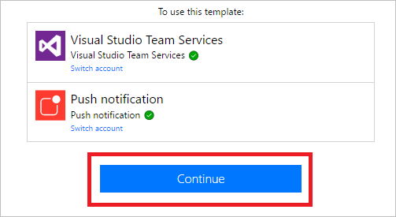
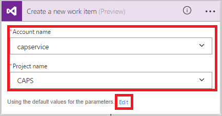

# 사용자 입력을 사용하는 단추 흐름 소개
간단히 단추를 눌러 일상적인 작업을 실행하는 단추 흐름을 만듭니다. 사용자가 흐름이 실행될 때 사용되는 특정 세부 정보를 제공할 수 있도록 하여 흐름을 사용자 지정할 수 있습니다. 이 토픽은 사용자의 입력을 받는 단추 흐름을 만든 다음 단추 흐름을 실행하고 사용자 입력을 제공하는 방법을 강조하는 일련의 과정을 연습합니다.

Microsoft Flow 웹 사이트 또는 Microsoft Flow용 모바일 앱에서 단추 흐름을 만들 수 있습니다. 이 토픽의 경우 웹 사이트를 사용합니다.

### 필수 구성 요소
* Microsoft Flow 웹 사이트에 대한 계정입니다.

## 템플릿 열기
1. [Microsoft Flow 웹 사이트](https://flow.microsoft.com)에 로그인하고 검색 상자에 **Visual Studio**를 입력한 다음 검색 아이콘을 눌러 Visual Studio와 관련된 모든 템플릿을 찾습니다.
   
      
2. **Visual Studio에서 우선 순위 2 버그 열기** 템플릿을 선택합니다.
   
      
3. **이 템플릿 사용** 단추를 선택합니다.
   
      
   
    이 템플릿은 Visual Studio Team Services(VSTS) 및 푸시 알림 서비스를 사용합니다. 둘 중 하나에 연결되지 않은 경우 이러한 서비스에 로그인해야 합니다. **로그인** 단추는 서비스에 로그인해야 하는 경우에만 나타납니다.
4. 모든 필수 서비스에 로그인한 후 **계속** 단추를 선택합니다.
   
      
5. (선택 사항) 포털의 위쪽에 있는 상자에 선택한 이름을 입력하여 흐름의 이름을 변경합니다.
   
    

## 사용자 입력 사용자 지정
1. 트리거 카드에서 **편집**을 선택합니다.
   
      
2. **+** 아이콘을 선택하여 사용자 지정 입력 필드를 추가할 수 있도록 페이지를 확장합니다.
   
    
3. 다른 사람이 사용자의 흐름을 실행할 때 사용할 수 있도록 하려는 각 사용자 지정 필드에 대한 **제목 입력** 및 **설명 입력**을 입력합니다.  
   
    이 예제에서는 이 흐름을 사용하는 누구나 버그를 재현하고 버그의 심각도를 평가하는 단계를 입력할 수 있도록 두 사용자 지정 입력 필드(**버그 재현 단계** 및 **버그 심각도**)를 만듭니다.  
   
    

## 버그 사용자 지정
1. **새 작업 항목 만들기** 카드의 제목 표시줄을 누릅니다.
   
      
2. VSTS 환경에 적합한 선택을 한 다음 **편집**을 선택합니다.
   
    예를 들어 **myinstance**를 입력하여 myinstance.visualstudio.com에 연결합니다.
   
      
3. **고급 옵션 표시**를 선택하여 이 카드에 대한 다른 필드를 표시합니다.
   
      
4. **버그 제목** 토큰 앞에 커서를 놓은 다음 **제목** 텍스트 필드에 "심각도:"를 입력합니다.
5. 커서가 아직 제목 텍스트 필드에 있는 상태에서 **버그 심각도** 토큰을 선택한 다음 " -- "를 입력합니다.  
6. **설명** 텍스트 필드에서 **버그 설명** 토큰 바로 뒤에 커서를 놓은 다음 Enter를 눌러 새 행을 시작합니다.
7. 커서를 새 행에 놓은 다음 **버그 재현 단계** 토큰을 선택합니다.
   
    

## 푸시 알림 사용자 지정
1. **푸시 알림을 보내기** 카드의 제목 표시줄을 눌러 확장합니다.
2. 동적 콘텐츠 토큰의 목록에서 **더 보기**를 선택한 다음 **링크** 텍스트 필드에서 **URL**을 추가합니다.
3. **링크 레이블** 텍스트 필드에서 **Id** 토큰을 추가합니다.
   
      
4. 메뉴에서 **흐름 만들기**를 탭하여 자기만의 흐름을 만듭니다.    

## 흐름 실행
이 연습에서는 Microsoft Flow에 대 한 모바일 앱을 사용하여 방금 만든 단추 흐름을 실행합니다. 제목, 설명, 재현 단계 및 심각도 수준과 함께 버그를 만드는 데 필요한 모든 사용자 입력을 제공합니다.  

1. Microsoft Flow용 모바일 앱에서 **단추** 탭을 누른 다음 **단계 포함 버그 보고서 만들기** 단추를 누릅니다.
   
      
2. 보고하는 버그에 대한 제목을 입력한 후 **다음**을 누릅니다. 예제:
   
      
3. 보고하는 버그에 대한 설명을 입력한 후 **다음**을 누릅니다. 예제:
   
      
4. 보고하는 버그를 재현할 단계를 입력한 후 **다음**을 누릅니다. 예제:
   
      
5. 보고하는 버그의 심각도를 입력한 다음 **완료**를 누릅니다.  
      
   
    흐름이 실행됩니다.
6. (선택 사항) **작업** 탭을 눌러 결과를 표시합니다.
   
      
7. (선택 사항) **새 작업 항목 만들기** 단계를 눌러 흐름의 실행에 대한 자세한 결과를 표시합니다.
   
      

## 다음 단계
* [단추 흐름 공유](share-buttons.md)
* [흐름에 대해 알아보기](guided-learning/learning-introducing-flow.md)  
* [단추 흐름에 대해 알아보기](introduction-to-button-flows.md)  
* [트리거 토큰을 사용하는 단추 흐름에 대해 알아보기](introduction-to-button-trigger-tokens.md)  

