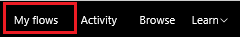
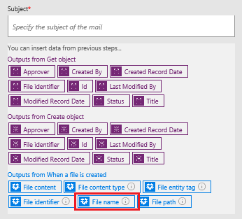
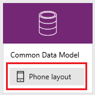
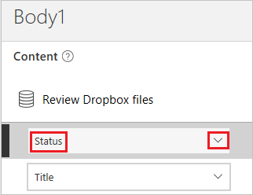

# Microsoft Flow 및 Microsoft Common Data Service를 사용하여 승인 루프 작성
Common Data Service를 사용하면 흐름과 독립적인 데이터베이스에 저장된 정보를 갖는 흐름을 작성할 수 있습니다. 가장 좋은 예로 승인을 들 수 있습니다. 엔터티에 승인 상태를 저장할 경우 흐름이 이를 기반으로 작업할 수 있습니다.

이 예제에서는 사용자가 Dropbox에 파일을 추가하면 시작되는 승인 프로세스를 만듭니다. 파일이 추가되면 관련 정보가 앱에 표시되어 검토자가 변경을 승인 또는 거부할 수 있습니다. 검토자가 변경 내용을 승인 또는 거부하면 알림 메일이 발송되며 거부된 파일은 Dropbox에서 삭제됩니다.

이 섹션의 단계에 따라 다음을 작성하게 됩니다.

* Dropbox에 추가된 각 파일에 관한 정보와 파일의 상태가 승인, 거부 또는 보류인지에 대한 정보가 담긴 **사용자 지정 엔터티** 
* 파일이 Dropbox에 추가되면 사용자 지정 엔터티에 정보를 추가하고, 파일이 승인 또는 거부되면 메일을 보내며, 거부된 파일을 삭제하는 **흐름**.   이 단계에서는 흐름을 처음부터 새롭게 작성하는 방법을 보여 주지만 템플릿에서 비슷한 흐름을 만들 수 있습니다.
* 검토자가 Dropbox에 추가된 파일을 승인 또는 거부할 수 있는 **앱**. PowerApps를 사용하여 사용자 지정 엔터티의 필드에 따라 이 앱을 자동으로 생성하게 됩니다.

**필수 구성 요소**

* [Microsoft Flow](sign-up-sign-in.md)와 [PowerApps](https://powerapps.microsoft.com/tutorials/signup-for-powerapps/)에 가입합니다.
* [연결 관리](https://powerapps.microsoft.com/tutorials/add-manage-connections/)에서 설명한 대로 Dropbox 및 Office 365 Outlook에 연결합니다. 

## 엔터티 작성
1. [powerapps.com](https://web.powerapps.com)에 로그인합니다.
2. 왼쪽 탐색 모음이 기본적으로 표시되지 않으면 왼쪽 위 모서리의 3줄 가로선이 있는 아이콘을 클릭하거나 누릅니다.
   
    
3. 왼쪽 탐색 모음에서 **관리**를 클릭하거나 누른 다음 **엔터티**를 클릭하거나 누릅니다.
   
    
4. 메시지가 표시되면 **내 데이터베이스 만들기**를 클릭하거나 누릅니다.
   
    
5. 오른쪽 위 모서리 근처에 있는 **새 엔터티**를 클릭하거나 누릅니다.
   
    
   
    브라우저 창을 최대화 되지 않은 경우 이 단추가 다른 위치에 나타날 수 있습니다.
6. **엔터티 이름**에서, 데이터베이스의 다른 엔터티 이름과 다르며 공백이 포함되지 않은 이름ㅇ르 지정합니다.
   
    이 예제를 정확하게 따라 하려면 **ReviewDropboxFiles**로 지정합니다.
   
    
7. **표시 이름**에서 친숙한 이름을 지정합니다.
   
    
8. **다음**을 클릭하거나 누릅니다.
   
    

## 엔터티에 필드 추가 
1. 오른쪽 위 모서리 근처에 있는 **필드 추가**를 클릭하거나 누릅니다.
   
    
2. 필드 목록의 맨 아래에 나타나는 빈 줄에서 **승인자** 필드의 속성을 설정합니다. 이 속성을 설정할 때는 Tab을 눌러 다음 열로 이동할 수 있습니다.
   
   * **표시 이름** 열에서 **승인자**를 입력합니다.
   * **이름** 열에서 **ApproverEmail**을 입력합니다.
   * **형식** 열에서 **전자 메일** 옵션을 클릭하거나 누릅니다.
   * **필수** 열에서 확인란을 선택합니다.
     
     
3. 다음 행에서 **상태** 필드의 속성을 설정합니다.
   
   * **표시 이름** 열에서 **상태**를 입력합니다.
   * **이름** 열에서 **상태**를 입력합니다.
   * **형식** 열에서 **문자** 옵션을 클릭하거나 누릅니다.
   * **속성** 열에서 기본값을 그대로 둡니다.
   * **필수** 열에서 확인란을 선택합니다.
     
     
4. 다음 행에서 **FileID** 필드의 속성을 설정합니다.
   
   * **표시 이름** 열에서 **파일 ID**를 입력합니다.
   * **이름** 열에서 **FileID**를 입력합니다.
   * **형식** 열에서 **문자** 옵션을 클릭하거나 누릅니다.
   * **속성** 열에서 기본값을 그대로 둡니다.
   * **고유** 열에서 확인란을 선택합니다.
   * **필수** 열에서 확인란을 선택합니다.
     
     
5. 오른쪽 가장자리 근처에서 **FileID** 필드에 대한 말줄임표(...)를 클릭하거나 누르고 **제목 필드로 설정**을 클릭하거나 누릅니다.
   
    
6. 왼쪽 아래 모서리 근처에서 **만들기**를 클릭하거나 누릅니다.
   
    
7. (선택 사항) 엔터티 목록이 다시 표시되면 이미 브라우저 창이 최대화되지 않은 경우 창을 최대화하고 **형식** 열 머리글을 클릭하거나 누릅니다. 목록은 방금 만든 것처럼 사용자 지정 엔터티가 맨 위에 표시되어 정렬됩니다.

## 로그인 및 흐름 만들기
1. [Microsoft Flow 포털](https://flow.microsoft.com)을 엽니다.
2. 브라우저 창이 최대화되어 있지 않으면 최대화한 다음 오른쪽 위 모서리 근처의 **로그인**을 클릭하거나 누릅니다.
   
    
3. 오른쪽 위 메뉴에서 powerapps.com의 데이터베이스를 만든 환경을 선택합니다.
   
    **참고**: 동일한 환경을 선택하지 않을 경우 엔터티가 표시되지 않습니다.
4. 왼쪽 위 모서리 근처에서 **내 흐름**을 클릭하거나 누릅니다.
   
    
5. 오른쪽 위 모서리 근처에서 **새 흐름 만들기**를 클릭하거나 누릅니다.
   
    

## 파일이 추가되면 시작
1. **다른 트리거 Search**가 포함된 상자에서 **Dropbox**를 입력하거나 붙여 넣은 다음 **Dropbox - 파일을 만들 때**를 클릭하거나 누릅니다.
   
    
2. **폴더** 아래에서 폴더 아이콘을 클릭하거나 누른 다음 파일이 추가된 폴더로 이동합니다.
   
    

## 엔터티에 데이터 추가
1. **새 단계**를 클릭하거나 누른 다음 **동작 추가**를 클릭하거나 누릅니다.
   
    
2. **추가 작업 검색**이 포함된 상자에서 **Common Data Service**를 입력하거나 붙여넣고 **Common Data Service - 개체 만들기**를 클릭하거나 누릅니다.
   
    
3. **엔터티**에서 **검토**를 입력하거나 붙여 넣은 다음 **Dropbox 파일 검토**를 클릭하거나 누릅니다.
   
    
4. **제목** 아래에서 상자 안을 클릭하거나 누른 다음 매개 변수 토큰 목록에서 **파일 이름**을 클릭하거나 눌러 해당 토큰을 필드에 추가합니다.
   
    
5. **승인자** 아래에서 파일을 검토할 사람의 전자 메일 주소를 입력하거나 붙여 넣습니다.
   
    **참고**: 흐름 테스트의 편의를 위해 자신의 고유 주소를 지정합니다. 나중에 흐름을 실제로 사용할 때 변경할 수 있습니다.
   
    
6. **상태**에서 **보류 중**을 입력하거나 붙여 넣습니다.
   
    
7. **파일 식별자** 아래에서 상자 안을 클릭하거나 누른 다음 매개 변수 토큰 목록에서 **파일 식별자**를 클릭하거나 눌러 해당 토큰을 필드에 추가합니다.
   
    

## 파일 검토 여부 확인
1. **개체 만들기** 동작에서 **새 단계**, **자세히**, **do until 추가**를 차례로 클릭하거나 누릅니다.
   
    
2. **Do until** 동작의 왼쪽 위 모서리에서 **값 선택**이 담긴 상자를 클릭하거나 누릅니다.
   
    
   
    **참고**: 브라우저 창이 최대화되지 않은 경우 **값 선택**이 담긴 위쪽 상자를 클릭하거나 누릅니다.
3. **개체 만들기의 출력**에서 **상태**를 클릭하거나 눌러 해당 매개 변수 토큰을 필드에 추가합니다.
   
    
4. **Do until** 동작의 가운데 근처에 있는 목록을 열고 **같지 않음**을 클릭하거나 누릅니다.
   
    
5. **Do until** 동작의 오른쪽 위 모서리에서 **값 선택**이 담긴 상자에 **보류 중**을 입력하거나 붙여 넣습니다.
   
    
   
    **참고**: 브라우저 창이 최대화되지 않은 경우 **값 선택**이 담긴 아래쪽 상자 안을 클릭하거나 누릅니다.
6. **Do until** 동작 아래 근처에서 **동작 추가**를 클릭하거나 누릅니다.
   
    
7. **추가 작업 검색**이 포함된 상자에서 **Common**을 입력하거나 붙여넣고 **Common Data Service - 개체 가져오기**를 클릭하거나 누릅니다.
   
    
8. **네임스페이스**에서 해당 데이터베이스를 클릭하거나 누릅니다.
9. **엔터티**에서 **검토**를 입력하거나 붙여 넣은 다음 **Dropbox 파일 검토**를 클릭하거나 누릅니다.
   
    
10. **개체 id**에서 상자 안을 클릭하거나 누른 다음 **파일 식별자** 매개 변수 토큰을 클릭하거나 눌러 필드에 추가합니다.
    
     

## 항목 승인 여부 확인
1. **Do-Until** 동작에서 **새 단계**를 클릭하거나 누른 다음 **조건 추가**를 클릭하거나 누릅니다.
   
    
2. 조건의 왼쪽 위 모서리에서 **값 선택**이 담긴 상자를 클릭하거나 누릅니다.
   
    
   
    **참고**: 브라우저 창이 최대화되지 않은 경우 **값 선택**이 담긴 위쪽 상자를 클릭하거나 누릅니다.
3. **개체 가져오기의 출력**에서 **상태** 매개 변수 토큰을 클릭하거나 눌러 필드에 추가합니다.
   
    
4. 조건의 오른쪽 위 모서리에서 **값 선택**이 담긴 상자에 **승인됨**을 입력하거나 붙여 넣습니다.
   
    
   
    **참고**: 브라우저 창이 최대화되지 않은 경우 **값 선택**이 담긴 아래쪽 상자에 **승인됨**을 입력하거나 붙여 넣습니다.

## 알림 메일 보내기
1. **예이면 아무 것도 안 함**에서 **동작 추가**를 클릭하거나 누릅니다.
   
    
2. **다른 동작 Search**가 포함된 상자에서 **메일 보내기**를 입력하거나 붙여 넣은 다음 **Office 365 Outlook - 전자 메일 보내기**를 클릭하거나 누릅니다.
   
    
3. **받는 사람**에서 항목을 수락했을 때 알림을 보내려는 사람의 주소를 입력하거나 붙여 넣습니다.
   
    **참고**: 흐름 테스트의 편의를 위해 자신의 고유 주소를 지정합니다. 흐름을 실제로 사용할 때 변경할 수 있습니다.
   
    
4. **제목**에서 상자 안을 클릭하거나 누른 다음 **파일 이름** 매개 변수토큰을 클릭하거나 눌러 필드에 추가합니다.
   
    
5. **본문**에서 **항목이 승인되었습니다.**를 입력하거나 붙여 넣습니다.
   
    
6. **아니요인 경우 아무 것도 안 함**에서 전자 메일 메시지의 본문을 **항목이 거부되었습니다.**로 지정하는 것을 제외하고 이 절차의 1-5단계를 반복합니다.
   
    

## 거부된 파일 삭제
1. 거부 메일의 필드에서 **동작 추가**를 클릭하거나 누릅니다.
   
    
2. **다른 동작 Search**가 들어 있는 상자에 **Dropbox**를 입력하거나 붙여 넣은 다음 **Dropbox - 파일 삭제**를 클릭하거나 누릅니다.
   
    
3. **파일**에서 상자 안을 클릭하거나 누른 다음 **파일 식별자** 토큰 매개 변수를 클릭하거나 눌러 필드에 추가합니다.
   
    

## 흐름 저장
1. 화면 맨 위에서 만드는 흐름의 이름을 입력하거나 붙여 넣은 다음 **흐름 만들기**를 클릭하거나 누릅니다.
   
    
2. **닫기**를 클릭하거나 누른 다음 **완료**를 클릭하거나 누릅니다.
3. Dropbox에서 지정한 폴더에 승인 테스트용 파일 1개와 거부 테스트용 파일 1개 등, 최소 둘 이상의 파일을 추가합니다.

## 앱 작성
1. [powerapps.com](https://web.powerapps.com)에 로그인한 다음 왼쪽 탐색 모음 아래쪽의 **새 앱**을 클릭하거나 누릅니다.
   
    
2. 나타나는 대화 상자에서 PowerApps Studio for Windows 또는 PowerApps Studio for the web을 여는 옵션을 클릭하거나 누릅니다.
3. PowerApps Studio for Windows를 열 경우 왼쪽 탐색 모음에서 **새로 만들기**를 클릭하거나 누릅니다.
4. **데이터에서 앱 만들기**의 **Common Data Service**에서 **전화 레이아웃** 타일을 클릭하거나 누릅니다.
   
    
5. **Search** 상자에 **검토**를 입력하거나 붙여 넣습니다.
   
    
6. **엔터티 선택**에서 **Dropbox 파일 검토**를 클릭하거나 누릅니다.
   
    
7. 오른쪽 아래 모서리 근처에서 **연결**을 클릭하거나 누릅니다.
   
    
8. 소개 둘러보기 시작 화면이 표시될 경우 PowerApps를 살펴봅니다(또는 **생략** 클릭 또는 누르기).
   
    
   
    항상 왼쪽 위 모서리에 있는 물음표 아이콘을 클릭하거나 누르고 **소개 둘러보기**를 클릭하거나 눌러 둘러볼 수 있습니다.
9. (선택 사항) 화면 아래에서 슬라이더를 끌어 배율을 높이면 앱이 더 보기 쉽습니다.
   
    

## 앱 사용자 지정
1. 오른쪽 탐색 모음에서 헤더와 설명이 포함된 레이아웃을 클릭하거나 누릅니다.
   
    
2. **BrowseScreen**에서 검색 모음 바로 아래를 클릭하거나 터치하여 더 큰 텍스트 상자 컨트롤을 선택합니다.
   
    
3. 오른쪽 창에서 아래쪽 화살표를 클릭하거나 눌러 아래쪽 목록을 엽니다.
   
    
4. 아래쪽 목록에서 **제목**을 클릭하거나 눌러 추가된 파일의 이름을 표시합니다.
   
    
5. 오른쪽 창에서 위쪽 목록을 연 다음 **상태**를 클릭하거나 눌러 각 파일의 상태를 표시합니다.
   
    

## 전체 솔루션 테스트 
1. PowerApps에서 왼쪽 위 모서리에 있는 재생 버튼을 클릭하거나 눌러 미리 보기 모드를 엽니다.
   
    
2. 목록의 첫 번째 파일에 대해 화살표를 클릭하거나 눌러 해당 파일에 대한 세부 사항을 표시합니다.
   
    
3. 오른쪽 위 모서리에서 연필 아이콘을 클릭하거나 눌러 파일 관련 세부 정보를 변경합니다.
   
    
4. **상태** 상자에 **승인됨**을 입력하거나 붙여 넣습니다.
   
    
5. 오른쪽 위 모서리에서 확인 표시 아이콘을 클릭하거나 눌러 변경 내용을 저장하고 세부 정보 화면으로 돌아갑니다.
   
    
   
    잠시 후 파일이 승인되었음을 설명하는 전자 메일이 전달됩니다.
6. 오른쪽 위 모서리에서 뒤로 버튼을 클릭하거나 눌러 찾아보기 화면으로 돌아갑니다.
   
    
7. 목록의 다른 파일에 대해 화살표를 클릭하거나 눌러 해당 파일에 대한 세부 사항을 표시합니다.
   
    
8. 오른쪽 위 모서리에서 연필 아이콘을 클릭하거나 눌러 파일 관련 세부 정보를 변경합니다.
   
    
9. **상태** 상자에 **거부됨**(또는 **승인됨**을 제외한 다른 항목, **Aproved** 또는 **Approoved** 포함)을 입력하거나 붙여 넣습니다.
   
    
10. 오른쪽 위 모서리에서 확인 표시 아이콘을 클릭하거나 눌러 변경 내용을 저장하고 세부 정보 화면으로 돌아갑니다.
    
     
    
     잠시 후 파일이 거부되었으며 파일이 Dropbox에서 삭제될 것임을 알리는 이메일이 전달됩니다.

