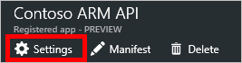

# Microsoft Flow에서 사용자 지정 커넥터로 Azure Active Directory 사용
ARM(Azure Resource Manager)을 사용하면 Azure에서 솔루션의 구성 요소(예: 데이터베이스, 가상 컴퓨터 및 웹앱)를 관리할 수 있습니다. 이 자습서에서는 Azure Active Directory에서 인증을 활성화하고 사용자 지정 커넥터로 ARM API 중 하나를 등록한 다음 Microsoft Flow에 연결하는 방법에 대해 설명합니다. 흐름의 일부로 Azure 리소스를 관리하려는 경우에 유용합니다. ARM에 대한 자세한 내용은 [Azure Resource Manager 개요](https://docs.microsoft.com/azure/azure-resource-manager/resource-group-overview)를 참조하세요.

## 필수 구성 요소
* [Azure 구독](https://azure.microsoft.com/free/).
* [Microsoft Flow 계정](https://flow.microsoft.com)
* 이 자습서에서 사용된 [샘플 OpenAPI 파일](http://pwrappssamples.blob.core.windows.net/samples/AzureResourceManager.json).

## Azure Active Directory에서 인증 활성화
첫째, ARM API 끝점을 호출할 때 인증을 수행할 Azure Active Directory (AAD) 응용 프로그램을 만들어야 합니다.

1. [Azure 포털](https://portal.azure.com)에 로그인합니다.  Azure Active Directory 테넌트가 둘 이상 있는 경우 오른쪽 위 모서리에 있는 자신의 사용자 이름을 확인하여 올바른 디렉터리에 로그인했는지 확인합니다.
   
    
2. 왼쪽 메뉴에서 **서비스 더 보기**를 클릭합니다.  **필터** 텍스트 상자에 **Azure Active Directory**를 입력한 후 **Azure Active Directory**를 클릭합니다.
   
    
   
    Azure Active Directory 블레이드가 열립니다.   
3. Azure Active Directory 블레이드 메뉴에서 **앱 등록**을 클릭합니다.
   
    
4. 등록된 응용 프로그램 목록에서 **추가**를 클릭합니다.
   
       
5. 응용 프로그램에 대한 이름을 입력하고, **웹앱 / API**을 선택한 채로 둔 다음, **Sign-on URL**에 대해 `https://login.windows.net`를 입력합니다.  **만들기**를 클릭합니다.  
   
    
6. 목록에서 새 응용 프로그램을 클릭합니다.
   
    
   
    등록된 앱 블레이드를 엽니다.  **응용 프로그램 ID**를 적어둡니다.  나중에 필요합니다.
7. 설정 블레이드도 또한 열려 있어야 합니다.  열려 있지 않은 경우 **설정** 단추를 클릭합니다.
   
    
8. 설정 블레이드에서 **회신 URL**을 클릭합니다. URL 목록에서 `https://msmanaged-na.consent.azure-apim.net/redirect`을 추가하고 **저장**을 클릭합니다.
   
    
9. 설정 블레이드로 돌아가 **필요한 권한**을 클릭합니다.  필요한 권한 블레이드에서 **추가**를 클릭합니다.
   
    
   
    Add API 액세스 블레이드가 열립니다.
10. **API 선택**을 클릭합니다. 열리는 블레이드에서 Azure Service Management API에 대한 옵션을 클릭하고 **선택**을 클릭합니다.
    
    
11. **권한 선택**을 클릭합니다.  *위임된 권한* 아래에서, **조직 사용자로 Azure Service Management 액세스**를 클릭하고 **선택**을 클릭합니다.
    
    
12. Add API 액세스 블레이드에서 **완료**를 클릭합니다.
13. 설정 블레이드로 돌아가 **키**를 클릭합니다.  키 블레이드에서 키에 대한 설명을 입력하고 만료 기간을 선택한 다음 **저장**을 클릭합니다.  새 키가 표시됩니다.  키 값이 나중에 필요함으로 적어둡니다.  이제 Azure 포털을 닫아도 좋습니다.
    
    

## Microsoft Flow에서 연결 추가
AAD 응용 프로그램을 구성했으므로 사용자 지정 커넥터를 추가해 보겠습니다.

1. [Microsoft Flow 웹앱](https://flow.microsoft.com/)에서 페이지의 오른쪽 위에 있는 **설정**을 클릭합니다.(기어 모양으로 생김)  그런 다음 **사용자 지정 커넥터**를 클릭합니다.
   
      
2. **사용자 지정 커넥터 만들기**를 클릭합니다.  
   
    API 속성에 대해 묻는 메시지가 표시됩니다.  
   
   | 속성 | 설명 |
   | --- | --- |
   | 이름 |페이지 위쪽에서 **제목 없음**을 클릭하고 흐름 이름을 지정합니다. |
   | OpenAPI 파일 |[샘플 ARM OpenAPI 파일](http://pwrappssamples.blob.core.windows.net/samples/AzureResourceManager.json)로 이동합니다. |
   | 업로드 API 아이콘 |**업로드 아이콘**을 클릭하여 아이콘에 맞는 이미지 파일을 선택합니다. 1MB 미만의 JPG 또는 PNG 이미지 파일이 사용됩니다. |
   | 설명 |사용자 지정 커넥터에 대한 설명을 입력합니다(선택 사항). |
   
      
   
    **계속**을 선택합니다.
3. 다음 화면에서 OpenAPI 파일은 인증을 위해 AAD 응용 프로그램을 사용하기 때문에 Flow에 응용 프로그램에 대한 약간의 정보를 제공해야 합니다.  **클라이언트 id** 아래에, 앞서 적어둔 AAD **응용 프로그램 ID**를 입력합니다.  클라이언트 암호로 **키**를 사용합니다.  마지막으로 **리소스 URL**로 `https://management.core.windows.net/`을 입력합니다.
   
   > [!IMPORTANT]
   > 리소스 URL을 후행 슬래시를 포함하여 위에 적은 그대로 포함하도록 해야 합니다.
   > 
   > 
   
    
   
    보안 정보를 입력한 후 사용자 지정 커넥터를 만들기 위해 페이지 맨 위에 있는 흐름 이름 옆에 확인 표시(**&#x2713;**)를 클릭합니다.
4. 이제 **사용자 지정 커넥터** 아래에 해당 사용자 지정 커넥터가 표시됩니다.
   
      
5. 사용자 지정 커넥터가 등록되었으므로 앱과 흐름에서 사용할 수 있도록 사용자 지정 커넥터에 대한 연결을 만들어야 합니다.  사용자 지정 커넥터 이름 오른쪽에 있는 **+**을 클릭한 다음 로그인 화면을 완료합니다.

> [!NOTE]
> 샘플 OpenAPI는 ARM 작업의 전체 집합을 정의하지 않으며 현재 [모든 구독 나열](https://msdn.microsoft.com/library/azure/dn790531.aspx) 작업만 포함합니다.  이 OpenAPI를 편집하거나 [온라인 OpenAPI 편집기](http://editor.swagger.io/)를 사용하여 다른 OpenAPI 파일을 만들 수 있습니다.
> 
> 이 프로세스는 AAD를 사용하여 인증된 RESTful API에 액세스하는 데 사용할 수 있습니다.
> 
> 

## 다음 단계
흐름을 만드는 방법에 대한 자세한 정보는 [Microsoft Flow를 통한 작성 시작](get-started-logic-flow.md)을 참조하세요.

질문하거나 사용자 지정 커넥터에 대한 의견을 제출하려면 [커뮤니티에 가입합니다](https://aka.ms/flow-community).

