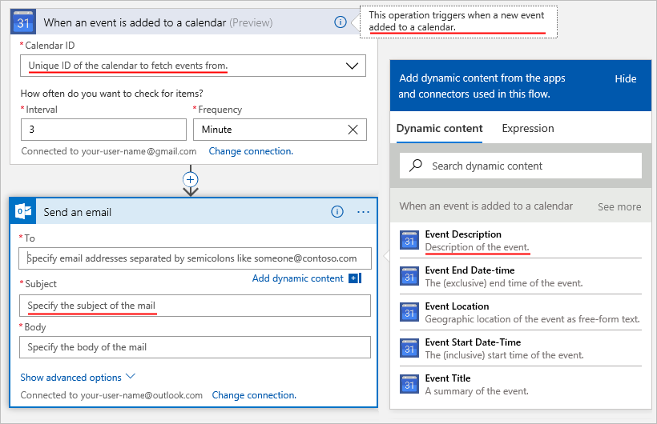
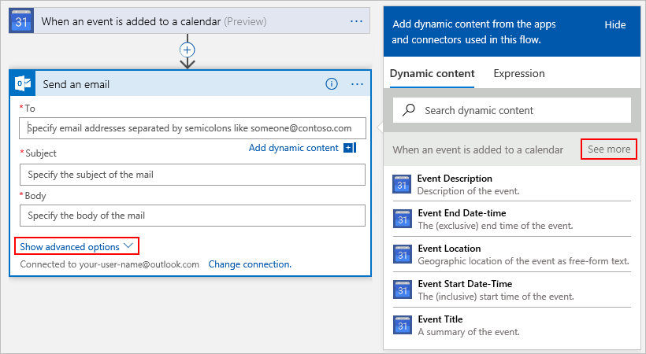
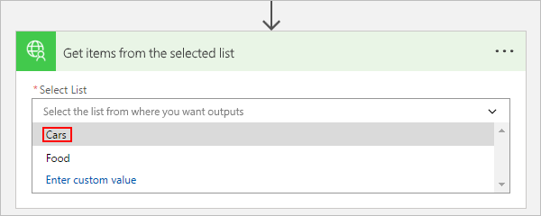

# <a name="openapi-extensions-for-custom-connectors-in-microsoft-flow"></a>Microsoft Flow에서 사용자 지정 커넥터에 대한 OpenAPI 확장
## <a name="introduction"></a>소개
Microsoft Flow, Azure Logic Apps 또는 Microsoft PowerApps에서 사용자 지정 커넥터를 만들려면 API의 작업 및 매개 변수를 설명하는 언어에 상관없이 컴퓨터가 읽을 수 있는 문서인 OpenAPI 정의 파일을 제공해야 합니다. OpenAPI의 기본 기능과 함께 Logic Apps 및 Flow에 대한 사용자 지정 커넥터를 만들 때 다음과 같은 OpenAPI 확장도 포함할 수 있습니다.

* `summary`
* `x-ms-summary`
* `description`
* `x-ms-visibility`
* `x-ms-dynamic-values`
* `x-ms-dynamic-schema`

이러한 확장에 대한 자세한 내용은 다음과 같습니다.

<a name="summary"></a>

## <a name="summary"></a>summary
작업(작업)의 제목을 지정합니다. </br>
적용 대상: 작업 </br>
권장: `summary`에 *문장의 첫 글자*를 사용합니다. </br>
예: "달력에 새 이벤트를 추가하면" 또는 "전자 메일 보내기"


``` json
"actions" {
  "Send_an_email": {
    /// Other action properties here...
    "summary": "Send an email",
    /// Other action properties here...
  }
},
```

## <a name="x-ms-summary"></a>x-ms-summary
엔터티에 대한 제목을 지정합니다. </br>
적용 대상: 매개 변수, 응답 스키마 </br>
권장: `x-ms-summary`에 *단어의 첫 글자를 대문자로*를 사용합니다. </br>
예: "달력 ID", "제목", "이벤트 설명" 등


``` json
"actions" {
  "Send_an_email": {
    /// Other action properties here...
    "parameters": [ 
      {
        /// Other parameters here...
        "x-ms-summary": "Subject",
        /// Other parameters here...
      }
    ]
  }
},
```
<a name="description"></a>

## <a name="description"></a>description
작업의 기능 또는 엔터티의 형식 및 기능에 대한 자세한 설명을 지정합니다. </br>
적용 대상: 작업, 매개 변수, 응답 스키마 </br>
권장: `description`에 *문장의 첫 글자*를 사용합니다. </br>
예: "달력에 새 이벤트를 추가하면 이 작업을 트리거합니다.", "메일의 제목을 지정합니다." 등



``` json
"actions" {
  "Send_an_email": {
     "description": "Specify the subject of the mail",
     /// Other action properties here...
  }
},
```

<a name="visibility"></a>

## <a name="x-ms-visibility"></a>x-ms-visibility
엔터티의 사용자 연결 가시성을 지정합니다. </br>
가능한 값: `important`, `advanced` 및 `internal` </br>
적용 대상: 작업, 매개 변수, 스키마

* `important` 작업 및 매개 변수는 항상 사용자에게 첫 번째로 표시됩니다.
* `advanced` 작업 및 매개 변수는 추가 메뉴에서 숨겨집니다.
* `internal` 작업 및 매개 변수는 사용자에게서 숨겨집니다.

> [!NOTE]
> `internal` 및 `required` 매개 변수의 경우 이러한 매개 변수에 기본값을 제공**해야** 합니다.
> 
> 

예: **자세히 보기** 메뉴 및 **고급 옵션 표시** 메뉴에서는 `advanced` 작업 및 매개 변수를 숨깁니다.



``` json
"actions" {
  "Send_an_email": {
     /// Other action properties here...
     "parameters:": [
         {
           "name": "Subject",
           "type": "string",
           "description": "Specify the subject of the mail",
           "x-ms-summary": "Subject",
           "x-ms-visibility": "important",
           /// Other parameter properties here
         }
     ]
     /// Other action properties here...
  }
},
```

## <a name="x-ms-dynamic-values"></a>x-ms-dynamic-values
작업의 입력 매개 변수를 선택할 수 있도록 사용자에게 채워진 목록을 보여줍니다. </br>
적용 대상: 매개 변수 </br>
사용 방법: 매개 변수의 정의에 `x-ms-dynamic-values` 개체를 추가합니다. 예를 들어, 이 [OpenAPI 샘플](https://procsi.blob.core.windows.net/blog-images/sampleDynamicSwagger.json)을 참조하세요.



### <a name="properties-for-x-ms-dynamic-values"></a>x-ms-dynamic-values의 속성
| 이름 | 필수 또는 선택 | 설명 |
| --- | --- | --- |
| **operationID** |필수 |목록을 채우기 위해 호출할 작업 |
| **value-path** |필수 |매개 변수 값을 의미하는 `value-collection` 내의 개체에 있는 경로 문자열입니다. `value-collection`을 지정하지 않은 경우 응답이 배열로 평가됩니다. |
| **value-title** |선택 사항 |값의 설명을 의미하는 `value-collection` 내의 개체에 있는 경로 문자열입니다. `value-collection`을 지정하지 않은 경우 응답이 배열로 평가됩니다. |
| **value-collection** |선택 사항 |응답 페이로드에서 개체의 배열로 평가되는 경로 문자열입니다. |
| **parameters** |선택 사항 |dynamic-values 작업을 호출하는 데 필요한 입력 매개 변수를 지정하는 속성을 가진 개체입니다. |

`x-ms-dynamic-values`의 속성을 보여주는 예제는 다음과 같습니다.

``` json
"x-ms-dynamic-values": {
  "operationId": "PopulateDropdown",
  "value-path": "name",
  "value-title": "properties/displayName",
  "value-collection": "value",
  "parameters": {
     "staticParameter": "{value}",
     "dynamicParameter": {
        "parameter": "{value-to-pass-to-dynamicParameter}"
     }
  }
}
```

## <a name="example-all-the-openapi-extensions-up-to-this-point"></a>예제: 이 지점에서 모든 OpenAPI 확장
``` json
"/api/lists/{listID-dynamic}": {
    "get": {
        "description": "Get items from a single list - uses dynamic values and outputs dynamic schema",
        "summary": "Gets items from the selected list",
        "operationID": "GetListItems",
        "parameters": [
           {
             "name": "listID-dynamic",
             "type": "string",
             "in": "path",
             "description": "Select the list from where you want outputs",
             "required": true,
             "x-ms-summary": "Select List",
             "x-ms-dynamic-values": {
                "operationID": "GetLists",
                "value-path": "id",
                "value-title": "name"
             }
           }
        ]
    }
}
```

## <a name="x-ms-dynamic-schema"></a>x-ms-dynamic-schema
현재 매개 변수 또는 응답에 대한 스키마가 동적임을 나타냅니다. 이 개체는 이 필드의 값에 의해 정의된 작업을 호출하고, 동적으로 스키마를 검색하고, 사용자 입력을 수집하기 위한 적절한 UI를 표시하거나 사용 가능한 필드를 표시할 수 있습니다. 

적용 대상: 매개 변수, 응답

사용 방법: 요청 매개 변수 또는 응답 본문 정의에 `x-ms-dynamic-schema` 개체를 추가합니다. 예를 들어, 이 [OpenAPI 샘플](https://procsi.blob.core.windows.net/blog-images/sampleDynamicSwagger.json)을 참조하세요.

이 예제에서는 사용자가 드롭다운 목록에서 선택한 항목에 따라 입력 양식을 변경하는 방법을 보여줍니다.


또한 이 예제에서는 사용자가 드롭다운 목록에서 선택한 항목에 따라 출력을 변경하는 방법을 보여줍니다. 이 버전에서 사용자는 "Cars"를 선택합니다.


이 버전에서 사용자는 "Food"를 선택합니다.


### <a name="properties-for-x-ms-dynamic-schema"></a>x-ms-dynamic-schema의 속성
| 이름 | 필수 또는 선택 | 설명 |
| --- | --- | --- |
| **operationID** |필수 |스키마를 가져오기 위해 호출할 작업입니다. |
| **parameters** |필수 |dynamic-schema 작업을 호출하는 데 필요한 입력 매개 변수를 지정하는 속성을 가진 개체입니다. |
| **value-path** |선택 사항 |스키마를 가진 속성을 참조하는 경로 문자열입니다. </br>지정하지 않으면 응답은 루트 개체의 속성에서 스키마를 포함하도록 합니다. |
|  | | |

동적 매개 변수에 대한 예제는 다음과 같습니다.

``` json
{
  "name": "dynamicListSchema",
  "in": "body",
  "description": "Dynamic schema for items in the selected list",
  "schema": {
    "type": "object",
    "x-ms-dynamic-schema": {
        "operationID": "GetListSchema",
        "parameters": {
          "listID": {
            "parameter": "listID-dynamic"
          }
        },
        "value-path": "items"
    }
  }
}
```

동적 응답에 대한 예제는 다음과 같습니다.

``` json
"DynamicResponseGetListSchema": {
   "type": "object",
   "x-ms-dynamic-schema": {
      "operationID": "GetListSchema",
      "parameters": {
         "listID": {
            "parameter": "listID-dynamic"
         }
      },
      "value-path": "items"
    }
}
```

## <a name="next-steps"></a>다음 단계
[사용자 지정 커넥터 등록](register-custom-api.md).

[ASP.NET Web API 사용](customapi-web-api-tutorial.md).

[Azure Resource Manager API 등록](customapi-azure-resource-manager-tutorial.md)

