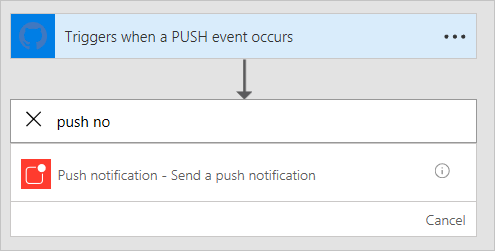

# <a name="use-webhooks-with-microsoft-flow"></a>Microsoft Flow와 함께 웹후크 사용
[웹후크](http://www.webhooks.org/)는 이벤트 알림을 제공하는 데 사용하는 간단한 HTTP 콜백입니다.  Microsoft Flow에서는 웹후크를 사용하여 흐름을 트리거할 수 있습니다.  이 자습서에서는 웹후크로 트리거되는 흐름을 만드는 방법을 보여 줍니다.

> [!NOTE]
> 웹후크를 통해 알림을 보낼 수 있는 서비스의 예로 GitHub를 사용하지만 여기서 설명하는 기술은 웹후크를 사용하는 모든 서비스로 확장할 수 있습니다.
> 
> 

## <a name="prerequisites"></a>필수 구성 요소
자습서를 완료하려면 다음이 필요합니다.

* [웹후크](http://www.webhooks.org/)에 대한 기본적인 이해
* [OpenAPI 사양](http://swagger.io/specification/)(Swagger)에 대한 기본적인 이해
* [GitHub](https://www.github.com) 계정
* 이 자습서의 [샘플 OpenAPI JSON 파일](http://pwrappssamples.blob.core.windows.net/samples/githubWebhookSample.json)
* 또는 OpenAPI 파일의 필기 작성을 원하지 않는 경우 [트리거 UI](customapi-webhooks.md#creating-webhook-triggers-from-the-ui)를 사용하여 웹후크 트리거를 정의할 수도 있습니다.

## <a name="the-openapi-file"></a>OpenAPI 파일
웹후크는 Microsoft Flow에서 [사용자 지정 커넥터](register-custom-api.md) 유형으로 구현되므로 웹후크의 모양을 정의하는 OpenAPI JSON 파일을 제공해야 합니다.  OpenAPI에는 웹후크 작동에 중요한 세 가지 정의가 포함되어 있습니다.

1. 웹후크 만들기
2. API(이 경우 GitHub)에서 들어오는 후크 요청 정의
3. 웹후크 삭제

### <a name="creating-the-webhook"></a>웹후크 만들기
웹후크는 `/repos/{owner}/{repo}/hooks`에 대한 HTTP POST를 통해 GitHub 쪽에 만들어집니다.  OpenAPI에 정의된 트리거를 사용하여 새 흐름을 만들 때 또는 트리거를 수정할 때마다 Microsoft Flow는 이 URL에 게시해야 합니다.  아래 샘플에서 `post` 속성에는 GitHub에 게시할 요청의 스키마가 포함되어 있습니다.

```json
"/repos/{owner}/{repo}/hooks": {
    "x-ms-notification-content": {
    "description": "Details for Webhook",
    "schema": {
        "$ref": "#/definitions/WebhookPushResponse"
    }
    },
    "post": {
    "description": "Creates a Github webhook",
    "summary": "Triggers when a PUSH event occurs",
    "operationId": "webhook-trigger",
    "x-ms-trigger": "single",
    "parameters": [
        {
        "name": "owner",
        "in": "path",
        "description": "Name of the owner of targetted repository",
        "required": true,
        "type": "string"
        },
        {
        "name": "repo",
        "in": "path",
        "description": "Name of the repository",
        "required": true,
        "type": "string"
        },
        {
        "name": "Request body of webhook",
        "in": "body",
        "description": "This is the request body of the Webhook",
        "schema": {
            "$ref": "#/definitions/WebhookRequestBody"
        }
        }
    ],
    "responses": {
        "201": {
        "description": "Created",
        "schema": {
            "$ref": "#/definitions/WebhookCreationResponse"
        }
        }
    }
    }
},
```

> [!IMPORTANT]
> `"x-ms-trigger": "single"` 속성은 흐름 디자이너에서 사용할 수 있는 트리거 목록에 이 웹후크를 표시하도록 Microsoft Flow에 알려주는 스키마 확장이므로 포함되어야 합니다.
> 
> 

### <a name="defining-the-incoming-hook-request-from-the-api"></a>API에서 들어오는 후크 요청 정의
들어오는 후크 요청의 모양(GitHub에서 Microsoft Flow까지의 알림)은 위 샘플에서 보여 주듯이 사용자 지정 `x-ms-notification-content` 속성에 정의되어 있습니다.  흐름에서 사용할 부분만 포함하며, 요청 내용 전체를 포함할 필요는 없습니다.

### <a name="deleting-the-webhook"></a>웹후크 삭제
OpenAPI에 정의를 포함하여 웹후크를 삭제하는 방법을 Microsoft Flow에 알려주는 것이 매우 중요합니다.  흐름에서 트리거를 업데이트할 때마다 또는 흐름을 삭제할 때마다 Microsoft Flow에서 웹후크를 삭제하려고 시도합니다.

```json
"/repos/{owner}/{repo}/hooks/{hook_Id}": {
    "delete": {
    "description": "Deletes a Github webhook",
    "operationId": "DeleteTrigger",
    "parameters": [
        {
        "name": "owner",
        "in": "path",
        "description": "Name of the owner of targetted repository",
        "required": true,
        "type": "string"
        },
        {
        "name": "repo",
        "in": "path",
        "description": "Name of the repository",
        "required": true,
        "type": "string"
        },
        {
        "name": "hook_Id",
        "in": "path",
        "description": "ID of the Hook being deleted",
        "required": true,
        "type": "string"
        }
    ]
    }
},
```

> [!IMPORTANT]
> Microsoft Flow에서 웹후크를 삭제할 수 있으려면 웹후크를 만들 때 API에서 `Location` HTTP 헤더를 201 응답에 **포함해야** 합니다.  `Location` 헤더에는 HTTP DELETE와 함께 사용할 웹후크에 대한 경로가 있어야 합니다.  예를 들어 GitHub의 응답에 포함된 `Location`은 다음 형식을 따릅니다. `https://api.github.com/repos/<user name>/<repo name>/hooks/<hook ID>`
> 
> 

## <a name="authentication"></a>인증
웹후크 요청을 Microsoft Flow에 보내는 API에는 일반적으로 특정 유형의 인증이 있으며 GitHub도 예외는 아닙니다.  여러 유형의 인증이 지원됩니다.  이 자습서에서는 GitHub의 개인 액세스 토큰을 사용합니다.

1. [GitHub](https://www.github.com)로 이동하고, 아직 로그인하지 않은 경우 로그인합니다.
2. 오른쪽 위에서 **프로필 사진**을 클릭한 다음 메뉴에서 **설정**을 클릭합니다.
   
    
3. 왼쪽 메뉴의 **개발자 설정**에서 **개인 액세스 토큰**을 클릭합니다.
   
    
4. **새 토큰 생성** 단추를 클릭합니다.
   
    
5. **토큰 설명** 상자에서 설명을 입력합니다.
6. **admin:repo_hook** 확인란을 선택합니다.
   
    
7. **토큰 생성** 단추를 클릭합니다.
8. 새 토큰을 기록해 둡니다.
   
    
   
   > [!IMPORTANT]
   > 이 토큰에는 다시 액세스할 수 없습니다. 따라서 이 자습서의 뒷부분에서 사용하려면 메모장과 같은 다른 곳에 복사하여 붙여넣어 둡니다.
   > 
   > 

## <a name="adding-the-webhook-to-microsoft-flow"></a>Microsoft Flow에 웹후크 추가
이제 Microsoft Flow에 사용자 지정 커넥터로 웹후크를 추가하는 데 필요한 것은 모두 갖추어졌습니다.

1. [Microsoft Flow 웹 포털](https://flow.microsoft.com)로 이동하여 아직 로그인하지 않은 경우 로그인합니다.
2. **설정** 아이콘을 클릭한 다음 **사용자 지정 커넥터**를 클릭합니다.
   
    
3. **사용자 지정 커넥터 만들기** 단추를 클릭합니다.
4. **OpenAPI 가져 오기** 상자에서 파일 폴더 아이콘을 클릭한 다음 OpenAPI 샘플 파일을 선택합니다.
5. **일반 정보** 섹션에서 **업로드 아이콘**을 클릭한 다음 아이콘으로 사용할 이미지 파일을 선택합니다.
6. **계속**을 클릭합니다.
   
    
7. 다음 화면에서 보안 설정을 구성합니다.  **인증 유형**에서 **기본 인증**을 선택합니다.
8. **기본 인증** 섹션의 레이블 필드에서 **사용자 이름** 및 **암호**를 입력합니다.  이러한 항목은 흐름에서 트리거를 사용할 때만 표시되는 레이블이 됩니다.
   
    
9. 페이지 위쪽에서 흐름 이름을 지정하고 **커넥터 만들기**를 클릭합니다.
   
    

이제 새 사용자 지정 커넥터가 사용자 지정 커넥터 페이지의 목록에 나타납니다.

## <a name="creating-webhook-triggers-from-the-ui"></a>UI에서 웹후크 트리거 만들기
1. 기준 OpenAPI 파일을 업로드/만든 후 사용자 지정 커넥터 마법사의 **정의** 탭으로 이동합니다.
2. 왼쪽 창에서 **+ 새 트리거**를 클릭하고 트리거의 설명을 입력합니다. 이 예제에서는 리포지토리로 끌어오기 요청을 수행하는 경우 발생하는 트리거를 만듭니다.
   
    
3. 다음으로 웹후크 트리거를 만드는 요청을 정의합니다. 샘플 *웹후크 트리거 만들기* 요청을 가져와서 이를 수행할 수 있습니다. 웹후크 만들기는 [Github API 참조](https://developer.github.com/v3/repos/hooks/#create-a-hook)를 참조하세요. 
4. Microsoft Flow는 표준 ```content-type``` 및 보안 헤더를 자동으로 추가하므로 샘플에서 가져오는 동안 정의할 필요가 없습니다. 
   
    
5. 웹후크 만들기 요청을 가져온 후 다음으로 샘플 응답에서 가져와서 웹후크 응답을 정의합니다. 끌어오기 요청 이벤트는 [Github API 참조](https://developer.github.com/v3/activity/events/types/#pullrequestevent)를 참조하세요. 
   
    **참고**: 전체 응답에 붙여 넣을 필요가 없습니다. 필요한 필드만 정의되어야 합니다.
   이 예에서는 PR을 만든 사용자의 PR url 및 정보만을 추출합니다.
   
    
6. 마지막 단계는 Microsoft Flow가 채울 Github에 대한 콜백 URL을 채워야 하는 값으로 웹후크 만들기 요청에서 매개 변수를 선택하는 것입니다. ```config``` 개체의 url 속성입니다.
   
    

## <a name="using-the-webhook-as-a-trigger"></a>트리거로 웹후크 사용
이제 모든 것을 구성했으므로 흐름에서 웹후크를 사용할 수 있습니다.  GitHub 리포지토리에서 git push를 수신할 때마다 Microsoft Flow 모바일 앱에 푸시 알림을 보낼 흐름을 만들어 보겠습니다.

1. [Microsoft Flow 웹 포털](https://flow.microsoft.com)의 페이지 위쪽에서 **내 흐름**를 클릭합니다.
2. **빈 흐름에서 만들기**를 클릭합니다.
3. Microsoft Flow에 대한 디자이너에서 이전에 등록한 사용자 지정 커넥터를 검색합니다.
   
    
   
    목록에서 트리거로 사용할 항목을 클릭합니다.
4. 이 사용자 지정 커넥터를 처음 사용하기 때문에 커넥터에 연결해야 합니다.  **연결 이름**에서 설명이 포함된 이름을 입력합니다.  **사용자 이름**에서 GitHub 사용자 이름을 사용합니다.  **암호**에서 앞에서 만든 **개인 액세스 토큰**을 사용합니다.
   
    
   
    **만들기**를 클릭합니다.
5. 이제 모니터링할 리포지토리에 대한 정보를 Microsoft Flow에 제공해야 합니다.  OpenAPI 파일에 있는 **WebhookRequestBody** 개체의 필드를 인식할 수 있습니다.  **소유자** 및 **리포지토리**에서 모니터링할 GitHub 리포지토리의 소유자 및 리포지토리 이름을 입력합니다.
   
    
   
   > [!IMPORTANT]
   > 이 예제에서는 [Visual Studio Code](https://code.visualstudio.com)에 대한 리포지토리를 사용하고 있습니다. 계정에 권한이 있는 리포지토리를 사용해야 합니다.  이렇게 하는 가장 쉬운 방법은 사용자 고유의 리포지토리를 사용하는 것입니다.
   > 
   > 
6. **+ 새 단계**, **작업 추가**를 차례로 클릭합니다.
7. **푸시 알림** 작업을 검색하고 선택합니다.
   
    
8. **텍스트** 필드에서 일부 텍스트를 입력합니다.  OpenAPI 파일의 **WebhookPushResponse** 개체는 사용할 수 있는 매개 변수 목록을 정의하고 있습니다.
   
    
9. 페이지 위쪽에서 흐름 이름을 지정하고 **흐름 만들기**를 클릭합니다.
   
    

## <a name="verification-and-troubleshooting"></a>확인 및 문제 해결
모든 항목이 올바르게 설정되었는지 확인하려면 **내 흐름**을 클릭한 다음 새 흐름 옆의 **정보 아이콘**을 클릭하여 실행 기록을 봅니다.  이미 웹후크 만들기에서 하나 이상의 "성공" 실행이 표시되어야 합니다.  이는 웹후크가 GitHub 쪽에서 성공적으로 만들어졌음을 나타냅니다.  실행이 실패한 경우 실행 세부 정보를 검토하면 실패한 이유를 확인할 수 있습니다.  "404 찾을 수 없음" 응답으로 인해 실패한 경우 사용된 리포지토리에서 웹후크를 만들 수 있는 올바른 권한이 GitHub 계정에 없을 가능성이 있습니다.

## <a name="summary"></a>요약
모든 항목이 올바르게 구성되었으면 이제는 선택한 GitHub 리포지토리에서 git push가 발생할 때마다 Microsoft Flow 모바일 앱에서 푸시 알림을 받게 됩니다.  위 프로세스를 사용하면 모든 웹후크 가능 서비스를 흐름의 트리거로 사용할 수 있습니다.

## <a name="next-steps"></a>다음 단계
* [사용자 지정 커넥터 등록](register-custom-api.md).
* [ASP.NET Web API 사용](customapi-web-api-tutorial.md).
* [Azure Resource Manager API 등록](customapi-azure-resource-manager-tutorial.md)

