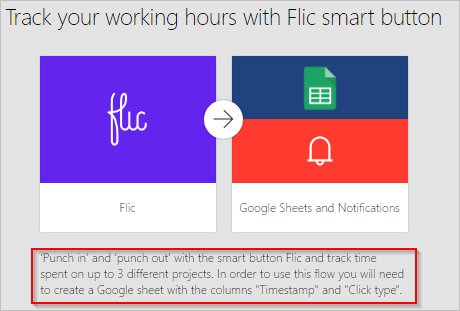
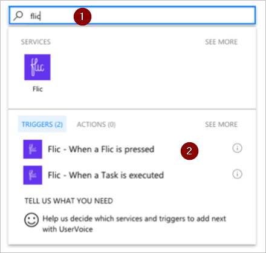
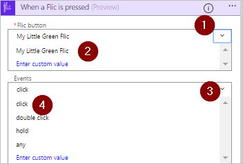

# Flic 스마트 단추(미리 보기)를 눌러 흐름을 실행합니다.
바로 가기 실습에서는 Flic이라고 하는 실제 단추를 눌러 흐름을 트리거합니다. 예를 들어 Flic 키를 눌러 작업 시간을 추적하거나 일정을 차단하거나 이벤트 시 방문자를 세거나 지리적 위치를 저장합니다.

> [!IMPORTANT]
> 흐름을 만들기 전에 Flic의 [Android](https://play.google.com/store/apps/details?id=io.flic.app) 또는 [iOS](https://itunes.apple.com/us/app/flic-app/id977593793?ls=1&mt=8)용 모바일 앱을 사용하여 모든 Flic 속성을 구성합니다.
> 
> 

## 필수 구성 요소
Microsoft Flow에서 Flic을 사용하려면 다음 항목이 있어야 합니다.

* [Microsoft Flow](https://flow.microsoft.com)에 액세스합니다.
* Flic의 [Android](https://play.google.com/store/apps/details?id=io.flic.app) 또는 [iOS](https://itunes.apple.com/us/app/flic-app/id977593793?ls=1&mt=8) 모바일 앱을 다운로드하고 하나 이상의 Flic 쌍을 만드는 데 사용합니다.

## Flic 속성 구성
Flic의 모바일 앱을 사용하여 Flic의 이벤트 프로그래밍 이벤트는 다음과 같습니다.

* 클릭(한 번 빠르게 누름)
* 두 번 클릭(두 번 빠르게 누름)
* 홀드(한 번 길게 누름)

이 스크린샷에서는 Flic 구성 프로세스의 예제를 보여줍니다.

Flic 이벤트를 Microsoft Flow에 연결한 후에 흐름의 트리거로 해당 Flic을 선택할 수 있습니다. 이 연습의 뒷부분에서 트리거를 선택합니다.

## Flic에 의해 트리거되는 흐름 만들기
이 연습에서는 Flic을 사용하여 컨설턴트가 각 클라이언트에서 걸린 시간을 기록하는 흐름을 실행합니다. 컨설턴트는 도착 시 Flic을 한 번 누르고 클라이언트에서 출발하기 직전에 다시 누릅니다. Flic을 누를 때마다 연결된 흐름의 실행을 시작합니다. 흐름은 Google Sheets에 현재 시간을 저장하고 이메일 알림을 보냅니다. 이메일은 흐름 실행에 대한 세부 정보를 포함합니다.

참고: Flic 모바일 앱을 쌍으로 사용하고 하나 이상의 **클릭** 작업을 구성하여 Microsoft Flow를 트리거합니다. 이 스크린샷에서 Microsoft Flow를 트리거하도록 **클릭** 작업을 구성했습니다. 이 연습의 뒷부분에서 Flic을 한 번 누르면(클릭) 흐름을 트리거하도록 구성했습니다.

   

흐름을 만들기 시작해 보겠습니다.

### 템플릿으로 시작
1. [Microsoft Flow](https://flow.microsoft.com)에 로그인합니다.
   
    
2. 검색 상자에 **Flic**을 입력한 다음 검색 아이콘을 선택합니다.
   
    
3. **Flic 스마트 단추를 사용하여 작업 시간 추적** 템플릿을 선택합니다.
   
    

### Google Sheets에서 스프레드시트 만들기
1. 템플릿의 세부 정보를 검토하고 이 템플릿에 Google Sheets의 스프레드시트가 필요하다는 점을 기억합니다.
   
   
2. Google Sheets에서 **ClickType** 및 **TimeStamp**라는 열이 있는 시트를 포함하는 스프레드시트를 만듭니다.
   
      팁: 열의 맨 위에 있는 열 이름을 입력하여 Google Sheets의 열 이름을 지정합니다. 따라서 시트는 이 스크린샷과 같이 표시됩니다.
   
   
   
   참고: 이 연습의 뒷부분에서 이 시트를 사용합니다.

### 흐름에 Flic 트리거 추가
1. 템플릿의 서비스에 로그인한 다음 **계속**을 선택합니다.
   
     템플릿의 모든 필수 서비스에 로그인한 후에 **계속**을 사용할 수 있습니다.
   
    
2. **Flic**을 검색 상자에 입력한 다음 **Flic - Flic을 누를 때** 트리거를 선택합니다.
   
    
3. **Flic - Flic을 누를 때** 카드의 **Flic 단추** 목록에서 사용하려는 Flic을 선택합니다.
4. **이벤트** 목록에서 **클릭**을 선택하여 Flic를 한 번 누를 때 흐름을 트리거하도록 지정합니다.
   
    
   
   필요에 따라 **모든**을 선택하여 각 Flic 이벤트(클릭, 두 번 클릭 또는 홀드)가 흐름을 트리거하도록 지정할 수 있습니다.
   
   **두 번 클릭**은 Flic를 두 번 빠르게 누르는 경우 흐름을 트리거함을 나타냅니다. **홀드**는 Flic을 길게 한 번 누르면 흐름을 트리거함을 나타냅니다.
   
   다른 흐름을 만들고 **이벤트** 목록에서 다른 이벤트를 사용하여 트리거할 수 있습니다. 예를 들어 **두 번 클릭** 이벤트를 사용하여 클라이언트를 남겨둔 시간을 기록할 수 있습니다.

### 시트 구성
   **행 삽입** 카드에서:

1. **파일** 목록에서 이전에 만든 스프레드시트를 선택합니다.
2. **워크시트** 목록에서 시트를 선택합니다.
   
   참고: 시트를 선택한 후에 두 개의 추가 상자가 **행 삽입** 카드에 표시됩니다. 이 상자는 이전에 만든 시트에서 두 개의 열을 나타냅니다.
3. **ClickType** 상자를 선택한 다음 **클릭 형식** 토큰을 선택합니다.
4. **Timestamp** 상자를 선택한 다음 **클릭 시간** 토큰을 선택합니다.
   
    

### 이메일 설정이 올바른지 확인
1. **이메일 알림 보내기** 카드가 이 스크린샷처럼 보이는지 확인합니다.
   
    

### 흐름을 저장하고 테스트합니다.
1. 흐름에 이름을 지정하고 저장합니다.
   
    

작업을 수행한 경우 Flic를 한 번 누르면 흐름을 트리거합니다. 흐름은 시트에서 클릭 형식과 현재 시간을 기록한 다음 이메일을 보냅니다.

1. Flic을 한 번 누릅니다.
2. Google Sheets에서 워크시트를 엽니다. "클릭"과 시간이 각각 채워진 **ClickType** 및 **타임스탬프** 열이 표시됩니다.
   
    
3. 또한 Microsoft Flow 웹 사이트 또는 Microsoft Flow 모바일 앱에서 실행 결과를 볼 수 있습니다. 테스트 실행의 스크린샷은 다음과 같습니다.
   
    
4. 흐름의 실행에서 받은 알림 이메일 본문은 다음과 같습니다.
   
    

추가로 흐름을 저장하려면 Flic을 누를 때 흐름을 확장하여 위치(위도와 경도)를 자동으로 기록하는 것이 좋습니다.

## 자세한 내용
* [단추 흐름 공유](share-buttons.md)
* 단추 흐름이 실행될 때 현재 데이터를 보내기 위해 [단추 트리거 토큰](introduction-to-button-trigger-tokens.md)을 사용하는 방법에 대해 알아보세요.
* [Android](https://aka.ms/flowmobiledocsandroid), [iOS](https://aka.ms/flowmobiledocsios) 또는 [Windows Phone](https://aka.ms/flowmobilewindows)용 Microsoft Flow 모바일 앱 설치.

