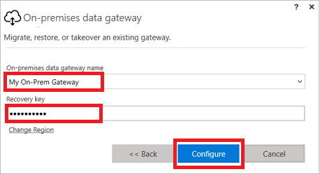

# <a name="understand-on-premises-data-gateways-for-microsoft-flow"></a>Microsoft Flow의 온-프레미스 데이터 게이트웨이 이해
Microsoft SQL Server와 같은 온-프레미스 데이터 원본에 대한 보안 연결을 설정하려면 Microsoft Flow와 함께 온-프레미스 데이터 게이트웨이를 사용합니다.

## <a name="installation-and-configuration"></a>설치 및 구성
### <a name="prerequisites"></a>필수 구성 요소
최소:

* [.NET Framework 4.6](https://www.microsoft.com/download/details.aspx?id=48130)
* 64비트 버전의 Windows 7 또는 Windows Server 2008 R2(이상)

권장:

* 8코어 CPU
* 8GB 메모리
* 64비트 버전의 Windows Server 2012 R2(이상)

관련 고려 사항:

* 도메인 컨트롤러에는 게이트웨이를 설치할 수 없습니다.
* 꺼지거나, 유휴 상태가 되거나, 인터넷 연결이 중단될 가능성이 있는 랩톱 등의 컴퓨터에 게이트웨이를 설치해서는 안 됩니다.
* 무선 네트워크에서는 게이트웨이 성능이 떨어질 수 있습니다.

## <a name="install-a-gateway"></a>게이트웨이 설치
> [!IMPORTANT]
> Microsoft SharePoint 데이터 게이트웨이는 이제 HTTP와 HTTPS 트래픽을 모두 지원합니다.
> 
> 

1. [설치 프로그램을 다운로드](https://go.microsoft.com/fwlink/?LinkID=820931)한 다음 실행합니다.
   
    
2. 설치 마법사의 첫 화면에서 **다음**을 선택하여 랩톱에 게이트웨이를 설치하는 것과 관련한 미리 알림을 승인합니다.
   
    
3. 설치 위치를 선택합니다.
4. 사용약관 및 개인 정보 취급 방침에 동의합니다.
5. **설치**를 선택합니다.
   
    
6. **사용자 계정 컨트롤** 대화 상자에서 **예**를 선택하여 계속합니다.
7. **온-프레미스 데이터 게이트웨이** 화면에서 게이트웨이에 로그인하는 데 사용할 계정에 대한 이메일 주소를 입력하고, **로그인**을 선택한 후, 로그인 프로세스를 완료합니다.
   
    

## <a name="register-new-gateway-or-take-over-existing-gateway"></a>새 게이트웨이 등록 또는 기존 게이트웨이 인수
1. **이 컴퓨터에 새 게이트웨이 등록** 또는 **기존 게이트웨이 마이그레이션, 복원 또는 인수**를 선택한 후 **다음**을 선택합니다.
   
    
2. 새 게이트웨이를 구성하려면, **새 온-프레미스 데이터 게이트웨이 이름** 상자에 이름을 입력하고, **복구 키** 상자에 복구 키를 입력하고, **복구 키 확인** 상자에 동일한 복구 키를 입력합니다. **구성**을 선택한 후 **닫기**를 선택합니다.
   
    
3. 최소 8자 이상을 포함하는 복구 키를 지정하여 안전한 위치에 보관합니다. 게이트웨이를 마이그레이션, 복원 또는 인수하려면 이 키가 필요합니다.
4. 기존 게이트웨이를 마이그레이션, 복원 또는 인수하려면 게이트웨이의 이름과 복구 키를 입력하고 **구성**을 선택한 다음 나타나는 지침을 따릅니다.
   
    

## <a name="restart-the-gateway"></a>게이트웨이 다시 시작
게이트웨이는 Windows서비스 형태로 실행되며 다른 Windows서비스와 마찬가지로 여러 방법으로 시작 및 중지할 수 있습니다. 예를 들어, 게이트웨이가 실행되는 컴퓨터에서 상승된 권한으로 명령 프롬프트를 열고 다음 명령 중 하나를 실행합니다.

* 서비스를 중지하려면 다음 명령을 실행합니다.

```batchfile
    net stop PBIEgwService
```

* 서비스를 시작하려면 다음 명령을 실행합니다.

```batchfile
    net start PBIEgwService
```

## <a name="configure-a-firewall-or-proxy"></a>방화벽 또는 프록시 구성
게이트웨이에 대한 프록시 정보를 제공하는 것과 관련한 정보는 [프록시 설정 구성](https://powerbi.microsoft.com/documentation/powerbi-gateway-proxy/)을 참조하세요.

PowerShell 프롬프트에서 다음 명령을 실행하여 방화벽 또는 프록시가 연결을 차단하고 있는지 확인할 수 있습니다. 이 명령은 Azure Service Bus에 대한 연결을 테스트합니다. 이 명령은 네트워크 연결만을 테스트하며, 클라우드 서버 서비스나 게이트웨이에 영향을 미치지 않습니다. 이 명령은 컴퓨터가 인터넷에 연결되었는지 판단하는 데 도움이 됩니다.

```powershell
Test-NetConnection -ComputerName watchdog.servicebus.windows.net -Port 9350
```

결과는 아래 출력과 같아야 합니다. **TcpTestSucceeded**가 *true*가 아니면 방화벽에 의해 차단되었을 수 있습니다.

    ComputerName           : watchdog.servicebus.windows.net
    RemoteAddress          : 70.37.104.240
    RemotePort             : 5672
    InterfaceAlias         : vEthernet (Broadcom NetXtreme Gigabit Ethernet - Virtual Switch)
    SourceAddress          : 10.120.60.105
    PingSucceeded          : False
    PingReplyDetails (RTT) : 0 ms
    TcpTestSucceeded       : True

자세한 정보가 필요하면 **ComputerName** 및 **Port** 값을 이 토픽의 뒷부분 **포트 구성**에 나오는 값으로 대체합니다.

방화벽은 Azure Service Bus에서 Azure Data Center로의 연결도 차단할 수 있습니다. 여기에 해당하는 경우 해당 데이터 센터의 지역에 대한 모든 [IP 주소](https://www.microsoft.com/download/details.aspx?id=41653)를 허용 목록에 지정(차단 해제)할 수 있습니다.

## <a name="configure-ports"></a>포트 구성
게이트웨이는 Azure Service Bus에 대한 아웃바운드 연결을 만듭니다. 아웃바운드 포트 TCP 443(기본값), 5671, 5672, 9350 ~ 9354에서 통신합니다. 게이트웨이에는 인바운드 포트가 필요하지 않습니다.

[하이브리드 솔루션](https://azure.microsoft.com/documentation/articles/service-bus-fundamentals-hybrid-solutions/)에 대해 자세히 알아봅니다.

| 도메인 이름 | 아웃바운드 포트 | 설명 |
| --- | --- | --- |
| *.analysis.windows.net |443 |HTTPS |
| *.login.windows.net |443 |HTTPS |
| *.servicebus.windows.net |5671-5672 |고급 메시지 큐 프로토콜(AMQP) |
| *.servicebus.windows.net |443, 9350-9354 |TCP의 서비스 버스 릴레이에 대한 수신기(액세스 제어 토큰 획득에 443 필요) |
| *.frontend.clouddatahub.net |443 |HTTPS |
| *.core.windows.net |443 |HTTPS |
| login.microsoftonline.com |443 |HTTPS |
| *.msftncsi.com |443 |게이트웨이에 연결할 수 없는 경우 인터넷 연결을 테스트하는 데 사용됩니다. |

도메인 대신 IP 주소를 허용 목록으로 지정해야 할 경우 [Microsoft Azure Datacenter IP 범위 목록](https://www.microsoft.com/download/details.aspx?id=41653)을 다운로드하여 사용할 수 있습니다. 일부 경우 정규화된 도메인 이름 대신 IP 주소를 통해 Azure Service Bus 연결이 수행됩니다.

## <a name="sign-in-account"></a>로그인 계정
사용자는 직장 또는 학교 계정으로 로그인합니다. 이것이 조직 계정입니다. Office 365 제품에 로그인하였고 직장 전자 메일을 입력하지 않은 경우 nancy@contoso.onmicrosoft.com처럼 보일 수 있습니다. 클라우드 서비스 안에서 사용자 계정은 Azure ADD(Active Directory)의 테넌트 안에 저장됩니다. 대부분의 경우에서 AAD 계정의 UPN 은 전자 메일 주소와 일치합니다.

## <a name="windows-service-account"></a>Windows Service 계정
온-프레미스 데이터 게이트웨이는 Windows 서비스 로그온 자격 증명에 *NT SERVICE\PBIEgwService* 를 사용하도록 구성됩니다. 기본적으로 서비스 형태의 로그온 권한이 있습니다. 이것은 게이트웨이를 설치하는 컴퓨터의 컨텍스트에 해당합니다.

온-프레미스 데이터 원본이나 클라우드 서비스에 로그인한 직장 또는 학교 계정에 연결하는 데 사용되는 계정이 아닙니다.

## <a name="tenant-level-administration"></a>테넌트 수준 관리

다른 사용자가 설치 및 구성한 모든 게이트웨이를 테넌트 관리자가 관리할 수 있는 단일 위치는 현재 없습니다.  테넌트 관리자인 경우 조직의 사용자에게 설치하는 모든 게이트웨이에 관리자로 추가하도록 요청하는 것이 좋습니다. 이렇게 하면 게이트웨이 설정 페이지 또는 [PowerShell 명령](https://docs.microsoft.com/power-bi/service-gateway-high-availability-clusters#powershell-support-for-gateway-clusters)을 통해 조직의 모든 게이트웨이를 관리할 수 있습니다.

## <a name="frequently-asked-questions"></a>질문과 대답
### <a name="general-questions"></a>일반적인 질문
**질문:** 게이트웨이는 어떤 데이터 원본을 지원하나요?
**대답:**

* SQL Server
* SharePoint
* Oracle
* Informix
* Filesystem
* DB2

**질문:** SQL Azure와 같은 클라우드의 데이터 원본에는 게이트웨이가 필요한가요?
**대답:** 아니요. 게이트웨이는 온-프레미스 데이터 원본에만 연결할 수 있습니다.

**질문:** 실제 Windows 서비스를 무엇이라고 하나요?
**대답:** 서비스에서 게이트웨이는 **Power BI Enterprise Gateway Service**라고 합니다.

**질문:** 클라우드로부터 게이트웨이에 대한 인바운드 연결이 있나요?
**대답:** 아니요. 게이트웨이는 Azure Service Bus에 대한 아웃바운드 연결을 사용합니다.

**질문:** 아웃바운드 연결을 차단한 경우 어떻게 되나요? 열려면 어떻게 해야 하나요?
**대답:** 게이트웨이가 사용하는 [포트](gateway-reference.md#configure-ports) 및 호스트를 참조하세요.

**질문:** 게이트웨이는 데이터 원본과 동일한 컴퓨터에 설치해야 하나요?
**대답:** 아니요. 게이트웨이는 제공된 연결 정보를 사용하여 데이터 원본에 연결합니다. 이런 점에서 게이트웨이를 클라이언트 응용 프로그램으로 생각할 수 있습니다. 제공된 서버 이름에 연결할 수 있기만 하면 됩니다.

**질문:** 게이트웨이로부터 데이터 원본에 대해 쿼리를 실행할 때 대기 시간은 어떻게 되나요? 최상의 아키텍처는 무엇인가요?
**대답:**  네트워크 대기 시간을 줄이려면 게이트웨이를 가능한 데이터 원본에 근접하게 설치합니다. 게이트웨이를 실제 데이터 원본에 설치할 수 있다면 발생하는 대기 시간을 최소화할 수 있습니다. 데이터 센터도 고려해야 합니다. 예를 들어 서비스에서 미국 서부 데이터 센터를 사용하고 SQL Server는 Azure VM에서 호스팅되는 상황에서, 서부에도 Azure VM을 배치하고자 합니다. 그러면 대기 시간을 최소화하고 Azure VM에 대한 송신 요금을 피할 수 있습니다.

**질문:** 네트워크 대역폭에 대한 요구 사항이 있나요?
**대답:** 네트워크 연결에 대한 처리량이 높으면 좋습니다. 환경마다 각기 차이점이 있으며 보내는 데이터의 크기가 결과에 영향을 미칩니다. ExpressRoute를 사용하면 온-프레미스와 Azure Data Center 간에 일정 수준의 처리량을 보장할 수 있습니다.

타사 도구인 [Azure Speed Test 앱](http://azurespeedtest.azurewebsites.net/)을 사용하여 처리량을 확인할 수 있습니다.

**질문:** Azure Active Directory 계정으로 게이트웨이 Windows 서비스를 실행할 수 있나요?
**대답:** 아니요. Windows 서비스에는 유효한 Windows 계정이 있어야 합니다. 기본적으로 서비스 SID, *NT SERVICE\PBIEgwService*로 실행됩니다.

**질문:** 결과는 어떻게 클라우드로 보내나요?
**답변:** 결과는 Azure Service Bus를 사용하여 전송됩니다. 자세한 내용은 참조 [작동 원리](gateway-reference.md#how-the-gateway-works)를 참조하세요.

**질문:** 내 자격 증명은 어디에 저장되나요?
**대답:** 데이터 원본에 대해 입력한 자격 증명은 게이트웨이 클라우드 서비스에 암호화되어 저장됩니다. 자격 증명은 게이트웨이 온-프레미스에서 해독됩니다.

### <a name="high-availabilitydisaster-recovery"></a>고가용성/재해 복구
**질문:** 게이트웨이에서 고가용성 시나리오에 맞는 계획이 있나요?
**답변:** 네, 고가용성은 [현재 사용할 수 있습니다](https://flow.microsoft.com/blog/gateway-ha-increased-apply-to-each).

**질문:** 재해 복구에 어떤 옵션을 사용할 수 있나요?
**대답:** 복구 키를 사용하여 게이트웨이를 복원 또는 이동할 수 있습니다.

**질문:** 복구 키의 장점은 무엇인가요?
**대답:** 게이트웨이를 복구하거나 마이그레이션할 수 있습니다.

### <a name="troubleshooting-questions"></a>문제 해결 질문
**질문:** 게이트웨이 로그는 어디에 있나요?
**대답:** 이 토픽의 뒷부분에 나오는 [도구](gateway-reference.md#tools)를 참조하세요.

**질문:** 어떤 쿼리를 온-프레미스 데이터 원본으로 보내고 있는지 어떻게 확인하나요?
**대답:** 보내는 쿼리를 포함하는 쿼리 추적을 활성화할 수 있습니다. 문제 해결을 마치면 원래 값으로 되돌려야 합니다. 쿼리 추적을 활성화된 상태로 두면 로그가 너무 커지게 됩니다.

데이터 원본에서 쿼리를 추적하는 도구를 살펴볼 수도 있습니다. 예를 들어, Extended Events나 SQL Profiler for SQL Server 및 Analysis Services를 사용할 수 있습니다.

## <a name="how-the-gateway-works"></a>게이트웨이 작동 원리


사용자가 온-프레미스 데이터 원본과 연결된 요소와 상호 작용할 때:

1. 클라우드 서비스는 데이터 원본에 대해 암호화된 자격 증명과 함께 쿼리를 만들고 이 쿼리를 게이트웨이가 처리할 수 있게 큐로 보냅니다.
2. 게이트웨이 클라우드 서비스는 이 쿼리를 분석하고 [Azure Service Bus](https://azure.microsoft.com/documentation/services/service-bus/)에 요청을 푸시합니다.
3. 온-프레미스 데이터 게이트웨이는 보류 중인 요청에 대해 Azure Service Bus를 폴링합니다.
4. 게이트웨이가 쿼리를 받고, 자격 증명을 해독한 다음 데이터 원본을 해당 자격 증명과 연결합니다.
5. 게이트웨이가 실행을 위해 쿼리를 데이터 원본에 보냅니다.
6. 데이터에서 결과를 게이트웨이로 돌려 보내며 그 다음 클라우드 서비스로 보냅니다. 그러면 서비스에서 결과를 사용합니다.

## <a name="troubleshooting"></a>문제 해결
### <a name="update-to-the-latest-version"></a>최신 버전으로 업데이트
게이트웨이 버전이 만료되면 많은 문제가 표면화될 수 있습니다. 최신 버전인지 확인합니다.  게이트웨이를 최근에 업데이트하지 않은 경우 최신 버전을 설치하고 문제가 발생하는지 확인하는 것이 좋습니다.

#### <a name="error-failed-to-add-user-to-group---2147463168---pbiegwservice---performance-log-users---"></a>오류: 사용자를 그룹에 추가하지 못했습니다.  (-2147463168   PBIEgwService   성능 로그 사용자)
지원되지 않는 도메인 컨트롤러에 게이트웨이를 설치하려고 시도한 경우 이 오류가 나타날 수 있습니다. 도메인 컨트롤러가 아닌 컴퓨터에 게이트웨이를 설치해야 합니다.

## <a name="tools"></a>도구
### <a name="collecting-logs-from-the-gateway-configurator"></a>게이트웨이 구성 도구에서 로그 수집
게이트웨이에 대해 몇 가지 로그를 수집할 수 있습니다. 항상 로그에서 시작하세요.

1. 설치 프로그램 로그
   
    %localappdata%\Temp\On-premises_data_gateway_*.log
2. 구성 로그
   
    %localappdata%\Microsoft\on-premises data gateway\GatewayConfigurator*.log
3. 엔터프라이즈 게이트웨이 서비스 로그
   
    C:\Users\PBIEgwService\AppData\Local\Microsoft\on-premises data gateway\Gateway*.log
4. 이벤트 로그

**온-프레미스 데이터 게이트웨이 서비스** 이벤트 로그는 **응용 프로그램 및 서비스 로그** 아래에 있습니다.


### <a name="fiddler-trace"></a>Fiddler 추적
[Fiddler](http://www.telerik.com/fiddler)는 HTTP 트래픽을 모니터링하는 Telerik의 무료 도구입니다.  클라이언트 컴퓨터에서 Power BI 서비스를 앞뒤로 살펴볼 수 있습니다. 이렇게 오류와 기타 관련 정보를 확인할 수 있습니다.

