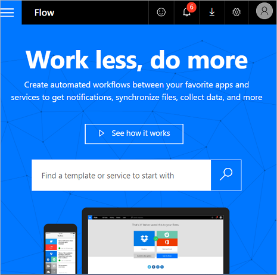
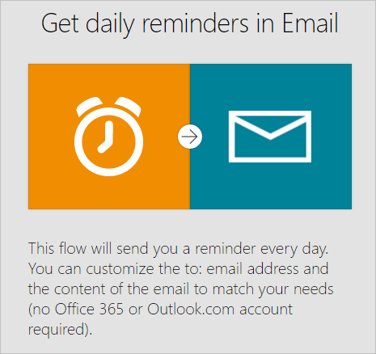
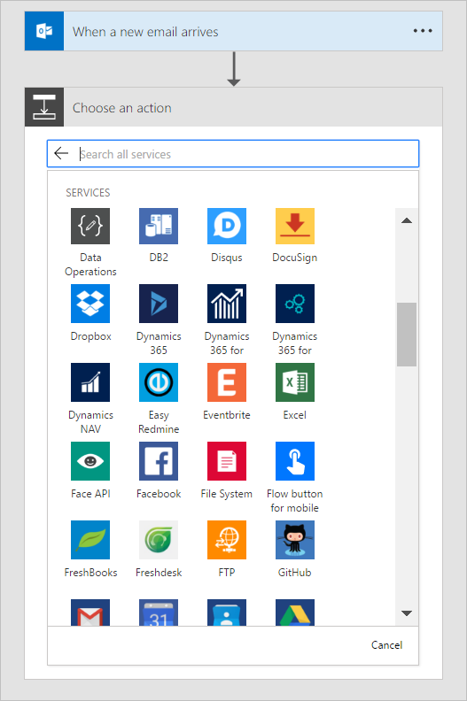

# Microsoft Flow 시작 #

<iframe width="560" height="315" src="https://www.youtube.com/embed/iMteXfAvDSE?list=PL8nfc9haGeb55I9wL9QnWyHp3ctU2_ThF" frameborder="0" allowfullscreen></iframe>

환영합니다! Microsoft Flow는 자주 사용하는 앱과 서비스 사이에 자동화된 워크플로를 만들어 파일 동기화, 알림 수신, 데이터 수집 등의 작업을 수행하는 데 도움이 되는 서비스입니다.

기본 흐름 형식은 [자동화됨](get-started-logic-flow.md), [단추](introduction-to-button-flows.md), [예약됨](run-scheduled-tasks.md) 및 [비즈니스 프로세스](business-process-flows-overview.md) 흐름입니다.

Dynamics 365 고객 관계 사용자 지정자인 경우 [워크플로](configure-workflow-steps.md), [작업](create-actions.md), [모바일 작업 흐름](create-mobile-task-flow.md) 및 [대화](use-cds-for-apps-dialogs.md)를 포함하는 클래식 앱용 Common Data Service 프로세스에 익숙할 수 있습니다.

가장 먼저 해야 할 단계는 [등록](sign-up-sign-in.md)입니다. 이미 Microsoft Flow 계정이 있는 경우 태블릿, 데스크톱 컴퓨터 또는 휴대폰에서 바로 [로그인](https://flow.microsoft.com/signin)하세요.

## 시작 페이지 확인 ##

Microsoft Flow의 [시작 페이지에서](https://flow.microsoft.com) [다양한 템플릿 집합을 탐색하고](https://flow.microsoft.com/templates) Microsoft Flow에 대한 몇 가지 주요 기능에 대해 알아볼 수 있습니다. Microsoft Flow로 어떤 작업을 할 수 있고 Microsoft Flow가 어떻게 비즈니스와 생활에 유용한지 간단히 확인할 수 있습니다.

Microsoft Flow를 사용하면 다음을 수행할 수 있습니다.

- 템플릿 및 서비스를 쉽게 검색할 수 있습니다.

    

- 가장 인기 있는 서비스 중에서 선택합니다.

    

- 각 흐름의 개요를 확인합니다.

    

각 템플릿은 특정 목적에 맞게 설계되었습니다. 예를 들어 상사가 메일을 보냈을 때 문자 메시지 전송, Twitter 잠재 고객을 Dynamics 365에 추가, 파일 백업을 위한 템플릿이 있습니다. 이러한 템플릿은 빙산의 일각일 뿐이며, 정확히 필요한 프로세스에 맞는 사용자 지정 흐름을 만들도록 영감을 줍니다.

## 첫 번째 흐름 만들기 ##

1. 유용한 템플릿을 선택합니다. 간단한 템플릿은 [**메일로 일별 미리 알림 받기**](https://flow.microsoft.com/galleries/public/templates/45a3399aa29345308f08b6db0a9c85b9/)입니다.

    

1. **계속**을 선택합니다.

    

1. 일별 미리 알림을 보낼 메일 주소를 입력합니다. 다음으로, 미리 알림 메시지를 입력합니다. 마지막으로 **흐름 만들기**를 선택한 다음 흐름이 예상대로 실행되고 있는지 확인합니다.

    

    > [!NOTE]
    > 해당 이벤트에서 발생하는 흐름 및 작업을 트리거하는 조건을 탐색할 수 있습니다. 설정을 자유롭게 조절하여 자체적인 흐름을 만듭니다. 동작을 추가하거나 삭제할 수도 있습니다.

1. **완료**를 선택합니다.

[이 자습서에 따라](get-started-logic-template.md) 템플릿에서 흐름을 만드는 방법에 대해 자세히 알아보세요.

## 아이디어 발휘 ##

이제 템플릿에서 첫 번째 흐름을 만들었습니다. Microsoft Flow에서 지원하는 [150개 이상의 데이터 원본](https://flow.microsoft.com/connectors/)을 사용하여 [자신만의 흐름을 처음부터 만들어 보세요](get-started-logic-flow.md).

처음부터 흐름을 만들 때는 전체 워크플로우를 제어합니다. 다음은 시작하는 몇 가지 아이디어입니다.

- [여러 단계가 있는 흐름](multi-step-logic-flow.md)
- [일정에 따라 작업 실행](run-scheduled-tasks.md)
- [승인 흐름 만들기](wait-for-approvals.md)
- [작동 중인 흐름 보기](see-a-flow-run.md)
- [템플릿 게시](publish-a-template.md)

## 모바일 앱 사용 ##

[Android](https://aka.ms/flowmobiledocsandroid), [iOS](https://aka.ms/flowmobiledocsios) 또는 [Windows Phone](https://aka.ms/flowmobilewindows)용 Microsoft Flow 모바일 앱을 다운로드합니다. 이 앱을 사용하여 [흐름 활동을 모니터링하고](mobile-monitor-activity.md), [흐름을 관리하고](mobile-manage-flows.md), [템플릿에서 흐름을 만들 수 있습니다](mobile-create-flow.md).

## 기꺼이 도와드리겠습니다. ##

Microsoft Flow가 사용자 환경에 큰 도움이 되기를 기대합니다. [안내되는 학습](https://flow.microsoft.com/guided-learning/) 자습서를 확인하고 [커뮤니티에 가입](http://go.microsoft.com/fwlink/?LinkID=787467)하여 궁금한 점과 아이디어를 나눌 수 있습니다. 문제가 있으면 [지원에 문의](http://go.microsoft.com/fwlink/?LinkID=787479)하세요.
