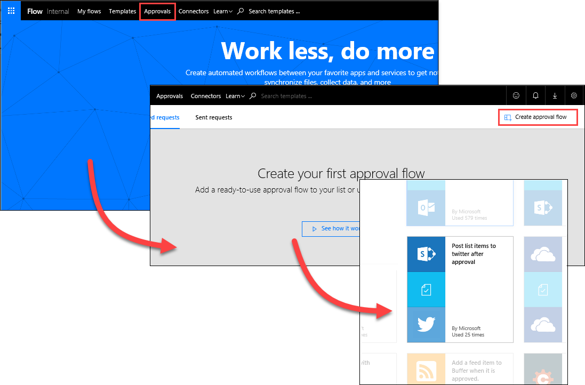
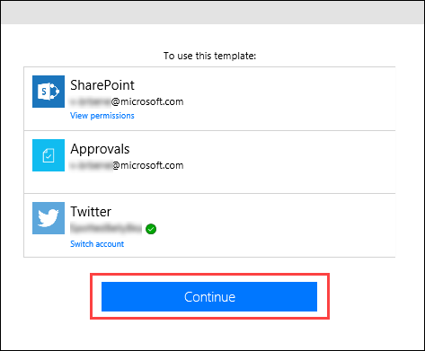

# 승인 요청 만들기
이전 항목에서 간단한 방법으로 SharePoint 목록을 사용하여 Twitter 피드를 강화하는 방법을 알아보았습니다. 이 항목에서는 승인을 사용하여 보다 비즈니스 친화적인 시나리오를 작성하는 방법을 배웁니다. 이러한 방식으로 SharePoint 목록에 액세스할 수 있는 모든 사용자는 트윗에 기여할 수 있으며 소셜 미디어 팀은 이러한 트윗을 승인하거나 거부할 수 있습니다. 팀은 계정 및 고객에게로 이동하는 콘텐츠의 컨트롤을 유지 관리합니다. 

## 승인 요청 흐름 만들기
1. **Microsoft Flow** 홈페이지에서 **승인**을 선택하고, **승인 흐름 만들기**를 선택한 다음 아래로 스크롤하고 **승인 후 Twitter에 목록 항목 게시** 템플릿을 선택합니다. 
   
    
2. **SharePoint**, **승인** 및 **Twitter**에 대한 계정 자격 증명을 확인하고 **계속**을 선택합니다. 
   
    

기본적으로 이 템플릿은 특정 목록에 새 항목이 만들어질 때마다 승인 프로세스를 시작하고 항목이 승인되면 Twitter에 트윗을 게시합니다. 이 항목에서는 승인 응답으로 SharePoint 목록을 업데이트하고, 승인 여부를 표시하고, 승인자가 제안된 트윗에 추가한 모든 주석을 추가하는 단계를 추가하여 이 프로세스를 수정합니다. 

1. 앞에서 만든 **ContosoTweets** SharePoint 목록에서 두 개의 새 열을 추가합니다.
   
   1. 더하기 기호 "**+**" 선택 및 **예/아니요** 선택
   2. **ApprovalStatus** 입력 및 **만들기** 선택
   3. 더하기 기호 "**+**" 선택 및 **텍스트 한 줄** 선택
   4. **ApproverComments** 입력 및 **저장** 선택
      
      
2. 다시 **Microsoft Flow**의 **새 항목이 만들어진 경우** 작업에서 다음 값을 입력합니다.
   
   * **사이트 주소**: 팀 SharePoint URL
   * **목록 이름**: ContosoTweets
     
     
3. **승인 시작** 작업에서 **편집**을 선택하여 모든 필드를 표시합니다. 
   
    
4. **제목**에 **다음에 대한 새 트윗**을 입력하고 동적 콘텐츠 목록에서 **제목**을 선택합니다. 
   
    
5. **다음에 할당됨**에 사용자 이름 또는 테스트 사용자 이름을 입력하고 선택합니다. 
   
    
6. **세부 정보**에서 기본 항목을 제거하고 단어 **on** 및 **by**로 연결된 동적 콘텐츠 목록에서 **TweetContent**, **TweetDate** 및 **Created by DisplayName**을 추가합니다. 
   
    
7. **항목 링크**에서 SharePoint 목록의 URL을 복사하여 붙여넣고 **항목 링크 설명**에 **Contoso 트윗 목록**을 입력합니다. 
   
    
8. **조건** 작업에서 **예인 경우** 상자로 마우스를 가리키고, 더하기 기호 "**+**"를 선택하고, **작업 추가**를 선택합니다. 
   
    
9. **업데이트 항목**을 검색하고, **SharePoint** 커넥터를 선택하고, **SharePoint - 업데이트 항목** 작업을 선택합니다.
   
    
10. **사이트 주소** 및 **목록 이름**에 사이트 URL 및 **ContosoTweets** 목록을 다시 입력하고, **ID**에 동적 콘텐츠 목록의 **ID** 를 입력합니다. 
    
     
11. **제목** 필드를 선택하고, 동적 콘텐츠 목록에서 **제목**을 검색합니다. **새 항목이 만들어진 경우** 작업에서 **제목** 항목을 추가합니다. 
    
     
12. **ApprovalStatus**를 선택하고 값을 **예**로 설정한 다음 **ApproverComments**를 선택하고 값을 동적 콘텐츠 목록의 **주석**으로 설정합니다. 
    
     
13. **아니요이면 *아무 것도 안 함*** 상자의 아래쪽 가까이에서 **작업 추가**를 선택합니다.
    
     
14. **예인 경우** 구성에 사용한 동일한 단계를 사용하여 **SharePoint - 업데이트 항목** 작업을 만들고 **ApprovalStatus**를 **아니요**로 설정을 제외하고 동일한 값으로 필드를 구성합니다. 
    
     
15. **트윗 게시** 작업을 선택하고, **편집**을 선택하고, **트윗 텍스트**를 동적 콘텐츠 목록의 **TweetContent**로 설정합니다.  페이지 맨 아래에서 **흐름 만들기**를 선택하여 작업을 저장합니다. 
    
     

이는 Microsoft Flow가 팀에 대한 생산성을 증대시킬 수 있는 하나의 방법입니다. 팀은 아이디어, 관련 뉴스 또는 제품 지침에 기여할 수 있으며 사용자는 여전히 고객에게 트윗되는 것에 대한 제어를 유지 관리합니다.

다음 항목에서는 승인자가 제안된 트윗에 대한 새 요청을 받는 경우를 살펴보겠습니다. 

