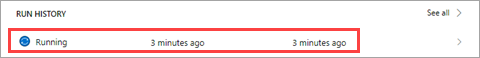
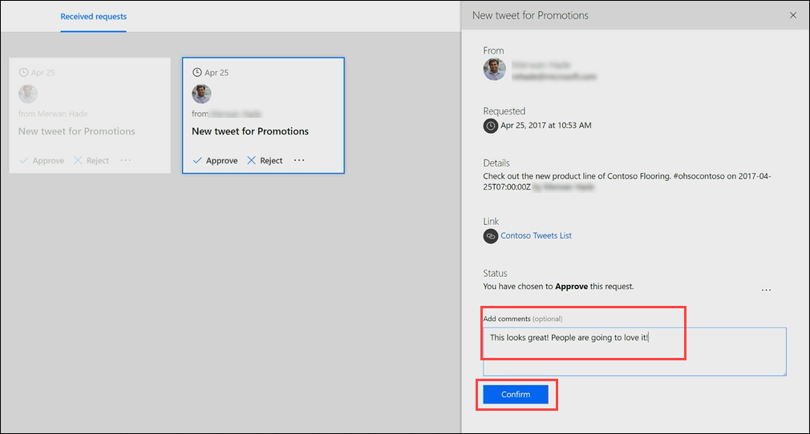

# 승인 요청 처리
이전 항목에서는 SharePoint 목록에 저장된 트윗에 대한 승인 프로세스를 작성하는 방법을 알아보았습니다.  이 항목에서는 승인자가 새 승인 요청을 받는 경우 환경이 어떻게 보여지는지에 대해 알아봅니다. 

## 요청 만들기 및 처리
먼저 SharePoint 목록에 항목을 추가해야 하며 그런 다음 해당 항목에 대한 승인 요청을 처리할 수 있습니다.

1. 이전 항목에서 구성된 SharePoint 목록 **ContosoTweets**를 엽니다.  **새로 만들기**를 선택하여 새 트윗을 만듭니다. 
   
    
2. 다음 값을 필드에 추가하고 **저장**을 선택합니다.
   
   * **제목** – 프로모션
   * **TweetContent** – Contoso Flooring #ohsocontoso의 새 줄 확인
   * **TweetDate** – 현재 날짜
     
     
3. **Microsoft Flow**에서 **내 흐름**을 선택합니다. 
4. 이전 항목에서 구성된 **승인 후 Twitter에 목록 항목 게시** 흐름을 선택한 다음 **실행 기록** 아래에서 실행 중인 흐름을 선택합니다.
   
    
5. **새 항목이 만들어진 경우** 트리거를 선택합니다. 방금 만든 목록 항목에 대한 정보가 표시되는지 확인합니다.
   
    
6. **Outlook**의 받은 편지함에서 자동화된 승인 메일을 연 다음 **승인**을 선택합니다. 
   
    
7. **승인 센터**에서 요청의 세부 정보를 보고, 주석을 추가하고, **확인**을 선택합니다. 
   
    
8. **SharePoint**에서 **ContosoTweets** 목록을 새로 고치고 **ApprovalStatus**가 **예**이고, 입력한 주석이 표시되는지 확인합니다. 
   
    

이 항목에서는 승인자의 관점에서 승인 요청 이메일을 받을 때부터 승인 센터에서 요청을 처리하기까지의 환경을 살펴보았습니다.

