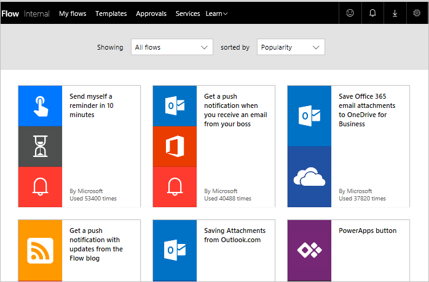
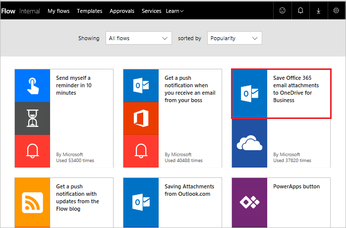

# 템플릿에서 흐름 만들기
Microsoft Flow에 대한 가이드 학습을 시작합니다. 이 단원에서는 Microsoft Flow 환경을 자세히 살펴보고 **첫 번째 흐름을 빌드**할 수 있습니다.

보다 의미 있는 방식으로 이미 사용 중인 서비스에 연결하는 데 도움을 주는 많은 수의 **선택 가능한 템플릿**이 있으므로 Microsoft Flow를 시작하는 것은 쉽습니다.  

## Microsoft Flow 템플릿
[ Microsoft Flow 웹 사이트](https://ms.flow.microsoft.com)를 살펴보고 **템플릿** 메뉴를 엽니다. 목록을 스크롤하면 Microsoft Flow를 통해 많은 서비스에 연결할 수 있는 것을 볼 수 있습니다.

## 템플릿 선택
전자 메일을 통한 **첨부 파일에 대한 검색**은 시간이 많이 걸릴 수 있으며 이 흐름은 OneDrive의 폴더로 **모든 전자 메일 첨부 파일을 저장**하여 시간을 절약합니다.

**비즈니스용 OneDrive에 Office 365 전자 메일 첨부 파일 저장** 템플릿을 선택합니다.

## 흐름 만들기 및 관리
이는 **흐름을 작성하는 데 필요한** 관련 질문에 답하는 **한 번 클릭** 템플릿 중 하나입니다.

템플릿 그래픽에는 성공하기 위해 템플릿이 **수행하는 것과 필요한** 것에 대한 **설명**이 있습니다.

**Office 365 Outlook** 및 **SharePoint** 서비스에 대한 **자격 증명을 제공**해야 합니다. 두 서비스를 정기적으로 사용하는 경우 해당 서비스로 이미 로그인됩니다.

1. **흐름 만들기**를 선택합니다.
   
    
   
    그런 다음 결과를 볼 수 있습니다. 
   
    
   
    흐름은 OneDrive에 **폴더를 만들었습니다**. 여기에서 이제 직장 전자 메일로 전자 메일을 전송하는 **모든 첨부 파일**을 자동으로 배치합니다.
2. **내 흐름**을 엽니다.
   
    
3. **방금 만든 흐름**을 선택하여 작동 방식을 봅니다.
   
    
4. **흐름 성공**을 표시하는 **녹색 확인 표시**가 나타납니다. **성공**을 선택하여 실행 기록 및 결과를 봅니다.
   
    
   
    **흐름의 모든 부분**이 성공했습니다. 
   
    

## Microsoft Flow의 중요한 개념
흐름을 작성할 때 알아야 할 사항입니다. 모든 흐름에는 두 개의 주요 부분인 **트리거** 및 **하나 이상의 작업**이 있습니다. 

**트리거**를 흐름에 대한 시작 작업으로 생각할 수 있습니다. 이는 SharePoint를 사용하는 경우 여기에서 가지는 **새 전자 메일에서** 또는 **새 항목이 추가되는 경우**와 같은 것일 수 있습니다. 나중에 배울 **되풀이**라는 트리거를 사용하는 경우 이는 고정된 일정일 수도 있습니다.

**트리거가 호출**될 때 발생하길 원하는 **작업이 활동입니다**. 예를 들어, **파일 만들기**는 OneDrive에 파일을 다시 만듭니다.

다른 작업은 **전자 메일** 보내기, **트윗** 게시, **승인** 시작 또는 그 외 작업일 수 있습니다.
이는 처음부터 직접 흐름을 작성할 때 모두 나중에 이루어집니다. 

## 다음 단원
다음 단원에서는 Microsoft Flow 모바일 앱 및 해당 기능을 살펴봅니다. 

