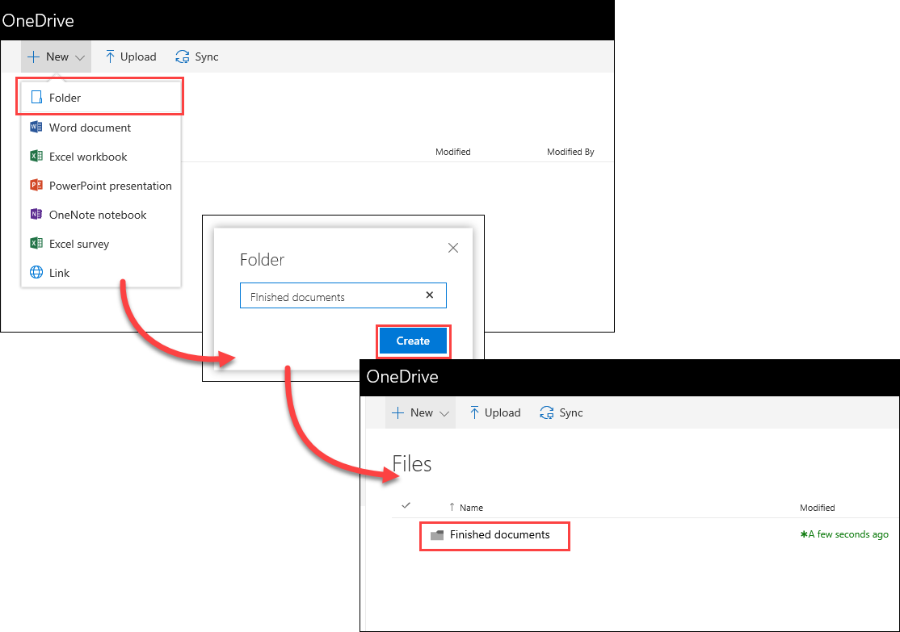
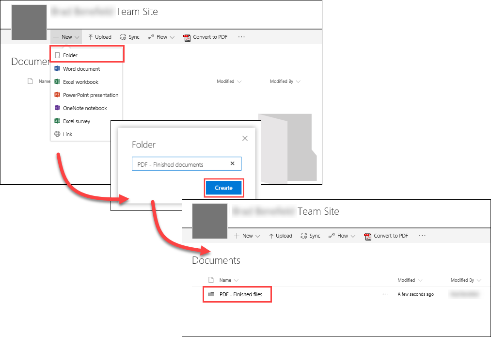
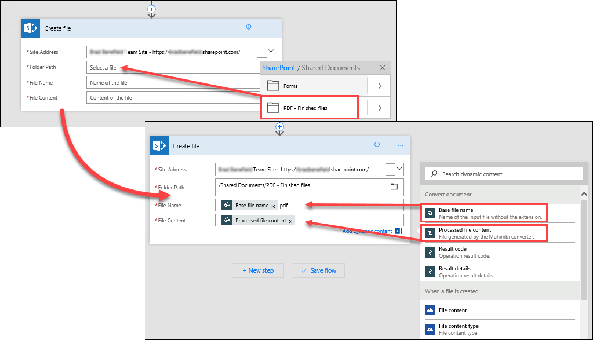
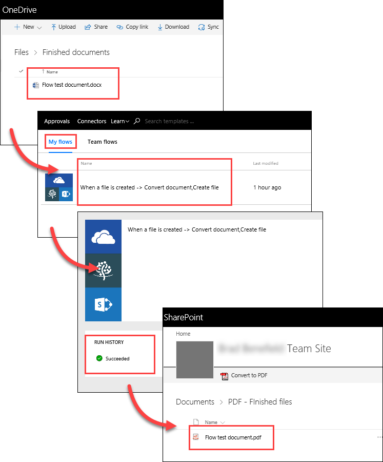

# 문서 변환 및 저장
이 항목에서는 Contoso Flooring에서 Microsoft Flow를 사용하여 문서를 표준 형식으로 자동으로 변환한 다음 클라우드에 보관하기 위해 SharePoint Online에 저장하는 방법을 알아봅니다. 새 파일이 비즈니스용 OneDrive 폴더에 추가된 경우를 감지한 다음 해당 파일을 PDF로 변환하고 SharePoint Online 폴더에 저장하는 흐름을 만듭니다. 

## 필수 구성 요소
이 시나리오의 경우 **Muhimbi**, PDF 변환 서비스를 사용한 계정이 필요합니다. Muhimbi 계정이 없는 경우 [30일 평가판](http://www.muhimbi.com/Products/PDF-Converter-for-SharePoint/Products-PDF-Converter-for-SharePoint-Free-Trial.aspx)을 등록할 수 있습니다. SharePoint Online 사이트를 통해 앱을 배포하기 위한 해당 페이지의 지침을 따릅니다. 

## 원본 및 대상 폴더 만들기
먼저 비즈니스용 OneDrive 및 SharePoint Online에 대한 원본 및 대상 폴더를 만들어야 합니다. 

1. 비즈니스용 OneDrive의 **파일** 아래에서 **완료된 문서**라는 폴더를 만듭니다. 
   
    
2. SharePoint Online의 **공유 문서**에서 **PDF – 완료된 파일**이라는 폴더를 만듭니다. 
   
    

## 흐름 만들기
1. Microsoft Flow에서 **내 흐름**을 선택하고 **빈 페이지에서 만들기**를 선택합니다. 
   
    
2. **수백 개의 커넥터 및 트리거 검색**을 선택합니다.
3. **OneDrive**를 검색하고 **비즈니스용 OneDrive**를 선택한 다음 트리거 **비즈니스용 OneDrive - 파일이 만들어진 경우**를 선택합니다. **폴더**에서 폴더 아이콘을 선택하고 이전 단계에서 만든 **완료된 문서** 폴더를 선택합니다. 
   
    
4. **+ 새 단계**를 선택한 다음 **작업 추가**를 선택합니다. 
   
    
5. **Muhimbi**를 검색하고 **Muhimbi PDF** 커넥터를 선택하고 작업 **Muhimbi PDF – 문서 변환**을 선택합니다.
   
    
6. 이 시점에서 Microsoft Flow에서 Muhimbi에 인증하라는 메시지가 표시됩니다. Microsoft Flow에서 Muhimbi 서비스를 사용하려면 **SharePoint 테넌트 ID**를 사용하여 Muhimbi를 등록해야 합니다. 
   
   1. 테넌트 ID를 찾으려면 SharePoint Online에서 **설정** 기어 아이콘을 선택하고 **사이트 설정**을 선택합니다.
   2. **사이트 모음 관리** 아래에서 **사이트 모음 앱 사용 권한**을 선택합니다. 테넌트 ID는 모든 앱 목록에서 "**@**" 기호 뒤에 오는 식별자입니다. 
      
       
7. **문서 변환** 작업에서 다음 값을 설정합니다.
   
   * **원본 파일 이름**: 동적 콘텐츠 목록에서 **파일 이름**을 선택합니다.
   * **원본 파일 콘텐츠**: 동적 콘텐츠 목록에서 **파일 콘텐츠**를 선택합니다.
   * **출력 형식**: 드롭다운 목록에서 **PDF**를 선택합니다.
     
     

지금까지 다음 단계로 흐름을 구성했습니다. 

1. 흐름은 새 파일이 특정 비즈니스용 OneDrive폴더에 추가될 때마다 트리거됩니다. 
2. Muhimbi 서비스는 해당 파일을 PDF로 변환합니다. 

마지막 단계의 경우 PDF 문서를 팀이 액세스할 수 있는 SharePoint Online 폴더로 이동하는 작업을 추가합니다.  

1. **+ 새 단계**를 선택한 다음 **작업 추가**를 선택합니다.  **SharePoint**를 검색하고 **SharePoint - 파일 만들기** 작업을 선택합니다. 
   
    
2. **파일 만들기** 작업에서 다음 값을 설정합니다.
   
   * **사이트 주소**: SharePoint 사이트의 URL입니다.  
   * **폴더 경로**: 폴더 아이콘을 선택하고 **PDF - 완료된 파일** 폴더로 이동합니다.
   * **파일 이름**: **문서 변환**에 대한 동적 콘텐츠 목록에서 **기본 파일 이름**을 선택한 다음 "**.pdf**"를 추가하면 해당 파일 확장명으로 SharePoint에 저장됩니다. 
   * **파일 콘텐츠**: **문서 변환**에 대한 동적 콘텐츠 목록에서 **처리된 파일 콘텐츠**를 선택합니다.
3. 페이지 맨 위에서 **흐름 만들기**를 선택하여 작업을 저장합니다.
   
    

## 흐름 테스트
1. 흐름을 테스트하려면 새 파일을 비즈니스용 OneDrive의 **완료된 문서** 폴더에 저장합니다. 
2. 흐름에서 **내 흐름**을 선택한 다음 새 흐름을 선택하여 실행 기록을 봅니다. 기본적으로 흐름은 5분마다 실행되도록 구성됩니다. 
3. 흐름이 실행된 후 파일이 PDF로 변환되고 SharePoint **PDF – 완료된 파일** 폴더에 저장되었는지 확인합니다. 
   
    

