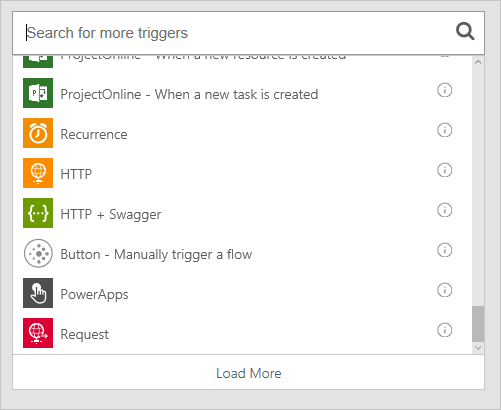

# Microsoft Flow의 구성 요소
이제 Microsoft Flow의 기본 사항을 배웠으므로 **Microsoft Flow의 소개**로 들어가겠습니다. 템플릿에서 흐름을 만들고 처음부터 흐름을 만드는 것을 신속하게 살펴보겠습니다.

## 템플릿 확인
flow.microsoft.com에서 페이지 위쪽의 **템플릿** 링크를 클릭하는 경우 웹 서비스와 함께 지금 바로 사용할 수 있는 몇 가지 템플릿이 나타납니다. 이러한 앱을 탐색하여 **Microsoft Flow로 어떤 작업을 할 수 있고 Microsoft Flow가 어떻게 비즈니스에 유용한지 간단히 확인합니다**.

각 템플릿 흐름은 어떤 일이 발생하는 경우 알림을 수신하고 한 서비스에서 다른 서비스로 새 파일을 복사하거나 SharePoint 승인을 추적하는 것과 같은 특정 목적을 위해 설계되었습니다. 이러한 템플릿은 **사용될 준비가 되어 있습니다**.  계정에 흐름을 추가하도록 **템플릿을 구성**하기만 하면 됩니다. **이 템플릿 사용**을 클릭하고 필수 서비스에 로그인한 다음 나오는 양식을 완료하여 이 작업을 수행합니다.  예를 들어 이는 SharePoint 목록이 수정될 때 전자 메일 알림을 보내는 템플릿에서 만든 흐름입니다. 

사용 가능한 수 백 개의 템플릿이 있으며 **웹용 Microsoft Flow** 또는 **모바일용 Microsoft Flow**에서 찾을 수 있습니다.

## 처음부터 흐름 만들기
템플릿을 사용하여 흐름을 만드는 방법을 살펴봤습니다. 그러나 자동화하려는 작업이 있지만 적절한 템플릿을 찾을 수 없는 경우는 어떻게 합니까? **처음부터 흐름을 작성**할 수 있습니다.  처음부터 흐름을 만들 때 빈 캔버스에서 시작하고 **서비스, 트리거 및 작업**을 추가하여 흐름을 작성합니다.  

## 흐름의 구성 요소
템플릿에서 흐름을 만들든지 처음부터 새로 흐름을 만들든지 간에 흐름에는 순서도와 매우 유사하게 특정 방식으로 함께 작동하는 **구성 요소**가 포함됩니다.

* **서비스**는 흐름에서 데이터의 원본 및 대상입니다.
* **트리거**는 흐름을 시작하는 이벤트입니다.
* **작업**은 흐름에서 수행되는 태스크입니다.
* **조건**은 흐름에서 if/then 논리 분기를 허용합니다.
* **루프**는 두 번 이상 작업을 반복하기 위한 것입니다.

### 서비스
Microsoft Flow는 여러 가지 다른 **응용 프로그램 및 서비스**에 연결할 수 있습니다.  일부 예제 서비스는 **Twitter**, **Github**, **Wunderlist**, **Office 365** 및 **Google 문서도구**입니다.  이들은 Microsoft Flow에서 수행되는 작업에 대한 **대상**을 제공할 뿐만 아니라 Microsoft Flow에 데이터를 제공하는 **원본**입니다.  **flow.microsoft.com** 맨 위의 **서비스** 링크를 클릭하여 서비스의 전체 목록을 볼 수 있습니다.

### 트리거
모든 흐름은 **트리거**로 시작합니다.  다양한 유형의 트리거가 있습니다.  일부는 **특정 사용자가 트윗을 보낼 때** 또는 **파일이 Dropbox 계정에 저장될 때**와 같은 연결된 웹 서비스의 이벤트입니다.  다른 트리거는 **반복 일정으로 흐름 실행** 또는 **웹 요청에 대한 응답으로 흐름 실행**과 같은 기본 제공입니다.  마지막으로 **Microsoft Flow 또는 Microsoft PowerApps의 단추**를 클릭하여 흐름을 시작하는 것과 같은 수동 트리거가 있습니다.  트리거는 종종 흐름에서 작업에 대해 **발생되는 이벤트에 대한 정보를 전달**합니다.

  

### 작업
**작업**은 흐름이 트리거된 후 실제로 **발생**하기를 원하는 것을 나타냅니다.  이는 **알림**, 원본에서 대상으로 **데이터 또는 파일 복사** 또는 **소셜 미디어에 게시** 또는 **일정 시간 동안 지연**과 같은 다른 작업일 수 있습니다.  또한 다른 작업과 함께 사용하도록 **서비스에서 데이터를 검색**하는 작업을 사용할 수도 있습니다.

 

### 조건
**조건**은 흐름에 의사 결정 추가를 허용합니다.  조건이 평가되는 경우 흐름은 **예** 경로 및 **아니오** 경로로 갈라집니다.   예를 들어 **Dropbox**에 게시된 휴가 사진을 **OneDrive**에 복사하려는 경우 파일 이름이 휴가라는 단어를 포함하면 파일을 **OneDrive**에 복사하지만 그렇지 않으면 아무 작업도 하지 않도록 선택하는지 확인하는 **Dropbox 새 파일** 트리거 후 조건을 만들 수 있습니다.

 

### 루프
**루프**는 작업이 반복적으로 발생해야 하거나 항목의 컬렉션에서 항목당 한 번씩 발생해야 하는 경우와 같이 작업을 두 번 이상 실행하도록 허용합니다.

## 다음 단원
이 항목에서는 Microsoft Flow를 살펴봤습니다.  **템플릿**을 검색하고 **처음부터 흐름 만들기**에 대해 알아보았습니다.  앱 및 서비스, 흐름을 시작하는 **트리거**, 흐름에서 이벤트가 발생하도록 하는 **작업**, 의사 결정을 하는 **조건** 및 흐름에서 반복하는 **루프**에 연결하여 흐름을 작성합니다.  **Microsoft Flow에 대해 알아보는 가장 쉬운 방법은 템플릿을 사용하여 시작하고** 이미 사용하고 있는 앱과 서비스에 연결하는 것입니다. 

다음으로 가이드 학습 과정에서 지금까지 학습한 내용을 검토할 예정입니다.

