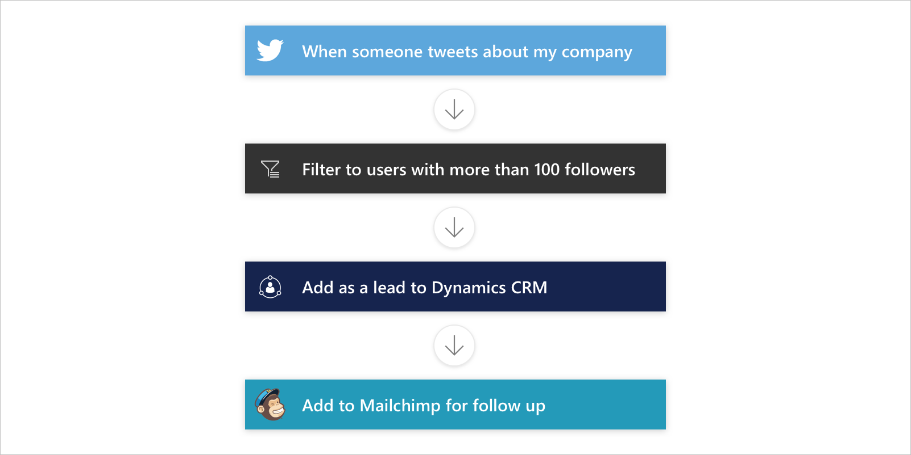
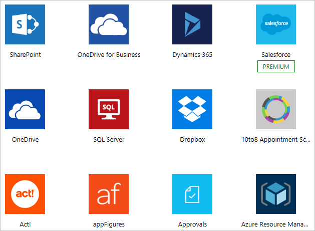
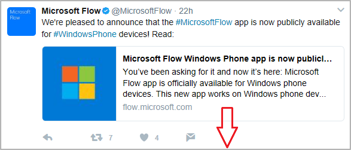

# Microsoft Flow에 대한 가이드 학습
Microsoft Flow에 대한 가이드 학습을 시작합니다. 이 **자습형 온라인 과정**은 순차적인 방법으로 Microsoft Flow를 설명하므로 기초부터 지식을 쌓을 수 있습니다. 과정은 원칙 및 세부 내용을 배우는 데 도움이 되는 논리적 진행을 따라 많은 **시각적 개체 및 예제**와 함께 **이해할 수 있는 청크로 지침**을 제공하도록 설계되었습니다.

이 과정에서는 Microsoft Flow 및 해당 개념을 배우게 됩니다. 사용자 환경에서 **흐름을 빌드**하고, **관리**하고, 사용자 환경에서 **관리**하는 방법을 참조하세요. Contoso Flooring이라는 가상 회사에 대한 정보 및 시나리오가 제공되지만 사용자의 비즈니스 또는 클라이언트의 비즈니스에서 동일한 시나리오를 사용하는 방법을 알아봅니다.

Microsoft Flow를 초보자인 경우 이 과정을 통해 시작할 수 있습니다. 이미 Microsoft Flow에 대한 경험이 있는 경우 이 과정을 통해 개념을 함께 결합하고 모자란 부분을 채울 수 있습니다. 이 과정은 진행 중인 작업이므로 이 과정에서 **진행 상황과 표시하려는 다른 항목을 알려주세요**.

## Microsoft Flow란?
Microsoft Flow는 가장 일반적인 앱 및 서비스에서 **워크플로를 자동화**하여 더욱 우수하고 효율적으로 작업을 할 수 있도록 하는 온라인 **워크플로 서비스**입니다. 예를 들어, 100명이 넘는 팔로워를 가진 사람이 귀사에 대한 트윗을 할 때마다 잠재 고객을 **Dynamics 365** 및 **MailChimp**의 레코드에 추가하는 흐름을 만들 수 있습니다.

등록하면 SharePoint 및 SQL Server와 같은 **100개 이상의 서비스에 연결**하고 **클라우드 또는 온-프레미스 원본에서 데이터를 관리**할 수 있습니다. Microsoft Flow와 함께 사용할 수 있는 응용 프로그램 및 서비스 목록은 지속적으로 증가합니다.

## Microsoft Flow를 통해 수행할 수 있는 작업은 무엇인가요?
Microsoft Flow를 사용하여 자주 사용하는 **응용 프로그램과 서비스** 사이에 **워크플로를 자동화**하고, 파일을 동기화하고, 알림을 수신하고, 데이터를 수집하는 등의 작업을 수행할 수 있습니다. 

예를 들어, 다음과 같은 작업을 **자동화**할 수 있습니다.

* 우선 순위가 높은 알림 또는 전자 메일에 즉시 응답합니다.
* 새 판매 잠재 고객을 캡처, 추적 및 팔로업합니다.
* 한 서비스에서 다른 서비스로 파일을 복사합니다.
* 비즈니스에 대한 데이터를 수집하고 팀과 해당 정보를 공유합니다.
* 승인 워크플로를 자동화합니다.

Microsoft Flow의 일반적인 용도는 **알림을 수신하는** 것입니다. 예를 들어, 판매 잠재 고객이 Dynamics 365 또는 Salesforce에 추가될 때마다 휴대폰에서 전자 메일 또는 푸시 알림을 즉시 받을 수 있습니다.

**Microsoft Flow를 사용하여 파일을 복사**할 수도 있습니다. 예를 들어, Dropbox에 추가된 모든 파일을 팀이 찾을 수 있는 SharePoint로 **자동으로 복사**되도록 할 수 있습니다.

 

 

특정 해시태그로 **누군가가 트윗을 전송**할 때마다 실행되는 흐름을 작성하여 사용자의 비즈니스에 대해 **사람들이 언급하는 내용을 모니터링**할 수 있습니다. 흐름은 해당 트윗에 대한 세부 정보를 SQL Server 데이터베이스, SharePoint 목록 또는 OneDrive(사용자에 대해 작동하는 어떤 서비스든지)에서 호스트되는 Excel 파일로 넣을 수 있습니다. 수집하는 데이터를 사용하여 Power BI에 연결하고, 추세를 찾고, 데이터에 대한 질문을 묻는 작업을 만들 수 있습니다.

마지막으로 **승인 루프를 자동화할 수 있습니다**. SharePoint 목록에서 휴가 요청을 예로 들 수 있습니다.

자세한 내용은 몇 단계 만에 흐름을 빌드하도록 돕는 **템플릿의 목록을 찾아보세요**. 예를 들어, **자신에게 일기 예보**, 정기적인 미리 알림 또는 관리자가 전자 메일을 보낼 때마다 휴대폰 알림을 보내는 흐름을 쉽게 작성할 수 있습니다.

해당 목록에 표시되지 않는 흐름에 대한 멋진 아이디어가 있나요? 처음부터 직접 고유의 흐름을 만들 수 있으며 원한다면 커뮤니티와 공유하세요!

## 어디에서 흐름을 만들고 관리할 수 있나요?
Microsoft Flow에 대한 모바일 앱을 다운로드하는 경우 **브라우저에서** 또는 **휴대폰에서** 흐름을 만들고 관리 작업을 수행할 수 있습니다.

  

다른 작업 중 이러한 작업을 수행할 수 있습니다.

* 어디에서든지 흐름을 켜거나 끕니다.
* 흐름이 실패한 경우 참조하세요.
* 자세한 실행 기록 보고서를 검토합니다.
* 알림 유형으로 실행을 보고 필터링합니다.

## Microsoft Flow의 간략한 둘러보기
도구로 넘어가서 살펴보겠습니다. Microsoft Flow를 사용하는 방법에 대해 알아볼 수 있는 다양한 정보가 있습니다.

홈페이지에 다음에 대한 메뉴가 있습니다.

* **내 흐름**, 흐름이 있는 곳입니다.
* **템플릿**, 시작하기 좋은 위치입니다.
* **승인**, 승인 프로세스를 자동화하고 간소화할 수 있습니다.
* **커넥터**(이전의 **서비스**), 한 서비스에서 다른 서비스로 연결할 수 있습니다.
* **학습**, Microsoft Flow에서 신속하게 확장하는 데 도움이 되는 정보를 얻을 수 있습니다.

지금은 다음을 포함하는 **학습**에 집중하겠습니다.

* **가이드 학습**은 Microsoft Flow 사용을 초기 기술부터 고급 시나리오까지 모든 과정을 단계별로 안내할 수 있습니다.
* **설명서**에는 고급 항목이 있습니다. 기능 또는 함수를 깊이 이해하려는 경우 여기에서 심층적으로 알아볼 수 있습니다.
* **지원**은 도움을 얻을 수 있는 훌륭한 방문 위치입니다.
* **커뮤니티**는 다른 사람이 Microsoft Flow를 사용하는 방법에 연결하고 확인하는 위치입니다.
* **피드백 제공**은 영향력 있는 사용자의 커뮤니티로 들어갑니다. 여기에서 개발자 및 다른 사용자에게 **의견과 질문을 보낼** 수 있습니다.
* **블로그**는 Microsoft Flow 에코시스템에서 가장 최신 개발 및 릴리스에 대해 최신 상태로 유지합니다.
* **가격 책정**을 통해 사용자 또는 비즈니스에 대한 올바른 계획을 선택할 수 있습니다.

**템플릿** 페이지에서 시도하려는 흐름에 대한 좋은 정보를 제공하는 가장 인기 있는 템플릿의 일부를 살펴볼 수 있습니다.

## 다음 단원
이제 Microsoft Flow가 무엇이고 가능한 작업이 무엇인지 살펴보았으니 흐름을 구성하는 것을 살펴보겠습니다.

