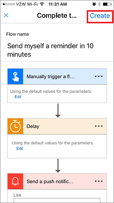

# Microsoft Flow 모바일 앱 사용
이 단원에서는 Microsoft Flow 모바일 앱 및 해당 기능을 다룹니다. 모바일 앱에서 **작업 피드**, **탐색**, **단추** 및 **흐름 관리**와 같은 기능에 액세스할 수 있습니다.

먼저 앱 스토어에서 Microsoft Flow 앱을 **다운로드** 및 **설치**해야 합니다.

설치되면 **열**고 **로그인**합니다. 앱을 열면 **작업 피드**가 표시됩니다.

작업 피드는 **이동하는 동안** 흐름에서 발생한 것을 보는 위치이며 전체 환경에 대해 **컴퓨터에 대한 액세스**가 없을 수도 있습니다.

예를 들어, 이러한 흐름 중 하나를 선택하는 경우 흐름의 **마지막 작업**에서 실행이 성공했는지 실패했는지 여부 및 실패한 경우 어느 단계가 실패했는지 **더욱 자세히 살펴볼** 수 있습니다.

볼 수 있듯이 이 흐름은 두 단계에서 성공했습니다. 여기에서 계속 진행하고 **단추** 아이콘을 선택합니다.

## 흐름을 시작하는 방법
   단추는 수동 작업으로 시작된 흐름입니다. 예를 들어, **관리자에게 "오늘 재택 근무" 전자 메일 보내기**와 같은 단추를 만들 수 있습니다.
멀리 떨어져 살고 교통이 복잡한 일하는 날에 이를 사용할 수 있습니다.

**찾아보기** 단추를 사용하여 컬렉션에 추가할 **더 많은 단추 흐름**에 대한 템플릿을 찾습니다.

작동 방법을 보려면 **10분 후에 나에게 미리 알림 보내기** 흐름 단추를 사용합니다.

1. **단추**, **템플릿 찾아보기**를 차례로 선택합니다.
2. 미리 알림 단추 흐름을 선택합니다.
3. **이 템플릿 사용**을 탭합니다.
   
    
4. **만들기**를 탭합니다.
   
    
   
    흐름이 **저장**됩니다.
   
    
5. **단추**를 탭하여 새 흐름을 봅니다. 
   
    
6. 계속 진행하여 탭하고 10분 후에 **미리 알림을 받습니다**.
   
    

컬렉션에 추가 단추를 추가하는 것은 간단합니다.

## 흐름 수정 또는 삭제
흐름 중 하나를 수정하거나 삭제하려고 결정한 경우 이는 쉽습니다.

1. 기본적으로 흐름에 대한 모바일 관리 영역인 **흐름** 단추를 탭합니다.
   
    
2. 이제 흐름 중 하나를 탭합니다.
   
    
   
    몇 가지 옵션을 확인할 수 있습니다.
   
   * 흐름을 활성화하거나 비활성화하려면 **흐름 활성화** 토글 스위치를 탭합니다.
   * 다시 사용자에게 유용하게 만들려는 경우 항상 흐름을 편집할 수 있습니다. 
   * 그리고 성공 및 실패한 실행을 알아보기 위해 흐름의 실행 기록을 볼 수 있습니다.
   * **흐름 삭제** 단추를 탭하여 흐름을 삭제할 수도 있습니다.
     
     
     
     여기에서 **흐름이 삭제된** 것을 확인합니다.
     
     

## 다음 단원
다음 단원에서는 팀에 대한 **단추 흐름을 만드는 방법**을 다룹니다. 

