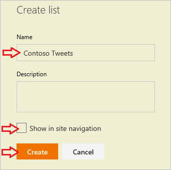
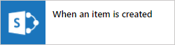
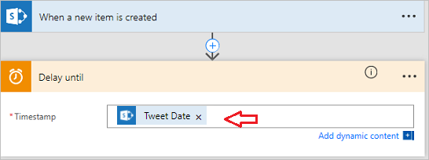
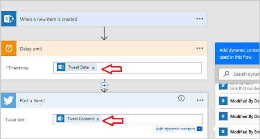

# 흐름에서 트윗 게시
이 흐름의 경우 **Contoso Flooring**의 마케팅 팀이 **Twitter 게시물** 및 게시 날짜를 저장하는 **SharePoint** 목록을 빌드합니다. 여기에서 콘텐츠를 자동 트윗하는 흐름을 작성합니다. 

## Microsoft Flow 서비스 연결
이 항목에서는 **SharePoint** 및 **Twitter** 서비스를 사용합니다. 새로운 서비스를 사용하는 경우 먼저 새 서비스에 연결해야 합니다. 

1. Microsoft Flow에서 **기어 아이콘**, **연결**을 차례로 선택합니다.
   
     
2. **+ 연결 만들기**를 선택합니다.
   
     
3. 목록 아래로 스크롤하고, Twitter를 찾고 **+**를 선택합니다.
   
    
4. Twitter 계정에 권한을 부여하려면 사용자 이름 또는 전자 메일 및 암호를 입력한 다음 **앱 권한 부여**를 선택합니다.
   
    
5. 연결을 확인하려면 **기어 아이콘**, **연결**을 차례로 선택합니다.
   
    
   
    새 Twitter 연결 및 만든 다른 모든 연결이 표시됩니다. 
   
    

## SharePoint 목록 빌드
가장 먼저 수행해야 할 작업은 Contoso Flooring에 대한 새 SharePoint Online 목록을 만드는 것입니다. 

1. SharePoint Online에서 **새로 만들기**, **목록**을 차례로 선택합니다.
   
    
2. 목록 이름을 **Contoso 트윗**으로 지정합니다. 
3. **사이트 탐색 창에서 표시** 확인란을 선택 해제하고 **만들기**를 선택합니다.
   
    
   
    **만들기**를 선택하면 SharePoint에서 새 목록으로 이동합니다.
4. 기본적으로 목록에는 단일 열- **제목**이 있습니다. 다른 열을 추가하고 이름을 **트윗 콘텐츠**로 지정합니다. 트윗에서 언급하는 것이 여기로 이동됩니다. 
   
   1. 더하기 기호를 선택한 다음 **더보기...**를 선택합니다.
      
       
   2. **여러 줄 텍스트**를 선택한 다음 **확인**을 선택합니다.
      
       
5. 트윗 날짜 및 시간에 대한 열을 추가하고 이름을 **트윗 날짜**로 지정합니다.
   
   1. 위의 **트윗 콘텐츠**와 마찬가지로 더하기 기호를 선택한 다음 **더보기...**를 선택합니다.
      
       
   2. **날짜 및 시간 형식** 아래로 스크롤합니다. 둘 다 포함되도록 **날짜 및 시간**을 선택합니다.
      
       
   3. **확인**을 선택합니다. SharePoint 사이트에 **Contoso 트윗** 목록이 표시되고 목록에 새 항목을 추가할 수 있습니다.

## 흐름 작성
목록을 작성했으므로 이제 흐름을 작성할 수 있습니다.

### 트리거 선택
1. Microsoft Flow에서 **내 흐름**으로 이동한 다음 **빈 페이지에서 만들기**를 선택합니다.
   
    
2. **항목이 만들어진 경우**를 선택합니다.
   
    
   
    트윗 콘텐츠로 새 행이 추가될 때 트리거를 발생시키려고 합니다.
3. SharePoint 사이트를 선택한 다음 앞에서 설정한 목록, **Contoso 트윗**을 선택합니다.
   
    

좋습니다. 이것이 트리거에 대한 항목입니다.

### 게시를 지연시킬 작업 추가
1. **+ 새 단계**를 선택한 다음 **작업 추가**를 선택합니다. 
   
    
2. **일정** 서비스 아래에서 **다음 기간까지 지연**을 선택합니다. 
   
      
3. 지연 값을 설정합니다.
   
   1. **타임스탬프** 필드에서 클릭하거나 탭합니다. 
   2. 동적 콘텐츠 상자가 열리고 아래로 스크롤하면 SharePoint 목록에 세 개의 열, **제목**, **트윗 날짜** 및 **트윗 콘텐츠**가 표시됩니다.
   3. **트윗 날짜**를 선택합니다. 
      
       
      
       이제 다른 사용자가 작업을 SharePoint 목록에 추가하면 **트윗 날짜** 열에 지정한 날짜 및 시간까지 작업을 지연합니다.
      
       

### 트윗을 게시하는 작업 추가
이제 **트윗 날짜** 열에 지정한 날짜 및 시간에 수행하도록 흐름에 대한 다른 작업을 추가합니다.

1. **+ 새 단계**, **작업 추가**를 선택한 다음 **Twitter**를 검색합니다.
   
     
2. 작업, **Twitter - 트윗 게시**를 선택합니다.
   
     
3. **트윗 텍스트** 필드에서 클릭하거나 탭하고 동적 콘텐츠 상자에서 **트윗 콘텐츠**를 선택합니다. 여기에 만든 순서가 있습니다. 
   
    
4. **흐름 만들기...**를 선택합니다.
   
     
5. **완료**를 선택합니다.
   
    
   
    이제 흐름이 완료되었습니다.
   
    
   
    SharePoint 목록에서 새 항목을 만들면 흐름이 미리 설정된 날짜까지 게시를 지연합니다. 해당 날짜가 충족되면 흐름에서 목록의 **트윗 콘텐츠** 열의 텍스트로 Twitter에 게시합니다.

## 다음 단원
다음 단원에서는 **되풀이**라는 트리거를 사용하여 **일정에 따라 흐름을 실행**하는 방법을 알아봅니다.

