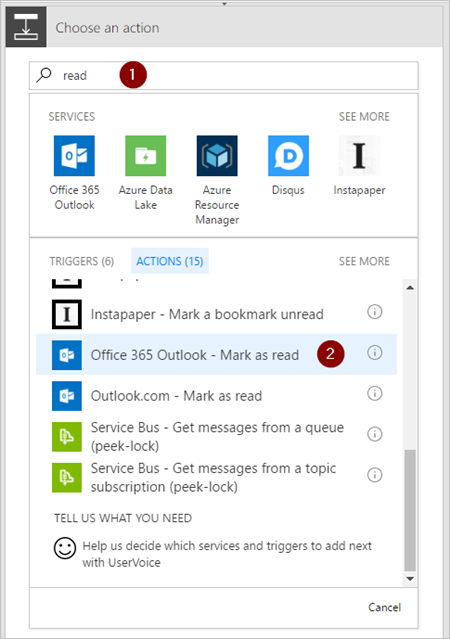
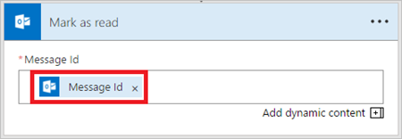

1. **새 단계** > **작업 추가**를 선택합니다.
2. "읽기"를 검색한 다음 작업 목록에서 **Office 365 Outlook - 읽음으로 표시**를 선택합니다.
   
    
3. **읽음으로 표시** 카드의 **메시지 ID** 상자에 **MessageId** 토큰을 추가합니다.
   
     **메시지 ID** 토큰이 표시되지 않으면 검색 상자에 **메시지 ID**를 입력하여 검색합니다.
   
    

