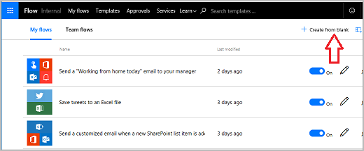
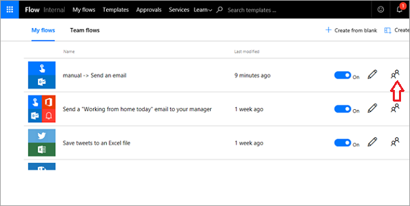

이 항목에서는 Contoso Flooring Company에 대한 **단추 흐름을 작성**하는 방법을 알아봅니다. 

단추 흐름은 팀에 **전자 메일을 보내**고 수행할 **작업을 경고**하는 데 사용될 수 있습니다. 흐름의 **소유권**은 팀에서 한 명의 작업자에게 **할당**되거나 여러 구성원에서 **공유**될 수 있습니다.  

1. 먼저 [Microsoft Flow 웹 사이트](https://ms.flow.microsoft.com)로 이동하고 로그인합니다.
2. 로그인이 완료되면 **내 흐름**, **빈 페이지에서 만들기**를 차례로 선택합니다.
   
    
   
    가장 먼저 필요한 것은 트리거입니다. 단추 흐름은 사용하기 편리한 것입니다. 
3. 목록에 없는 경우 페이지의 아래에서 **수백 개의 커넥터 및 트리거 검색**을 선택하고, **단추**를 입력하면 팝업 창이 뜹니다. 
4. **모바일용 흐름 단추**를 선택합니다.
   
     
5. **모바일용 흐름 단추 - 수동으로 흐름 트리거**를 선택합니다.
   
    
6. 입력 화면에서 **입력 텍스트 추가**를 선택합니다.
   
    
7. 첫 번째 텍스트 상자에 **Contoso Flooring**을, 두 번째 텍스트 상자에 **Warehouse 배달 전자 메일**을 입력합니다.
   
    
8. **새 단계**를 선택합니다. 
   
    
9. **작업 추가**를 선택합니다. 
   
    
10. **Office 365 Outlook** 커넥터를 선택합니다. 없는 경우 **outlook**을 검색합니다.
    
     
11. **Office 365 Outlook - 전자 메일 보내기**를 선택합니다.
    
     
    
     단추를 누르면 건물에 있는지 관계 없이 배달이 도착했음을 알리는 전자 메일이 전체 Contoso Warehouse 팀에게 전송됩니다.
12. 필드를 확장하고 Contoso Flooring에 대해 작동하는 전자 메일을 사용자 지정합니다.
    
    1. **받는 사람** 필드에 조직에서 유효한 전자 메일 주소를 입력합니다.
    2. **제목** 필드에 **배달 도착**을 입력합니다. 
    3. 오른쪽에 **동적 콘텐츠** 상자가 표시됩니다. 제목 줄에서 단추가 눌린 정확한 날짜와 시간을 표시하려면 **날짜** 및 **타임스탬프**를 선택합니다. 
       
        
13. 이제 **Warehouse 팀, 오늘의 배달이 도착했으니 언로드 구역으로 와주세요.** 와 같은 것을 알리는 전자 메일에 대한 간단한 **본문**을 입력합니다.
14. **흐름 만들기**를 선택하여 흐름을 저장합니다.
    
     

## 팀 흐름 만들기
팀 흐름을 만드는 방법의 예로 이 단추 흐름을 사용할 수 있습니다. 이 흐름의 작성자가 아파서 없는 경우 어떻게 됩니까? 회사를 그만두는 경우 어떻게 됩니까? 이 흐름이 계속 실행되도록 하려고 합니다. 이렇게 하려면 공동 소유자를 추가합니다.

1. 흐름에서 **팀 아이콘**을 선택하여 공동 소유자를 추가합니다.
   
     
2. 이름, 전자 메일 주소 또는 사용자 그룹을 입력하여 공동 소유자를 추가합니다.
   
    
3. 공동 소유자를 제거하려면 해당 이름 오른쪽의 쓰레기통을 선택합니다.
   
    
4. **이 소유자 제거**를 선택하여 제거를 완료합니다.
   
    

## 요약
이 단원에서는 **단추 흐름을 만드는** 방법을 알아봤습니다. 

곧, 흐름은 팀이 다른 작업에 소비할 수 있는 귀중한 시간을 낭비하여 대기하고 기다릴 필요가 없도록 웨어하우스 작업자에게 **배달 도착**에 대해 **팀에게 알리는** 기능을 제공했습니다. 

그런 다음 작업자는 해당 단추를 팀과 공유하여 다른 작업자가 해당 작업자가 없는 경우 동일한 흐름을 트리거할 수 있었습니다.

## 다음 단원
**푸시 알림**을 사용하는 흐름을 만드는 방법을 알아보는 다음 단원을 확인하세요.

