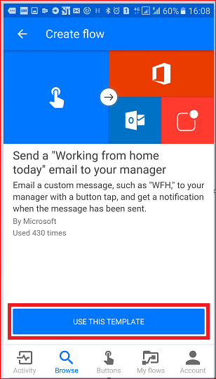

# 단추 트리거 토큰으로 시작
## 단추 트리거 토큰이란 무엇인가요?
단추 트리거 토큰은 [흐름 단추](introduction-to-button-flows.md)을 실행하는 장치에 알려져 사용할 수 있는 데이터 요소입니다. 이들 토큰은 지정된 시점에서 현재 시간 또는 장치의 지리적 위치 등의 요인에 따라 변경됩니다.  

예를 들어, 스마트 폰에서 단추 흐름을 실행하는 경우 날짜 및 현재 주소 뿐만 아니라 현재 위치의 **시간을 스마트 폰이 알고** 있을 수 있습니다. 이 컨텍스트에서 시간, 날짜 및 스마트 폰이 위치한 곳의 주소는 단추 흐름이 실행될 때 모두 결정됩니다. 이들 정보는 장치에서 실행되는 모든 단추 흐름에서 사용하기 위해 자동으로 사용할 수 있습니다. 이러한 트리거 토큰을 사용하여 다른 사람에게 위치를 제공하거나 특정 작업/서비스 호출에 얼마나 많은 시간을 소모하는지 추적하는 것과 같이 반복적인 작업을 최소화하는 유용한 흐름을 만들 수 있습니다.

### 단추 트리거 토큰 목록
단추 흐름을 만들 때 사용할 수 있는 단추 트리거 토큰의 목록은 다음과 같습니다.

| 매개 변수 | 설명 |
| --- | --- |
| 도시 |흐름을 실행하는 장치가 있는 도시입니다. |
| 국가/지역 |흐름을 실행하는 장치가 있는 국가/지역입니다. |
| 전체 주소 |흐름을 실행하는 장치가 있는 위치의 전체 주소입니다. |
| 위도 |흐름을 실행하는 장치가 있는 위치의 위도입니다. |
| 경도 |흐름을 실행하는 장치가 있는 위치의 경도입니다. |
| 우편 번호 |흐름을 실행하는 장치가 있는 지역의 우편 번호입니다. |
| 주 |흐름을 실행하는 장치가 있는 주입니다. |
| 거리명 |흐름을 실행하는 장치가 있는 지역의 거리명입니다. |
| 타임스탬프 |흐름을 실행하는 장치가 있는 지역의 시간입니다. |
| 날짜 |흐름을 실행하는 장치가 있는 지역의 날짜입니다. |
| 사용자 이름 |흐름을 실행하는 장치에 등록된 사용자의 이름입니다. |
| 사용자 전자 메일 |흐름을 실행하는 장치에 등록된 사용자의 전자 메일 주소입니다. |

## 트리거 토큰을 사용하는 단추 흐름 만들기
단추를 만들 때 트리거 토큰을 사용하여 단추에 다양한 기능을 추가할 수 있습니다.

이 연습에서는 Android 장치에서 단추 흐름을 만듭니다. 단추 흐름은 트리거 토큰을 사용하여 날짜와 전체 주소가 적힌 "**재택 근무**" 전자 메일을 상사에게 보냅니다.

이 연습에서는 Android 장치의 스크린 샷이 표시되지만, iOS 및 Windows Phone 장치의 환경이 비슷합니다.

### 필수 구성 요소
* Microsoft Flow에 액세스할 수 있는 회사 또는 학교 이메일 주소 또는 [Microsoft 계정](https://account.microsoft.com/about?refd=www.microsoft.com).
* [Android](https://aka.ms/flowmobiledocsandroid), [iOS](https://aka.ms/flowmobiledocsios) 또는 [Windows Phone](https://aka.ms/flowmobilewindows)용 Microsoft Flow 모바일 앱.

이제 시작해 보겠습니다.

1. 흐름을 시작하고 **찾아보기** 를 선택합니다.  
     
2. **단추** 범주 아래에서 **관리자에게 '오늘 재택 근무' 전자 메일 보내기** 서비스를 선택합니다.   
     
3. **이 템플릿 사용**을 선택합니다.  
     
4. **전자 메일 보내기** 카드에서 **편집**을 선택합니다.  
     
5. **주체** 텍스트 상자를 누르고 "WFH" 텍스트 다음에 " **today-** "를 텍스트 상자에 입력합니다. 텍스트 상자를 누르면 매개 변수/토큰의 목록도 열립니다. 다음 단계에서 이러한 토큰 중 하나를 사용하여 전자 메일의 제목에 날짜를 추가하겠습니다.  
     
6. 제목 텍스트 상자에 커서를 둔 상태에서 매개 변수의 **수동** 목록으로 스크롤하여 **날짜**를 누릅니다. 이제 날짜 매개 변수가 **제목** 텍스트 상자에 있습니다.  
     
7. **본문** 텍스트 상자로 스크롤하고 기본 메시지 다음을 누르면 그 위치에 추가 토큰을 포함시킬 수 있습니다.  
     
8. **전체 주소** 매개 변수를 누른 다음 **만들기**를 누릅니다.  
     
9. **완료**를 누릅니다. 이제 단추 흐름이 만들어졌습니다.  
     

## 실행 단추 흐름
**참고**: 이 단추 흐름은 전자 메일을 통해 현재 위치를 전송합니다.  

1. 화면 맨 아래에 있는 **단추** 범주를 누릅니다. 사용할 수 있는 권한이 있는 단추 목록이 표시됩니다. 방금 만든 단추 흐름을 나타내는 단추를 누릅니다.  
     
2. 단추 흐름이 장치의 위치 정보에 액세스해도 무방하다는 것을 나타내려면 **허용**을 누릅니다.  
     
3. 잠시 후 전자 메일을 상사에게 보냈음을 확인합니다.  
     

축하합니다. 날짜와 전체 주소 트리거 토큰을 사용하는 단추 흐름을 만들었습니다. 

## 다음 단계
* [단추 흐름 공유](share-buttons.md)
* [단추 흐름에 대해 알아보기](introduction-to-button-flows.md)  
* [흐름에 대해 알아보기](guided-learning/get-started.yml?tutorial-step=1)

