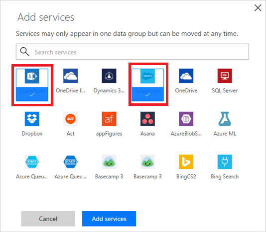

# 데이터 그룹에 관한 모든 것 알아보기
## 데이터 그룹이란?
데이터 그룹은 [데이터 손실 방지(DLP) 정책](prevent-data-loss.md) 내에서 서비스를 분류하는 간단한 방법입니다. 사용 가능한 두 개의 데이터 그룹은 **비즈니스 데이터 전용** 그룹 및 **비즈니스 데이터 허용 안됨** 그룹입니다. 조직은 특정 데이터 그룹에 어떤 서비스를 배치할지 자유롭게 결정할 수 있습니다. 서비스를 분류하는 좋은 방법은 조직에 미치는 영향에 따라 그룹을 짓는 것입니다. 기본적으로 모든 서비스는 **비즈니스 데이터 허용 안됨** 데이터 그룹에 배치됩니다. 관리자 센터에서 DLP 정책의 속성을 만들거나 수정하는 경우에 데이터 그룹에서 서비스를 관리합니다.

## 데이터 그룹 간에 데이터 공유 방법
데이터는 서로 다른 그룹에 있는 서비스 간에 공유되지 않습니다. 예를 들어, **비즈니스 데이터 전용** 그룹에 SharePoint 및 Salesforce를 배치하고 **비즈니스 데이터 허용 안됨** 그룹에 Facebook 및 Twitter를 배치하는 경우 SharePoint와 Facebook 간에 데이터를 이동하는 흐름을 만들 수 없습니다. 서로 다른 그룹에 있는 서비스 간에 데이터를 공유할 수는 없는 반면에 특정 그룹 내의 서비스 간에는 데이터를 공유할 수 있습니다. 따라서 이전 예제로 돌아가 SharePoint와 Salesforce는 같은 데이터 그룹에 배치 되었기 때문에 최종 사용자는 흐름을 만들어 SharePoint와 Salesforce 사이에 데이터를 공유할 수 있습니다. 마찬가지로, 최종 사용자는 Facebook과 Twitter 간에 데이터를 공유하는 흐름 및 PowerApps를 만들 수 있습니다. 여기서 요점은 특정 그룹 내의 서비스 간에 데이터 공유가 가능한 반면에 서로 다른 그룹에 있는 서비스 간에 데이터 공유는 불가능합니다.’  

또한 하나의 데이터 그룹을 반드시 *기본* 그룹으로 지정해야 합니다. 처음에는 **비즈니스 데이터 허용 안됨** 그룹이 *기본* 그룹이며 모든 서비스는 그 데이터 그룹 안에 있습니다. 관리자는 기본 데이터 그룹을 **비즈니스 데이터 전용** 데이터 그룹으로 변경할 수 있습니다. 흐름에 추가되는 새로운 서비스는 지정된 *기본* 그룹에 배치된다는 점을 **유의**합니다. 이러한 이유로 **비즈니스 데이터 허용 안됨**을 기본 그룹으로 유지하고 조직에서 비즈니스 데이터를 새 서비스와 공유되도록 허용할 때의 영향을 평가한 후 서비스를 수동으로 **비즈니스 데이터 전용** 그룹에 추가하는 것이 좋습니다.

## 데이터 그룹에 서비스 추가
이 연습에서 우리는 SharePoint와 Salesforce를 데이터 손실 방지(DLP) 정책의 **비즈니스 데이터 전용** 데이터 그룹에 추가합니다. 

1. DLP 정책의 **비즈니스 데이터 전용** 그룹 상자 내에 있는 **+ 추가** 링크를 선택합니다.    
     
2. SharePoint와 Salesforce를 선택한 다음 둘 다 비즈니스 데이터 전용 그룹에 추가하기 위해 **서비스 추가**를 선택합니다.    
     
3. 맨 위에 있는 메뉴에서 **Save Policy**를 선택합니다.  
    
4. 이제 SharePoint와 Salesforce는 모두 비즈니스 데이터 전용 그룹에 있습니다.  
      

이 연습에서 우리는 SharePoint와 Salesforce를 DLP 정책의 **비즈니스 데이터 전용** 데이터 그룹에 추가했습니다. DLP 정책 환경의 한 축인 개인이 SharePoint 또는 Salesforce와 **비즈니스 데이터 허용 안됨** 데이터 그룹 내의 어느 서비스 간에 데이터를 공유하는 앱을 만드는 경우 앱 실행이 허용되지 않습니다.

## 데이터 그룹에서 서비스 제거
모든 서비스는 사용 가능한 데이터 그룹 중 하나에 있어야 하므로 특정 그룹에서 서비스를 제거하려면 단지 그 서비스를 다른 그룹에 추가한 다음 정책을 저장합니다.  

## 기본 데이터 그룹을 변경합니다.
이 연습에서는 기본 데이터 그룹을 **비즈니스 데이터 허용 안됨** 데이터 그룹에서 **비즈니스 데이터 전용** 데이터 그룹으로 변경합니다.  

**중요** 흐름에 추가되는 새로운 서비스는 지정된 *기본* 그룹에 배치됩니다. 이러한 이유로 **비즈니스 데이터 허용 안됨**을 기본 그룹으로 유지하고 서비스를 수동으로 **비즈니스 데이터 전용** 그룹에 추가하는 것이 좋습니다.

1. 데이터 그룹의 오른쪽 위 모서리에 있는, 기본 데이터 그룹으로 지정 하려는 **...** 를 선택합니다.    
     
2. **기본 그룹으로 설정**을 선택합니다.  
      
3. 맨 위에 있는 메뉴에서 **Save Policy**를 선택합니다.  
    
4. 데이터 그룹이 이제 기본 데이터 그룹으로 지정되었음을 확인 합니다.  
      

## 다음 단계
* [DLP(데이터 손실 방지) 정책에 대한 자세한 정보](prevent-data-loss.md)
* [환경에 대한 자세한 정보](environments-overview-admin.md)   

