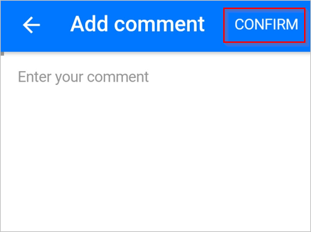

# Microsoft Flow를 사용하여 모바일 장치에서 요청 승인
흐름에서 사용자를 승인자로 식별하고 사용자가 Microsoft Flow용 모바일 앱을 설치한 경우 승인이 요청될 때마다 사용자가 푸시 알림을 받습니다.

이 문서에서는 사용자가 Microsoft Flow용 모바일 앱에서 승인 요청을 관리하는 동안 발생할 수 있는 몇 가지 일반적인 시나리오를 안내합니다.

> [!NOTE]
> 이 항목의 이미지는 Android 장치에서 가져온 것이지만 iOS 환경도 이와 비슷합니다.
> 
> 

## 필수 구성 요소
이 연습을 완료하려면 다음이 필요합니다.

* Microsoft Flow용 모바일 앱을 실행 중인 [Android](https://aka.ms/flowmobiledocsandroid) 또는 [iOS](https://aka.ms/flowmobiledocsios) 장치.
* 승인 흐름에서 승인자로 지정.
* 보류 중인 승인 요청.

## 보류 중인 요청 보기
1. Microsoft Flow용 모바일 앱을 엽니다.
   
    
2. 오른쪽 위 모서리에서 **승인**을 선택합니다.
   
    
3. 모든 보류 중인 승인 보기:
   
    

보류 중인 승인 요청이 없다면 만들기는 [승인 흐름](modern-approvals.md)을 만들고 자신을 승인자로 설정한 후 흐름을 트리거하세요. 흐름이 트리거되고 승인 요청을 보내면 몇 초 후 승인 센터에 승인 요청이 나타납니다.

## 요청 승인 및 주석(선택 사항) 입력
1. 아직 그렇게 하지 않은 경우 앞의 단계를 따라 [보류 중인 요청을 확인](mobile-approvals.md#view-pending-requests)합니다.
2. 승인하려는 요청에 **승인**을 선택합니다.
   
    
3. (선택 사항) **주석 추가(선택 사항)** 를 선택합니다.
   
    
   
    **주석 추가** 화면에서 주석을 입력합니다.
   
    
4. 오른쪽 위 모서리에서 **확인**을 선택합니다.
   
    
   
    흐름에서 사용자의 결정을 기록한 후 성공 화면이 표시됩니다.
   
    

## 요청 거부 및 주석(선택 사항) 입력
[요청 승인 단계](mobile-approvals.md#approve-requests-and-leave-an-optional-comment)를 따르되, 두 번째 단계에서 **거부**를 선택합니다.

## 자세한 정보
[최신 승인 흐름 만들기](modern-approvals.md).

