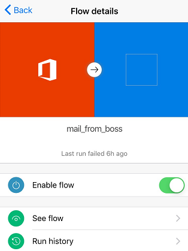

# 휴대폰에서 Microsoft Flow 흐름 관리
만든 모든 흐름의 목록을 보고, 각 흐름에 대해 해당 이벤트와 동작을 확인하며 흐름을 활성화 또는 비활성화하고 실행 기록을 탐색합니다.

**필수 구성 요소**

* [지원되는 장치](getting-started.md#use-the-mobile-app)에 [Android](https://aka.ms/flowmobiledocsandroid), [iOS](https://aka.ms/flowmobiledocsios) 또는 [Windows Phone](https://aka.ms/flowmobilewindows)용 Microsoft Flow 모바일 앱을 설치합니다. 이 토픽의 그래픽은 앱의 iPhone 버전이지만 Android 및 Windows Phone의 그래픽도 비슷합니다.
* 흐름이 아직 없는 경우 [Microsoft Flow 웹 사이트](https://flow.microsoft.com/)에서 하나 만듭니다. 테스트 편의를 위해 외부 이벤트가 발생할 때까지 기다리기 보다 직접 트리거할 수 있는 이벤트를 사용합니다.

이 자습서의 흐름은 특정 주소로부터 메일을 받았을 때 실행됩니다.

테스트를 위해 자신의 개인 전자 메일 주소로 흐름을 구성하고 흐름을 실제 사용하게 되면 다른 주소(예: 상사의 주소)로 구성할 수 있습니다.

흐름이 실행되면 사용자 지정 푸시 알림을 이 구문으로 전화로 보냅니다.

**참고**: 모바일 앱에서 [흐름 작업을 모니터링](mobile-monitor-activity.md)할 수도 있습니다.

## 흐름 관리
1. 모바일 앱을 연 다음 화면 아래쪽의 **내 흐름**을 눌러 모든 흐름을 나열합니다.
   
    각 항목은 흐름의 이름, 이벤트 및 동작에 대한 아이콘, 가장 최근에 실행된 시간, 가장 최근 실행의 성공 여부를 나타내는 아이콘을 표시합니다.
   
    
2. 흐름을 관리하려면 눌러 옵션을 표시합니다.
   
    
3. **흐름 활성화** 토글을 눌러 흐름을 활성화하거나 비활성화합니다.
4. 해당 흐름에 대한 이벤트 및 동작을 표시하려면 **흐름 보기**를 누르고 각 이벤트나 동작을 눌러 확장한 다음 **뒤로**를 누릅니다.
   
    
5. **실행 기록**을 눌러 흐름의 성공, 실패 또는 둘 다를 표시합니다.
   
    
6. 실행을 눌러 각 이벤트 및 동작의 성공 여부를 표시하고, 성공 시 실행 시간(초)을 표시합니다.
   
    

