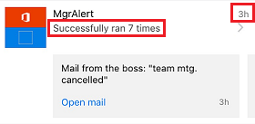
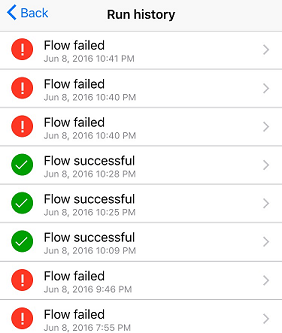

# 휴대폰에서 Microsoft Flow 활동 모니터링
오늘, 어제 및 과거에 각 흐름이 성공 또는 실패한 횟수의 요약을 확인합니다. 실행 시기, 각 단계의 진행 시간, 실패한 경우 실패 사유 등, 각 실행에 대한 상세 정보를 살펴봅니다.

**필수 구성 요소**

<iframe width="560" height="315" src="https://www.youtube.com/embed/vZuYZ64K3tI?list=PL8nfc9haGeb55I9wL9QnWyHp3ctU2_ThF" frameborder="0" allowfullscreen></iframe>

* [지원되는 장치](getting-started.md#use-the-mobile-app)에 [Android](https://aka.ms/flowmobiledocsandroid), [iOS](https://aka.ms/flowmobiledocsios) 또는 [Windows Phone](https://aka.ms/flowmobilewindows)용 Microsoft Flow 모바일 앱을 설치합니다. 이 토픽의 그래픽은 앱의 iPhone 버전이지만 Android 및 Windows Phone의 그래픽도 비슷합니다.
* 흐름이 아직 없는 경우 [Microsoft Flow 웹 사이트](https://flow.microsoft.com/)에서 하나 만듭니다. 테스트 편의를 위해 외부 이벤트가 발생할 때까지 기다리기 보다 직접 트리거할 수 있는 이벤트를 사용합니다.

이 자습서의 흐름은 특정 주소로부터 메일을 받았을 때 실행됩니다.

테스트를 위해 자신의 개인 전자 메일 주소로 흐름을 구성하고 흐름을 실제 사용하게 되면 다른 주소(예: 상사의 주소)로 구성할 수 있습니다.

흐름이 실행되면 사용자 지정 푸시 알림을 이 구문으로 전화로 보냅니다.

**참고:** 모바일 앱에서 [흐름을 관리](mobile-manage-flows.md)할 수도 있습니다.

## 활동 요약 표시
<iframe width="560" height="315" src="https://www.youtube.com/embed/nVCGJamOw6s?list=PL8nfc9haGeb55I9wL9QnWyHp3ctU2_ThF" frameborder="0" allowfullscreen></iframe>

1. 흐름을 전에 실행하지 않은 경우 실행을 트리거하여 데이터를 생성합니다.
   
    데이터가 앱에 표시되는 데 다소 시간이 걸릴 수 있습니다.
2. 모바일 앱을 엽니다. 기본적으로 **활동** 탭이 표시됩니다.
   
    이 탭은 날짜별로 데이터를 정리하며 오늘의 데이터가 맨 위에 옵니다.
   
    
   
    각 항목은 트리거 이벤트 및 동작에 해당하는 아이콘과 함께 흐름의 이름을 표시합니다.
   
    
   
    오늘 흐름이 한 번 이상 성공한 경우 항목에 성공 횟수와 가장 최근에 성공한 시간이 표시됩니다. 흐름이 실패한 경우 다른 항목이 유사 정보를 표시합니다.
   
    
   
    흐름이 푸시 알림을 보낸 경우 가장 최근인 알림의 텍스트가 성공적인 실행에 대한 항목의 아래쪽에 표시됩니다.
   
    
3. 하루에 여러 푸시 알림을 보낸 경우 알림을 왼쪽으로 밀면 최대 3회의 이전 실행에서 받은 알림이 표시됩니다. 하루에 4개가 넘는 푸시 알림이 전송된 경우 왼쪽으로 밀어 **더 보기**를 표시한 다음 눌러 모든 알림 목록을 확인합니다.
   
    
4. **뒤로**를 누르면 활동 요약으로 돌아갑니다.
5. 활동 요약을 필터링하려면 오른쪽 위 모서리의 아이콘을 누릅니다.
   
    모든 항목, 실패 항목만 또는 푸시 알림이 포함된 항목만 표시할 수 있습니다.
   
    

## 실행의 세부 정보 표시
1. 활동 요약에서 항목을 눌러 가장 최근 실행의 세부 정보를 표시합니다.
   
     각 이벤트 및 동작은 이벤트 동작의 성공 또는 실패 여부를 나타내는 아이콘과 함께 표시됩니다. 성공한 경우 진행 시간(초)도 함께 표시됩니다.
   
    
2. 화면 맨 아래에서 **이전 실행 참조**를 누르면 흐름의 모든 실행이 나열되며 여기서 실행을 누르면 세부 정보가 표시됩니다.
   
    

