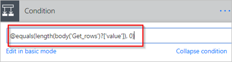

# Microsoft Flow에서 데이터 필터링 및 복사
이 연습에서는 새롭거나 변경된 항목에 대한 원본을 모니터링하고 해당 변경 내용을 대상에 복사하는 흐름을 만드는 방법을 보여줍니다. 사용자가 한 위치에서 데이터를 입력하지만 팀에서 다른 위치 또는 형식이 필요한 경우 이와 같은 흐름을 만들 수 있습니다.

이 연습을 통해 Microsoft SharePoint [목록](https://support.office.com/en-us/article/SharePoint-lists-I-An-introduction-f11cd5fe-bc87-4f9e-9bfe-bbd87a22a194)(원본)에서 [Azure SQL Database](https://docs.microsoft.com/azure/sql-database/sql-database-technical-overview)테이블 (대상)으로 데이터를 복사하는 동안 Microsoft Flow에서 지원하는 [150개 이상의 서비스](https://flow.microsoft.com/connectors/) 간에 데이터를 복사할 수 있습니다.

> [!IMPORTANT]
> 양방향 동기화가 지원되지 않으므로 대상에서 변경된 내용은 원본에 복사되지 않습니다. 양방향 동기화를 설정하려고 하면 원본과 대상 간에 변경 내용을 끊임 없이 전송하는 무한 루프를 만듭니다.
> 
> 

## 필수 구성 요소
* 데이터 원본 및 대상에 대한 액세스입니다. 이 연습에는 원본 및 대상을 만드는 단계가 포함되지 않습니다.
* [Microsoft Flow](https://flow.microsoft.com)에 액세스합니다.
* 데이터가 저장되는 방법에 대해 기본적으로 이해합니다.
* 흐름을 만드는 기본 사항에 익숙해야 합니다. [작업, 트리거](multi-step-logic-flow.md#add-another-action) 및 [조건](add-a-condition.md)을 추가하는 방법을 검토할 수 있습니다. 다음 단계에서는 이러한 작업을 수행하는 방법을 알고 있다고 가정합니다.

> [!TIP]
> 원본 및 대상의 모든 열 이름이 일치할 필요는 없지만 항목을 삽입하거나 업데이트하는 경우 모든 *필수* 열에 대한 데이터를 제공해야 합니다. Microsoft Flow는 필수 필드를 식별합니다.
> 
> 

## 단계의 빠른 개요
Microsoft Flow에 익숙해지면 다음과 같은 빠른 단계를 사용하여 데이터를 하나의 데이터 원본에서 다른 위치로 복사할 수 있습니다.

1. 모니터링할 원본 및 변경된 데이터를 복사할 대상을 식별합니다. 둘 다에 액세스했는지 확인합니다.
2. 원본 및 대상에서 항목을 고유하게 식별하는 하나 이상의 열을 식별합니다. 다음 예제에서는 **제목** 열을 사용하여 원하는 모든 열을 사용할 수 있습니다.
3. 변경 내용의 원본을 모니터링하는 트리거를 설정합니다.
4. 대상을 검색하여 변경된 항목이 있는지 확인합니다.
5. 다음과 같은 **조건**을 사용합니다.
   * 새롭거나 변경된 항목이 대상에 없는 경우 만듭니다.
   * 새롭거나 변경된 항목이 대상에 있는 경우 업데이트합니다.
6. 흐름을 트리거하고, 새롭거나 변경된 항목이 원본에서 대상에 복사되는지 확인합니다.

> [!NOTE]
> SharePoint 또는 Azure SQL Database에 대한 연결을 이전에 만들지 않은 경우 로그인하라는 메시지가 나타나면 지침을 따릅니다.
> 
> 

흐름을 만드는 자세한 단계는 다음과 같습니다.

## 변경 내용의 원본 모니터링
1. [Microsoft Flow](https://flow.microsoft.com)에 로그인하고 **내 흐름** > **빈 페이지에서 만들기**를 선택합니다.
2. **SharePoint**를 검색하고 트리거 목록에서 **SharePoint - 항목을 만들거나 수정하는 경우** 트리거를 선택합니다.
3. **사이트 주소**를 입력하고 **항목을 만들거나 수정하는 경우** 카드에서 **목록 이름**을 선택합니다.
   
    사용자 흐름이 새롭거나 업데이트된 항목에 대해 모니터링하는 SharePoint 목록의 **사이트 주소**와 **목록 이름**을 제공합니다.
   
    

## 새롭거나 변경된 항목에 대한 대상 검색
**SQL Server - 행 가져오기** 작업을 사용하여 새롭거나 변경된 항목에 대한 대상을 검색합니다.

1. **새 단계** > **작업 추가**를 선택합니다.
2. **행 가져오기**를 검색하고, **SQL Server - 행 가져오기**를 선택하고, **테이블 이름** 목록에서 모니터링하려는 테이블을 선택합니다.
3. **고급 옵션 표시**를 선택합니다.
4. **쿼리 필터** 상자에 **Title eq '**를 입력하고, 동적 콘텐츠 목록에서 **제목** 토큰을 선택하고, **'**를 입력합니다.
   
    이전 단계에서는 원본과 대상에서 행의 제목이 일치한다고 가정합니다.
   
    **행 가져오기** 카드는 이 이미지와 같아야 합니다.
   
    

## 새롭거나 변경된 항목이 있는지 확인
**새 단계** > **조건 추가**를 선택하여 **조건** 카드를 엽니다.

조건 카드에서:

1. 왼쪽에 있는 상자를 선택합니다.
   
    **이 흐름에서 사용된 앱과 커넥터에서 동적 콘텐츠 추가** 목록이 열립니다.
2. **행 가져오기** 범주에서 **값**을 선택합니다.
   
   > [!TIP]
   > **행 가져오기** 범주에서 선택한 **값**을 확인합니다. **항목을 만들거나 수정할 경우** 범주에서 **값**을 선택하지 않습니다.
   > 
   > 
3. 센터 상자의 목록에서 **다음과 같음**을 선택합니다.
4. 오른쪽의 상자에서 **0**(영)을 입력합니다.
   
    이제 **조건** 카드는 이 이미지와 유사합니다.
   
    
5. **고급 모드에서 편집**을 선택합니다.
   
    고급 모드를 열면 상자에서 **@equals(body('Get_rows')?['value'], 0)** 식이 표시됩니다. **body('Get_items')?['value']** 함수 주변에 **length()**를 추가하여 이 식을 편집합니다. 이제 전체 식은 다음과 같이 표시됩니다. **@equals(length(body('Get_rows')?['value']), 0)**
   
    이제 **조건** 카드는 이 이미지와 유사합니다.
   
    
   
   > [!TIP]
   > **length()** 함수를 추가하면 흐름에서 **값** 목록을 확인하고 항목이 포함되어 있는지 확인할 수 있습니다.
   > 
   > 

흐름이 대상에서 항목을 "가져오는" 경우 가능한 결과에는 두 가지가 있습니다.

| 결과 | 다음 단계 |
| --- | --- |
| 항목이 있습니다. |[항목 업데이트](odata-filters.md#update-the-item-in-the-destination) |
| 항목이 없습니다. |[새 항목 만들기](odata-filters.md#create-the-item-in-the-destination) |

> [!NOTE]
> 이러한 카드가 흐름에서 사용되는 Azure SQL Database 테이블의 열 이름을 표시하기 때문에 다음에 표시된 **행 삽입** 및 **행 업데이트** 카드의 이미지는 사용자의 이미지와 다를 수 있습니다.
> 
> 

## 대상에서 항목 만들기
항목이 대상에 없는 경우 **SQL Server - 행 삽입** 작업을 사용하여 만듭니다.

**조건**의 **예이면** 분기에서:

1. **작업 추가**를 선택하고, **행 삽입**을 검색하고, **SQL Server - 행 삽입**을 선택합니다.
   
    **행 삽입** 카드가 열립니다.
2. **테이블 이름** 목록에서 새 항목이 삽입되는 곳에서 테이블을 선택합니다.
   
    **행 삽입** 카드가 확장되고 선택한 테이블의 모든 필드를 표시합니다. 별표(*)가 표시된 필드는 필수이므로 행을 적용하려면 입력해야 합니다.
3. 사용하려는 각 필드를 채우고 데이터를 입력합니다.
   
    데이터를 수동으로 입력하거나, **동적 콘텐츠**에서 하나 이상의 토큰을 선택하거나, 텍스트와 토큰의 조합을 필드에 입력할 수 있습니다.
   
    이제 **행 삽입** 카드는 이 이미지와 유사합니다.
   
    

## 대상에서 항목 업데이트
대상에 항목이 있으면 변경 내용으로 업데이트합니다.

1. **SQL Server - 행 업데이트** 작업을 **조건**의 **아니요이면** 분기에 추가합니다.
2. 이 문서의 [항목 만들기](odata-filters.md#create-the-item-in-the-destination) 섹션에 있는 단계에 따라 테이블의 필드를 채웁니다.
   
    
3. 페이지 맨 위에 있는 **흐름 이름** 상자에서 흐름에 이름을 입력한 후 **흐름 만들기**를 선택하여 저장합니다.
   
    

이제 SharePoint 목록(원본)의 항목이 변경될 때마다 흐름은 새 항목을 트리거하고 삽입하거나 Azure SQL Database(대상)에 기존 항목을 업데이트합니다.

> [!NOTE]
> 항목이 원본에서 삭제될 때 흐름이 트리거되지 않습니다. 중요한 시나리오인 경우 항목이 더 이상 필요하지 않은 경우를 나타내는 별도의 열을 추가하는 것이 좋습니다.
> 
> 

## 자세한 정보
흐름에서 [데이터 작업](data-operations.md)을 사용합니다.

