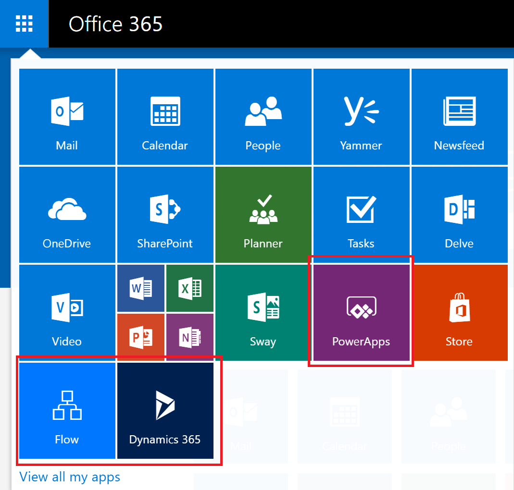

# 조직의 Microsoft Flow 관련 Q & A
이 토픽에는 조직에서 Microsoft Flow를 사용하는 방법과 Microsoft Flow 서비스를 컨트롤하는 방법을 설명합니다.

## Flow에 등록
### Microsoft Flow란?
Microsoft Flow는 자주 사용하는 앱과 서비스 사이에 자동화된 워크플로를 설정하여 파일 동기화, 알림 수신, 데이터 수집 등의 작업을 수행할 수 있는 공용 클라우드 서비스입니다. 

### 어떻게 Flow에 등록합니까?
개인이 웹 포털을 통해 Flow에 등록하는 방법에는 다음 두 가지가 있습니다.

#### 옵션 1
[flow.microsoft.com](https://flow.microsoft.com)으로 이동하고 **무료로 등록**을 선택한 다음 [portal.office.com](https://portal.office.com/Start?sku=flow_free) 또는 [signup.live.com](https://signup.live.com)을 통해 Flow에 대한 등록 프로세스를 완료하여 등록할 수 있습니다.

#### 옵션 2
[flow.microsoft.com](https://flow.microsoft.com)으로 이동하고 **로그인**을 선택하고, 회사, 학교 또는 개인 전자 메일을 통해 로그인한 다음 Flow 사용 약관을 수락하여 등록할 수 있습니다.    

조직의 사용자가 옵션 2를 통해 Flow에 등록하면 해당 사용자에게 Microsoft Flow 무료 라이선스가 자동으로 할당됩니다.

[흐름에 등록](sign-up-sign-in.md)은 자세한 세부 정보를 포함합니다.

### 다른 사람이 Flow에 등록하지 못하도록 차단할 수 있습니까?
Microsoft Flow는 완전히 공개된 클라우드 서비스이며, 전 세계 모든 사람들이 등록하여 일상 업무를 자동화하는 데 사용할 수 있습니다. Microsoft Flow를 사용하기 위해 Office 365 계정을 가지거나 사용할 필요가 없습니다. 따라서 현재 다른 사람이 Flow를 사용하지 못하도록 차단할 수 있는 메커니즘이 없습니다. 다시 말하면 전자 메일 주소와 관계 없이 모든 사람이 사용할 수 있습니다.

그러나 Microsoft Flow에 등록한 사람이 조직 내부에서 이를 지원하지 않기로 결정하면 회사에 비용이 발생하지 않습니다. 개인이 Microsoft Flow에 등록하면 Bing, Wunderlist, OneDrive 또는 Outlook.com과 같은 Microsoft의 다른 많은 클라우드 서비스와 마찬가지로 해당 개인과 Microsoft 간에 관계가 맺어집니다. 개인이 Microsoft Flow를 사용한다고 해서 어떤 방식으로든 조직에서 서비스를 제공하지는 않습니다.

마지막으로 Microsoft Flow의 조직 전용 데이터 사용을 제한하려는 경우 DLP(데이터 손실 방지) 정책을 통해 제한할 수 있습니다.

### 사람들은 어떻게 Microsoft Flow의 유료 기능에 액세스할 수 있습니까?
개인은 다음 세 가지 방법으로 Microsoft Flow의 유료 기능에 액세스할 수 있습니다.

1. 개별적으로 Flow 계획 1 또는 Flow 계획 2 평가판을 90일 동안 무료로 등록할 수 있습니다.
2. Office 365 관리 포털에서 사용자에게 Flow 라이선스를 할당할 수 있습니다.
3. Flow 서비스에 대한 액세스를 포함하는 Office 365 및 Dynamics 365 계획이 사용자에게 할당되었습니다. Flow 기능이 포함된 Office 365 및 Dynamics 365 계획 목록은 [Flow 가격 책정 페이지](https://flow.microsoft.com/pricing/)를 참조하세요.

### 다른 사람이 Flow의 유료 기능을 사용하지 못하도록 차단할 수 있습니까?
모든 개인은 Microsoft Flow의 유료 기능을 90일 동안 사용해 볼 수 있으며 비용은 발생하지 않습니다. 그러나 Office 365 관리 포털을 통해 조직 내부의 영구 유료 라이선스 할당을 완전히 관리할 수 있습니다.

무료 제공과 마찬가지로 개인이 평가판에 등록하기로 결정한 경우 개인과 Microsoft 간에 직접적인 관계를 맺지만 회사에서 반드시 보증하는 것은 아닙니다.

## 흐름의 관리
### 왜 Flow 아이콘이 Office 365 앱 시작 관리자에 나타납니까?
8월에 발표한 대로 Microsoft Flow는 이제 Office 365 제품군의 기본 구성 요소입니다. 이 발표 3개월 후에 Microsoft Flow는 기존의 모든 Office 365 SKU에 포함되는 서비스로 설정되었습니다. 현재 전 세계의 사용자가 Microsoft Flow를 사용할 수 있기 때문에 앱 시작 관리자에 나타났습니다.

기본적으로 앱 시작 관리자에서 Flow 타일을 제거하려면 다음 섹션을 참조하세요.

### 내 조직의 앱 시작 관리자에서 Microsoft Flow를 어떻게 제거합니까?
사용자에게 Flow 계획 1 또는 Flow 계획 2 라이선스가 할당된 경우 다음 단계에 따라 해당 사용자의 Flow 라이선스를 제거하면 앱 시작 관리자에서 Flow 아이콘이 제거됩니다.

1. [Office 365 관리 포털](https://portal.microsoftonline.com/)로 이동합니다.
2. 왼쪽 탐색 모음에서 **사용자**를 선택한 다음 **활성 사용자**를 선택합니다.
3. 라이선스를 제거할 사용자를 찾아 해당 이름을 선택합니다.
4. 사용자 세부 정보 창의 **제품 라이선스** 섹션에서 **편집**을 선택합니다.
5. **Microsoft Flow 계획 1** 또는 **Microsoft Flow 계획 2**라는 라이선스를 찾고 토글을 **해제**로 설정한 다음 **저장**을 선택합니다.
   
   

Office 365 및 Dynamics 365 계획 라이선스를 통해 Flow에 액세스할 수 있는 경우 다음 단계를 수행하여 이 계획에 포함된 추가 기능에 대한 액세스를 사용하지 않도록 설정할 수 있습니다.

1. [Office 365 관리 포털](https://portal.microsoftonline.com/)로 이동합니다.
2. 왼쪽 탐색 모음에서 **사용자**를 선택한 다음 **활성 사용자**를 선택합니다.
3. 액세스 권한을 제거할 사용자를 찾아 해당 이름을 선택합니다.
4. 사용자 세부 정보 창의 **제품 라이선스** 섹션에서 **편집**을 선택합니다.
5. Office 365 또는 Dynamics 365 라이선스를 확장하고 **Office 365용 흐름** 또는 **Dynamics 365용 흐름**에 대한 액세스를 사용하지 않도록 설정한 다음 **저장**을 선택합니다.
   
   

PowerShell을 통해 대량으로 라이선스를 제거할 수도 있습니다. 자세한 예제는 [Office 365 PowerShell을 사용하여 사용자 계정에서 라이선스 제거](https://technet.microsoft.com/library/dn771774.aspx)를 참조하세요.   마지막으로 라이선스에서 대량으로 서비스를 제거하는 방법에 대한 자세한 내용은 [Office 365 PowerShell을 사용하여 서비스에 대한 액세스 비활성화](https://technet.microsoft.com/library/dn771769.aspx)를 참조하세요.

조직의 사용자에 대해 Flow 라이선스 또는 서비스를 제거하면 해당 사용자의 다음 위치에서 Flow 아이콘이 제거됩니다.

1. [Office.com](https://office.com)
   
   
2. Office 365 앱 시작 관리자
   
   

여기서는 기본적으로 Flow 타일만 제거합니다. 그럼에도 불구하고 사용자는 개인적으로 Microsoft Flow를 계속 선택할 수 있습니다.

### 왜 Office 365 테넌트에 10,000개 Microsoft Flow 라이선스가 표시되었습니까?
모든 사람은 Microsoft Flow 계획 1 또는 2를 90일 동안 사용해 볼 수 있으며, 이 평가판 라이선스는 테넌트의 새 Flow 사용자에게 사용 가능한 용량을 나타냅니다. 이러한 라이선스에 대해서는 무료입니다. 특히 다음 두 가지 이유로 Flow에 대한 10,000개 용량의 라이선스(평가판)가 Office 365 관리 포털에서 표시됩니다.

1. 테넌트에서 한 명 이상의 사용자가 2016년 4월부터 2016년 10월에 걸친 Flow 공개 미리보기에 참여한 경우 "Microsoft PowerApps and Logic flows"라는 레이블이 붙은 10,000개의 라이선스가 표시됩니다.
   
    
2. 테넌트에서 최소한 한 명 이상의 사용자가 [PowerApps에 등록하는 방법](#how-do-people-sign-up-for-flow) 섹션에서 설명하는 **옵션 1** 평가판 등록을 통해 Flow 계획 2 평가판에 등록한 경우 "Microsoft Power Apps & Flow"라는 레이블이 붙은 10,000개의 라이선스가 표시됩니다.
   
    

Office 365 관리 포털을 통해 사용자에게 추가 라이선스를 할당하도록 선택할 수 있지만 이 경우 Microsoft Flow 계획 2의 평가판 라이선스이며 사용자에게 할당된 후 90일이 지나면 만료됩니다.

### 무료입니까? 해당 라이선스에 대한 요금이 청구됩니까?
사용자의 명시적 동의 없이는 조직에 비용을 부과할 수 없으므로 무료 또는 평가판 라이선스로 인해 어떤 비용도 조직에 청구될 수 없습니다. 또한 할당량을 시행하는 것처럼 어떤 할당량도 사용할 수 없습니다.

### Microsoft Flow 무료 라이선스를 제거했지만 Flow에 계속 액세스할 수 있습니까?
Microsoft Flow 무료 라이선스는 추적하기 위해서만 등록됩니다. 첫 번째 섹션에서 다루었듯이 다른 사람이 개인적인 목적으로 Microsoft Flow를 사용하는 것을 방지할 수는 없습니다. 따라서 Microsoft Flow 무료 라이선스가 있으면 실제로 기능을 부여하거나 제거하지 않습니다.

### 왜 Office 365 관리자 포털에서 모든 Flow 라이선스를 볼 수 없습니까?
사용자는 개인 또는 조직의 일부로 Microsoft Flow를 사용할 수 있습니다. 조직 수준의 라이선스는 Office 365 포털에서 항상 볼 수 있습니다. 그러나 사용자가 평가판에 등록할 경우 Office 365 관리자가 관리하지 않으며 포털에 표시되지 않습니다.

### 개인이 어떤 계획을 가지고 있는지 어떻게 알 수 있습니까?
누구든지 [https://flow.microsoft.com/pricing](https://flow.microsoft.com/pricing)에 있는 Flow 가격 책정 페이지를 방문하면 해당 계획을 볼 수 있습니다. 여기서는 현재 보유하고 있는 계획이나 평가판이 표시됩니다.

### Microsoft Flow에 등록하면 조직의 ID에 영향을 줍니까?
조직에 이미 기존 Office 365 환경이 있고 조직의 모든 사용자가 Office 365 계정을 갖고 있으면 ID 관리에 영향을 주지 않습니다.

조직에 이미 기존 Office 365 환경이 있지만 조직의 모든 사용자에게 Office 365 계정이 없는 경우 테넌트에 사용자를 만들고 사용자의 회사 또는 학교 전자 메일 주소에 따라 라이선스를 할당합니다. 즉, 특정 시간에 관리하는 사용자 수는 서비스에 등록하는 조직의 사용자에 따라 증가합니다.

조직에 전자 메일 도메인에 연결된 Office 365 환경이 없는 경우 ID를 관리하는 방법은 변경되지 않습니다. 사용자는 새로운 클라우드 전용 사용자 디렉터리에 추가되고 테넌트 관리자로 인계 받고 관리하는 옵션을 갖게 됩니다.

### Microsoft Flow에서 새로운 테넌트를 만들었습니다. 어떻게 관리합니까?
Microsoft Flow에서 새 테넌트를 만든 경우 다음 단계에 따라 해당 테넌트를 요구하고 관리할 수 있습니다.

1. 관리하려는 테넌트 도메인과 일치하는 전자 메일 주소 도메인을 사용하여 흐름에 등록하여 테넌트에 연결합니다. 예를 들어 Microsoft가 contoso.com 테넌트를 만든 경우 @contoso.com으로 끝나는 전자 메일 주소로 테넌트에 연결합니다.
2. 도메인 소유권을 확인하여 관리자 제어 요구: 테넌트에 들어가면 도메인 소유권을 확인하여 도메인 역할로 직접 승격할 수 있습니다. 이렇게 하려면 다음 단계를 수행합니다.    
   
   1. [https://portal.office.com](https://portal.office.com/Start?sku=flow_free)으로 이동합니다.
   2. 왼쪽 위에서 앱 시작 관리자 아이콘을 선택하고 관리자를 선택합니다.
   3. **Become the admin** 페이지의 지침을 읽은 다음 **Yes, I want to be the admin**을 선택합니다.  
      
       **참고**: 이 옵션이 표시되지 않는 경우 Office 365 관리자가 이미 설치되어 있는 것입니다.

### 여러 도메인이 있는 경우 해당 사용자가 추가된 Office 365 테넌트를 제어할 수 있습니까?
아무 작업도 하지 않는 경우 각 사용자 전자 메일 도메인 및 하위 도메인에 대한 테넌트가 만들어집니다.

사용자의 전자 메일 주소 확장명에 관계없이 모든 사용자를 동일한 테넌트에 포함하려는 경우:  

* 미리 대상 테넌트를 만들거나 기존 테넌트를 사용합니다. 해당 테넌트 내에 통합하려는 모든 기존 도메인 및 하위 도메인을 추가합니다. 그러면 해당 도메인 및 하위 도메인으로 끝나는 전자 메일 주소를 가진 모든 사용자는 등록할 때 대상 테넌트에 자동으로 연결됩니다.

**중요**: 생성된 후에는 테넌트 간에 사용자를 이동하는 지원되는 자동화된 메커니즘이 없습니다. 단일 Office 365 테넌트에 도메인 추가에 대해 알아보려면 [Office 365에 사용자 및 도메인 추가](https://support.office.com/article/Add-your-users-and-domain-to-Office-365-ffdb2216-330d-4d73-832b-3e31bcb5b2a7)를 참조하세요.

### 내 조직의 비즈니스 데이터에 액세스하는 사용자를 제한하려면 어떻게 해야 합니까?
Microsoft Flow를 사용하면 아래와 같이 비즈니스 데이터 및 비즈니스 외 데이터에 대한 데이터 영역을 만들 수 있습니다. 이러한 데이터 손실 방지 정책이 구현되면 비즈니스 데이터와 비즈니스 외 데이터를 결합하는 Flow를 설계하거나 실행하지 못합니다. 자세한 내용은 [DLP(데이터 손실 방지) 정책](prevent-data-loss.md)을 참조하세요.

  

