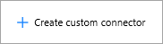

# <a name="register-and-use-custom-connectors-in-microsoft-flow"></a>Microsoft Flow에서 사용자 지정 커넥터 등록 및 사용
Microsoft Flow를 통해 코드 없이 워크플로를 작성할 수 있습니다. 하지만 경우에 따라 Microsoft Flow 기능을 확장해야 합니다. 웹 서비스는 이에 적합합니다. 흐름은 서비스에 연결하고 작업을 수행하고 데이터를 다시 가져올 수 있습니다. Microsoft Flow와 연결하려는 웹 서비스가 있는 경우 사용자 지정 커넥터로 서비스를 등록합니다. 이 프로세스를 통해 필요한 인증, 지원하는 작업, 각 작업의 매개 변수 및 출력 등, Microsoft Flow가 웹 API의 특징을 이해하게 합니다.

이 항목에서는 사용자 지정 커넥터를 등록하고 사용하는 데 필요한 단계를 살펴보고 Azure Cognitive Services [텍스트 분석 API](https://www.microsoft.com/cognitive-services/text-analytics-api)를 사용합니다. 이 API는 전달하는 텍스트의 언어, 의향 및 핵심 문구를 식별합니다.

## <a name="prerequisites"></a>필수 구성 요소
* [Microsoft Flow 계정](https://flow.microsoft.com)
* JSON 형식의 OpenAPI 2.0(이전의 Swagger) 파일, OpenAPI 정의에 대한 URL 또는 API에 대한 Postman 컬렉션. 하나도 없는 경우 사용자를 위한 지침을 제공합니다.
* 사용자 지정 커넥터를 대신하는 아이콘으로 사용할 이미지(선택 사항).

## <a name="steps-in-the-custom-connector-process"></a>사용자 지정 커넥터 프로세스의 단계
사용자 지정 커넥터 프로세스에는 아래에서 간략하게 설명하는 몇 가지 단계가 있습니다. 이 문서에서는 몇 가지 유형의 인증된 액세스가 있는 RESTful API가 이미 있다고 가정하므로 문서의 나머지 부분에서 3-6단계에 주안점을 둡니다. 1단계 및 2단계의 예제는 [Microsoft Flow에 대한 사용자 지정 Web API 만들기](customapi-web-api-tutorial.md)를 참조하세요.

1. 선택한 언어 및 플랫폼에서 **RESTful API를 빌드**합니다. Microsoft 기술의 경우 다음 중 하나를 권장하지만 모든 플랫폼을 사용할 수 있습니다.
   
   * Azure Functions
   * Azure 웹앱
   * Azure API 앱
2. 다음 인증 메커니즘 중 하나를 사용하여 **API의 보안을 유지**합니다. 커넥터에 인증되지 않은 액세스를 허용할 수 있지만 권장하지 않습니다.
   
   * Azure Active Directory. 자세한 내용은 [Microsoft Flow에서 사용자 지정 커넥터로 Azure Active Directory 사용](customapi-azure-resource-manager-tutorial.md)을 참조하세요.
   * Dropbox, Facebook 및 SalesForce와 같은 특정 서비스에 대한 OAuth 2.0
   * 일반 OAuth 2.0
   * API 키
   * 기본 인증
3. Microsoft Flow가 연결할 수 있도록 두 가지 업계 표준 방법 중 하나로 **API를 설명**합니다
   
   * OpenAPI 파일
   * Postman 컬렉션
     
     등록 프로세스의 일부로 4단계에서 OpenAPI 파일을 작성할 수도 있습니다.
4. API 설명, 보안 정보 및 기타 정보를 지정하는 Microsoft Flow의 마법사를 사용하여 **사용자 지정 커넥터를 등록**합니다.
5. 앱에서 **사용자 지정 커넥터를 사용**합니다. 앱에서 커넥터에 대한 연결을 만들고 Microsoft Flow에서 표준 연결을 호출하는 것처럼 API가 제공하는 모든 작업을 호출합니다.
6. Microsoft Flow에서 다른 리소스를 공유하는 것과 마찬가지로 **사용자 지정 커넥터를 공유**합니다. 이 단계는 선택사항이지만 여러 앱 작성자에서 사용자 지정 커넥터를 공유하는 것이 효율적입니다.

## <a name="describe-your-api"></a>API 설명
일부 인증된 액세스 유형의 API가 있다고 가정하면 Microsoft Flow가 연결할 수 있도록 API를 설명하는 방법이 필요합니다. 이를 수행하기 위해 다음을 포함한 *모든* REST API 끝점에서 수행할 수 있는 OpenAPI 파일 또는 Postman 컬렉션을 만듭니다.

* 공개적으로 사용할 수 있는 커넥터. 일부 예제에는 [Spotify](https://developer.spotify.com/), [Uber](https://developer.uber.com/), [Slack](https://api.slack.com/), [Rackspace](http://docs.rackspace.com/) 등이 포함됩니다.
* Azure, AWS(Amazon Web Services), Heroku, Google Cloud 등을 포함하여 모든 클라우드 호스팅 공급자에서 만들고 배포하는 API.
* API가 공용 인터넷에 공개되어 있는 한 네트워크에 배포되는 사용자 지정 LOB(기간 업무) API

OpenAPI 2.0(이전의 Swagger) 및 Postman 컬렉션은 서로 다른 형식을 사용하지만 모두 API의 작업 및 매개 변수를 설명하는 언어에 상관없이 컴퓨터가 읽을 수 있는 문서입니다.

* API가 작성된 언어 및 플랫폼에 따라 다양한 도구를 사용하여 이러한 문서를 생성할 수 있습니다. OpenAPI 파일의 예는 [텍스트 분석 API 설명서](https://westus.dev.cognitive.microsoft.com/docs/services/TextAnalytics.V2.0/export?DocumentFormat=Swagger&ApiName=Azure)를 참조하세요.
* API에 대한 OpenAPI 파일이 아직 없고 만들지 않으려는 경우 Postman 컬렉션을 사용하여 여전히 손쉽게 사용자 지정 커넥터를 만들 수 있습니다. 자세한 내용은 [Postman 컬렉션 만들기](postman-collection.md)를 참조하세요.
* Microsoft Flow는 궁극적으로 OpenAPI를 내부적으로 사용하므로 Postman 컬렉션이 구문 분석되고 OpenAPI 정의 파일로 변환됩니다.

**참고**: 파일 크기는 1MB 미만이어야 합니다.

### <a name="getting-started-with-openapi-and-postman"></a>OpenAPI 및 Postman 시작
* OpenAPI를 처음 접하는 경우 swagger.io 사이트의 [OpenAPI 시작](http://swagger.io/getting-started/)을 참조하세요.
* Postman을 처음 접하는 경우 해당 사이트에서 [Postman 앱](https://www.getpostman.com/apps)을 설치합니다.
* 사용자의 API가 Azure API 앱 또는 Azure Functions로 작성된 경우 자세한 내용은 [Azure 호스팅된 API를 Microsoft Flow 및 Microsoft Flow로 내보내기](https://docs.microsoft.com/azure/app-service/app-service-export-api-to-powerapps-and-flow)를 참조하세요.

## <a name="register-your-custom-connector"></a>사용자 지정 커넥터 등록
이제 OpenAPI 파일 또는 Postman 컬렉션을 사용하여 Microsoft Flow에서 사용자 지정 커넥터를 등록합니다.

1. 위쪽 모음의 [flow.microsoft.com](https://flow.microsoft.com)에서 기어를 선택하여 설정 메뉴를 엽니다. **사용자 지정 커넥터** 옵션을 선택합니다.
   
      
2. **사용자 지정 커넥터 만들기**를 선택합니다.
   
    
3. **일반** 탭에서 사용자 지정 커넥터를 만드는 방법을 선택합니다.
   
   * OpenAPI 업로드
   * OpenAPI URL 붙여넣기
   * Postman 컬렉션 V1 업로드
     
     
     
     사용자 지정 커넥터에 대한 아이콘을 업로드합니다. 설명, 호스트 및 기준 URL 필드는 일반적으로 OpenAPI 파일의 정보로 자동으로 채워집니다. 자동으로 채워지지 않는 경우 해당 필드에 정보를 추가할 수 있습니다. **계속**을 선택합니다.
4. **보안** 탭에서 모든 인증 속성을 입력합니다.
   
    
   
   * 인증 유형이 OpenAPI `securityDefinitions` 개체에서 정의된 것을 기준으로 자동으로 채워집니다. 다음은 OAuth2.0 예제입니다.
     
       ```
       "securityDefinitions": {
           "AAD": {
           "type": "oauth2",
           "flow": "accessCode",
           "authorizationUrl": "https://login.windows.net/common/oauth2/authorize",
           "tokenUrl": "https://login.windows.net/common/oauth2/token"
           "scopes": {}
           }
       },
       ```
   * OpenAPI 파일에서 `securityDefintions` 개체를 사용하지 않는 경우 값을 추가할 필요가 없습니다.
   * Postman 컬렉션을 사용하는 경우 인증 형식은 OAuth 2.0 또는 기본과 같은 지원되는 인증 유형을 사용하는 경우에만 자동으로 채워집니다.
   * AAD(Azure Active Directory) 인증 설정의 예제는 [Microsoft Flow에 대한 사용자 지정 Web API 만들기](customapi-web-api-tutorial.md#set-up-azure-active-directory-authentication)를 참조하세요.
5. **정의** 탭에서 요청 및 응답 값과 함께 OpenAPI 파일 또는 Postman 컬렉션에서 정의된 모든 작업은 자동으로 채워집니다. 필요한 모든 작업이 정의된 경우 이 화면에서 변경하지 않고 등록 과정의 6단계로 이동할 수 있습니다.
   
    
   
    기존 작업을 편집하거나 새 작업을 사용자 지정 커넥터에 추가하려는 경우 아래의 읽기를 계속합니다.
   
   1. OpenAPI 파일 또는 Postman 컬렉션에 없는 새 작업을 추가하려는 경우 왼쪽 창에서 **새 작업**을 선택하고 **일반** 섹션을 이름, 설명 및 작업의 가시성으로 채웁니다.
   2. **요청** 섹션에서 오른쪽 위의 **샘플에서 가져오기**를 선택합니다. 오른쪽의 형태로 샘플 요청에 붙여 넣습니다. 샘플 요청은 **동사**, **요청 URL**, **헤더** 및 **본문** 필드를 채울 정보를 얻을 수 있는 API 설명서에서 일반적으로 제공됩니다. 예는 [텍스트 분석 API 설명서](https://westus.dev.cognitive.microsoft.com/docs/services/TextAnalytics.V2.0/operations/56f30ceeeda5650db055a3c6)를 참조하세요.
      
      > [!IMPORTANT]
      > 작업에서 `Content-type` 헤더를 제거해야 합니다. 이 헤더는 Microsoft Flow에 의해 자동으로 추가됩니다. **보안** 섹션에 정의된 인증 헤더 역시 작업 및 트리거에서 제거해야 합니다. 
      > 
      > 
      
      
   3. **가져오기**를 선택하여 요청 정의를 완료합니다. 비슷한 방법으로 응답을 정의합니다.
6. 모든 작업을 정의한 후 **만들기**를 선택하여 사용자 지정 커넥터를 만듭니다.
7. 사용자 지정 커넥터를 만든 후 **테스트** 탭으로 이동하여 API에서 정의된 작업을 테스트합니다. 연결을 선택하고 입력 매개 변수를 제공하여 작업을 테스트합니다.
   
    
   
    호출이 성공한 경우 유효한 응답을 가져옵니다.
   
    

### <a name="quota-and-throttling"></a>할당량 및 제한
* 사용자 지정 커넥터 만들기 할당량에 대한 정보는 [Microsoft Flow 가격 책정](https://flow.microsoft.com/pricing/) 페이지를 참조하세요. 사용자와 공유되는 사용자 지정 커넥터는 이 할당량에 포함되지 않습니다.
* 사용자는 사용자 지정 커넥터에 만든 연결마다 분당 최대 500개 요청을 만들 수 있습니다.

## <a name="share-your-custom-connector"></a>사용자 지정 커넥터 공유
이제 사용자 지정 커넥터가 있으므로 조직의 다른 사용자와 공유할 수 있습니다. 사용자 지정 커넥터를 공유하는 경우 다른 사용자가 의존하기 시작할 수 있으며 사용자 지정 커넥터를 삭제하면 커넥터에 대한 모든 연결이 삭제됩니다. 조직 외부 사용자에게 커넥터를 제공하려는 경우 [Microsoft Flow에서 사용자 지정 커넥터 인증 개요](api-connector-overview.md)를 참조하세요.

1. 위쪽 모음의 [flow.microsoft.com](https://flow.microsoft.com)에서 기어를 선택하여 설정 메뉴를 엽니다. **사용자 지정 커넥터** 옵션을 선택합니다.
   
    
2. 커넥터에 대해 줄임표(**. . .**) 단추를 선택한 다음 **속성 보기**를 선택합니다.  
   
    
3. **공유**를 선택한 다음 커넥터에 대한 액세스 권한을 부여하려는 사용자 또는 그룹을 입력합니다.  
   
    
4. **저장**을 선택합니다.

## <a name="next-steps"></a>다음 단계
[Postman 컬렉션을 만드는 방법에 대해 알아보기](postman-collection.md)

[사용자 지정 OpenAPI 확장 학습](customapi-how-to-swagger.md).

[ASP.NET Web API 사용](customapi-web-api-tutorial.md).

[Azure Resource Manager API 등록](customapi-azure-resource-manager-tutorial.md)

