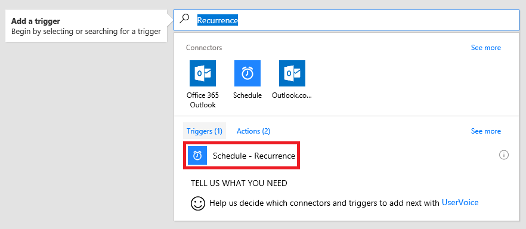
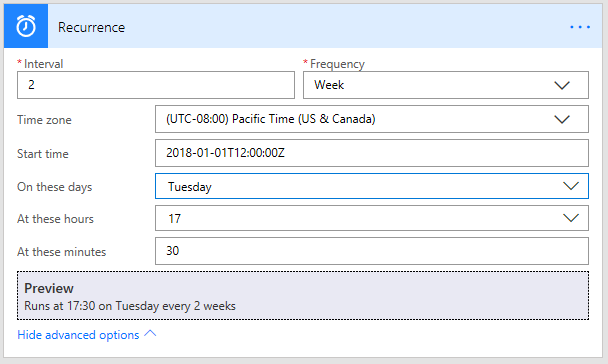
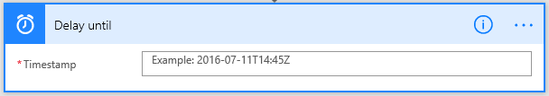

# 일정에 따라 흐름 실행
하나 이상의 작업(예: 전자 메일로 보고서 보내기)을 수행하는 흐름을 만듭니다.

* 하루, 한 시간 또는 1분에 한 번
* 지정한 날짜
* 몇 일, 몇 시간 또는 지정한 분 이후

## 반복 흐름 만들기
1. [Microsoft Flow](https://flow.microsoft.com)에 로그인하고 상단 탐색 모음에서 **내 흐름**을 선택합니다.
   
    
2. **빈값에서 만들기**를 선택합니다.
   
    
3. **모든 커넥터 및 트리거 검색** 상자에서 **되풀이**를 입력한 후 **일정 - 되풀이**를 선택합니다.
   
    
4. **반복** 대화 상자에서 흐름 실행 빈도를 지정합니다.
   
    예를 들어 2주마다 흐름을 실행하려면 **간격**에서 **2**, **빈도**에서 **주**를 선택합니다.
   
    

## 고급 옵션 지정
1. 이전 섹션의 단계에 따라 **고급 옵션 표시**를 선택합니다.
   
    **참고**: 이러한 옵션은 **간격** 및 **빈도**가 설정하는 값에 따라 변경됩니다. 화면이 아래 그래프와 일치하지 않으면 그래픽이 표시하는 동일한 값으로 **간격** 및 **빈도**를 설정해야 합니다.
2. **시간대**를 선택하여 **시작 시간**이 로컬 표준 시간대, UTC(협정 세계시) 등을 반영할지 여부를 지정합니다.
3. 형식에서 **시작 시간**을 지정합니다.
    YYYY-MM-DDTHH:MM:SSZ
4. **빈도** 아래에서 **일**을 지정한 경우 흐름이 실행되어야 하는 시간을 지정합니다.
5. **빈도** 아래에서 **주**를 지정한 경우 흐름이 실행되어야 하는 날짜 또는 요일 및 흐름이 실행되어야 하는 시간을 지정합니다.
   
    예를 들어 표시된 대로 흐름이 2018년 1월 1일 월요일 정오(태평양 표준시) 이후에 시작하도록 옵션을 구성하고 2주 간격으로 화요일 오후 5시 30분(태평양 표준시)에 실행합니다.
   
    
6. [처음부터 새로 흐름 만들기](get-started-logic-flow.md)에서 설명한 대로 흐름이 수행하게 할 동작을 추가합니다.

## 흐름 지연
1. [Microsoft Flow](https://flow.microsoft.com)에 로그인하고 상단 탐색 모음에서 **내 흐름**을 선택합니다.
   
    
2. **빈값에서 만들기**를 선택합니다.
   
    
3. [처음부터 새로 흐름 만들기](get-started-logic-flow.md)에서 설명한 대로 이벤트를 지정합니다.
4. **+ 새 단계**를 선택한 다음 **작업 추가**를 선택합니다.
   
    
5. 동작 목록에서 다음 중 하나를 수행합니다.
   
   * **지연**을 선택하고, **개수**를 지정하고, 시간 **단위**를 초, 분, 시간으로 지정니다.
   * **다음 날짜까지 지연**을 선택한 다음 이 형식으로 날짜를 지정합니다. YYYY-MM-DDTHH:MM:SSZ
     
     
     
     

