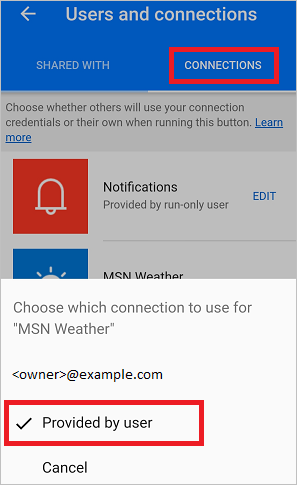
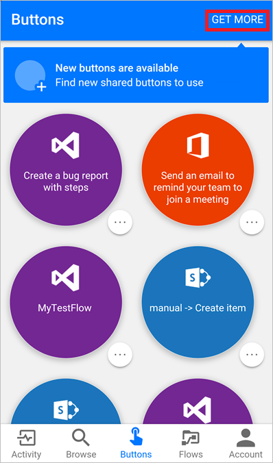
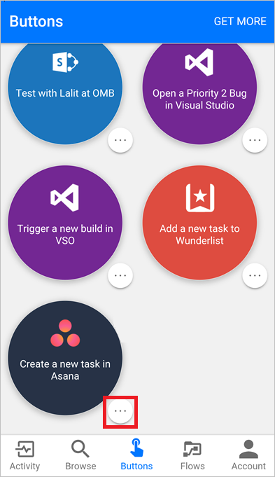

# Microsoft Flow에서 단추 흐름 공유
Microsoft Flow 모바일 앱에서 조직의 다른 사용자 또는 그룹과 [단추 흐름](introduction-to-button-flows.md)(단추)을 공유할 수 있습니다. 단추를 공유하면 사용자가 단추를 공유한 개인 또는 그룹이 사용자의 단추를 실행할 수 있고, 마찬가지로 자신의 단추도 실행할 수 있습니다. 다른 사용자가 공유한 단추에 대한 [링크를 공유](share-buttons.md#re-share-a-button)할 수도 있습니다. 언제든지 단추 [공유를 중지](share-buttons.md#stop-sharing-a-button)할 수 있습니다.

> 이 문서에 사용된 스크린샷은 Android 장치에서 생성되었습니다. iPhone을 사용하는 경우 이미지가 다르게 보일 수 있지만 기능은 동일합니다.
> 
> 

다른 사람이 공유한 단추를 사용하려면 [이 단계](share-buttons.md#use-shared-buttons)를 따르세요.

## 필수 구성 요소
단추를 공유하려면 다음이 필요합니다.

* [Microsoft Flow](https://flow.microsoft.com)에 액세스할 수 있는 계정
* 공유할 흐름
* [Android](https://aka.ms/flowmobiledocsandroid), [iOS](https://aka.ms/flowmobiledocsios) 또는 [Windows Phone](https://aka.ms/flowmobilewindows)용 Microsoft Flow 모바일 앱이 설치된 모바일 장치.
* 단추를 공유할 조직의 그룹 또는 사용자

## 단추 공유
Microsoft Flow 모바일 앱의 **단추** 탭에서 단추를 공유할 수 있습니다.

1. 공유하려는 단추 옆의 작은 아이콘을 누릅니다.
   
    
2. **단추 사용자** 페이지에서 **다른 사람 초대**를 누릅니다.
   
    
3. 단추를 공유하려는 그룹 또는 개인을 검색한 다음 선택합니다.
   
    
4. **다른 사용자 초대** 페이지에서 **보내기**를 누릅니다.
   
    
5. 페이지에서 단추 공유 작업이 완료되었음을 나타내는 **완료**를 누릅니다.
   
    

## 사용자의 고유한 연결 사용 필요
> [!NOTE]
> 단추를 공유할 때 단추를 공유하는 사용자가 단추에서 사용하는 모든 연결을 사용하도록 할 수 있습니다. 고유한 연결을 사용하도록 요구할 수도 있습니다. 다른 사용자가 사용자의 연결을 사용하도록 허용하면 사용자의 연결에서 자격 증명에 액세스하거나 다른 흐름에서 다시 사용할 수 없습니다.
> 
> 

다음 단계를 따라 단추를 공유하는 사용자가 고유한 연결을 사용하도록 해야 합니다.

1. 단추를 공유한 후에 즉시 표시되는 화면에서 **연결 관리**를 선택합니다.
2. 관리하려는 단추에서 **편집**을 선택합니다.
3. **사용자 입력** 또는 전자 메일 주소를 선택합니다.
   
    선택 항목은 공유 단추에서 사용해야 하는 연결을 나타냅니다.
   
    
   
    언제든지 옵션을 확인하거나 변경할 수 있습니다. 이를 위해 관리하려는 단추에서 **흐름** 탭 > 공유한 흐름 > **사용자 및 연결** > **연결** 탭 > **편집**을 선택합니다.
   
    

## 단추 사용자 목록 보기
**단추** 탭에서 다음 단계를 따르면 단추가 공유된 모든 그룹 또는 사용자를 볼 수 있습니다.

1. 사용하려는 단추 옆에 있는 작은 아이콘을 누릅니다.
2. **단추 사용자** 페이지에서 단추가 공유된 모든 그룹 또는 사용자를 봅니다.
   
    

## 단추 공유 중지
**단추** 탭에서 다음 단계를 수행하면 단추 공유를 중지할 수 있습니다.

1. 더 이상 공유하지 않으려는 단추 옆의 작은 아이콘을 누릅니다.
2. **단추 사용자** 페이지에서 단추 공유를 중지하려는 사용자 또는 그룹을 누릅니다.
   
    
3. 페이지가 표시될 때 **사용자 제거**를 누릅니다.
   
    
4. 제거 작업이 완료될 때까지 기다립니다. **단추 사용자** 목록이 새로 고쳐지며, 제거한 사용자 또는 그룹이 더 이상 나열되지 않습니다.
   
    

## 실행 기록 모니터링
단추를 공유한 개인이 시작한 실행을 포함하여 모든 실행 기록은 단추 작성자의 Microsoft Flow 모바일 앱의 **활동** 탭에만 나타납니다.

## 공유된 단추 사용
다른 사람이 공유한 단추를 실행하려면 **단추 추가** 페이지의 **단추** 탭에 해당 단추를 추가해야 합니다.

1. **단추** 탭에서 **더 가져오기**(또는 **새 단추 사용 가능** 배너가 나타날 경우 이 배너)를 누릅니다.
   
    
2. 사용하려는 단추를 누릅니다.
   
    누른 단추가 Microsoft Flow 앱의 **단추** 탭에 즉시 추가됩니다. 그러면 **단추** 탭에서 단추를 거기에 나열된 다른 단추와 마찬가지로 사용할 수 있습니다.
   
    

## 단추 다시 공유
사용자와 공유한 단추에 대한 링크를 공유할 수 있습니다.

1. 공유하려는 단추 옆의 **...** 를 선택합니다.
2. **공유 단추 링크**를 선택합니다.
   
    
3. 단추를 공유하는 데 사용하려는 앱을 선택하고 다음 단계를 따라 공유하려는 사용자에게 단추를 전송합니다.

## 공유된 단추 사용 중지
사용자와 공유된 단추를 더 이상 사용하지 않으려는 경우 다음 단계를 수행하여 **단추** 탭에서 해당 단추를 제거합니다.

1. **단추** 탭에서 더 이상 사용하지 않으려는 단추 옆에 있는 **...** 를 누릅니다.
   
    
2. 이때 나타나는 메뉴에서 **제거**를 누릅니다.

다 됐습니다. 단추가 Microsoft Flow 앱의 **단추** 탭에 더 이상 나타나지 않습니다.

> [!NOTE]
> 공유된 단추를 제거한 후 **단추** 탭에서 **더 가져오기**를 선택하여 다시 추가할 수 있습니다.
> 
> 

