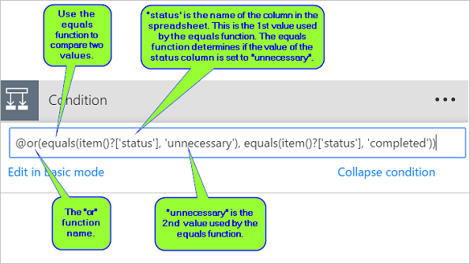
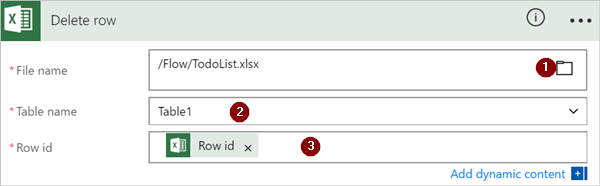

# <a name="use-expressions-in-conditions-to-check-multiple-values"></a>조건에서 식을 사용하여 여러 값을 확인합니다.
이 연습에서는 식과 **조건**을 사용하여 **고급 모드**에서 여러 값을 비교하는 법을 알아봅니다.

흐름을 만들 때 기본 모드에서 [ **조건**](add-condition.md#add-a-condition) 카드를 사용하면 단일 값을 다른 값과 신속하게 비교할 수 있습니다. 그러나 여러 값을 비교해야 할 때도 있습니다. 예를 들어 스프레드시트 또는 데이터베이스 테이블에서 몇 가지 열의 값을 확인하는 것이 좋습니다.

해당 조건에서 다음 논리 식을 어떤 조합으로든 사용할 수 있습니다.

식|설명|예
--------|-----------|-------
|[and](#use-the-and-expression)|두 인수를 사용하여 두 값이 모두 참이면 true를 반환합니다.<br><b>참고</b>: 두 인수는 부울이어야 합니다.|이 식은 false를 반환합니다. <br>and(greater(1,10),equals(0,0))
|[or](#use-the-or-expression)|두 인수를 사용하여 어느 인수든 하나의 값이 참이면 true를 반환합니다. <br><b>참고</b>: 두 인수는 부울이어야 합니다.|이 식은 true를 반환합니다.<br>or(greater(1,10),equals(0,0))
|equals|두 값이 같으면 true를 반환합니다.|예를 들어 parameter1이 someValue이면 이 식은 true를 반환합니다.<br>equals(parameters('parameter1'), 'someValue')
|[less](#use-the-less-expression)|두 인수를 사용하여 첫 번째 인수가 두 번째 인수보다 작을 경우 true를 반환합니다. <br><b>참고</b>: 지원 되는 형식은 integer, float 및 string입니다.|이 식은 true를 반환합니다.<br>less(10,100)
|lessOrEquals|두 인수를 사용하여 첫 번째 인수가 두 번째 인수보다 작거나 같을 경우 true를 반환합니다. <br><b>참고</b>: 지원 되는 형식은 integer, float 및 string입니다.|이 식은 true를 반환합니다.<br>lessOrEquals(10,10)
|[greater](#use-the-greater-expression)|두 인수를 사용하여 첫 번째 인수가 두 번째 인수보다 클 경우 true를 반환합니다. <br><b>참고</b>: 지원 되는 형식은 integer, float 및 string입니다.|이 식은 false를 반환합니다.<br>greater(10,10)
|greaterOrEquals|두 인수를 사용하여 첫 번째 인수가 두 번째 인수보다 크거나 같을 경우 true를 반환합니다. <br><b>참고</b>: 지원 되는 형식은 integer, float 및 string입니다.|이 식은 false를 반환합니다.<br>greaterOrEquals(10,100)
|[empty](#use-the-empty-expression)|개체, 배열 또는 문자열이 비어 있다면 true를 반환합니다.|이 식은 true를 반환합니다.<br>empty('')
|not|부울 값의 반대 값을 반환합니다. |이 식은 true를 반환합니다.<br>not(contains('200 Success','Fail'))
|if|식의 결과 값이 true 또는 false이면 특정 값을 반환합니다.|이 식은 "예"를 반환합니다.<br>if(equals(1, 1), 'yes', 'no')

## <a name="prerequisites"></a>필수 구성 요소
* Microsoft Flow에 액세스합니다.
* 이 연습의 뒷부분에서 설명된 테이블이 있는 스프레드시트입니다. Microsoft Flow에서 액세스할 수 있도록 스프레드시트를 Dropbox 또는 Microsoft OneDrive와 같은 위치에 저장하십시오.
* Microsoft Office 365 Outlook(Office 365 Outlook을 사용하는 동안 흐름에서 지원되는 어떠한 이메일 서비스라도 사용할 수 있습니다.)

## <a name="use-the-or-expression"></a>or 식 사용
때로 항목의 값이 valueA **또는** valueB인 경우 워크플로가 작업을 수행해야 합니다. 예를 들어 스프레드시트 테이블에는 작업의 상태를 추적할 수도 있습니다. 테이블에 *상태*란 이름의 열이 있고 *상태* 열의 가능한 값이 다음과 같다고 가정합니다.

* **완료됨**
* **차단됨**
* **불필요함**
* **시작되지 않음**

스프레드시트의 모양을 보여주는 예제는 다음과 같습니다.


앞의 스프레드시트가 주어진 경우 *완료됨* 또는 *불필요함*으로 설정된 *상태* 열이 있는 모든 행을 제거하려면 Microsoft Flow를 사용합니다.

흐름을 만들어 보겠습니다.

### <a name="start-with-a-blank-flow"></a>빈 흐름에서 시작
1. [Microsoft Flow](https://flow.microsoft.com)에 로그인합니다.

    
2. **내 흐름** 탭을 선택합니다.

    
3. **빈값에서 만들기**를 선택합니다.

    

### <a name="add-a-trigger-to-your-flow"></a>흐름에 트리거 추가
1. **일정**을 검색한 후 **일정 ‑ 되풀이** 트리거를 선택합니다.

    
2. 하루에 한 번 실행하도록 일정을 설정합니다.

    

### <a name="select-the-spreadsheet-and-get-all-rows"></a>스프레드시트를 선택하고 모든 행을 가져옵니다
1. **새 단계** > **작업 추가**를 선택합니다.

    
2. **행**을 검색한 후 **Excel-행 가져오기**를 선택합니다.

    참고: 사용 중인 스프레드시트에 해당하는 "행 가져오기" 작업을 선택합니다. 예를 들어, Google Sheets를 사용하고 있다면 **Google Sheets - 행 가져오기**를 선택합니다.

    
3. **파일 이름** 상자에서 폴더 아이콘을 선택하고, 데이터가 포함된 스프레드시트를 찾아 선택합니다.

    
4. **테이블 이름** 목록에서 데이터를 포함하는 테이블을 선택합니다.

    

### <a name="check-the-status-column-of-each-row"></a>각 행의 상태 열 확인
1. **새 단계** > **자세히** > **각각에 적용 추가**를 선택합니다.

    
2. **값** 토큰을 **이전 단계에서 출력 선택** 상자에 추가합니다.

    
3. **조건 추가** > **고급 모드에서 편집**을 선택합니다.
4. 다음 **or** 식을 추가합니다. 이 **or** 식은 테이블에서 각 행의 값을 확인합니다(식에서 액세스된 경우 행은 항목이라고 함). **상태** 열의 값이 *완료됨* **또는** *불필요함*인 경우, **or** 식은 "true"로 평가됩니다.

    **or** 식은 다음과 같이 나타납니다.

    ````@or(equals(item()?['status'], 'unnecessary'), equals(item()?['status'], 'completed'))````

    **조건** 카드는 이 이미지와 유사합니다.

    

### <a name="delete-matching-rows-from-the-spreadsheet"></a>스프레드시트에서 일치하는 행을 삭제합니다.
1. **예이면 아무 것도 안 함** 조건 분기에서 **작업 추가**를 선택합니다.
2. **행 삭제**을 검색한 후 **Excel ‑ 행 삭제**를 선택합니다.

    
3. **파일 이름** 상자에서 삭제하려는 데이터를 포함한 스프레드시트 파일을 선택합니다.
4. **테이블 이름** 목록에서 데이터가 들어 있는 테이블을 선택합니다.
5. **행 id** 토큰을 **Row id** 상자에 배치합니다.

    

### <a name="name-the-flow-and-save-it"></a>흐름에 이름 지정 및 저장하기
1. 흐름에 이름을 지정한 다음 **흐름 만들기** 버튼을 선택합니다.

    

### <a name="run-the-flow-with-the-or-expression"></a>or 식을 사용하여 흐름을 실행합니다.
흐름을 저장한 후 실행합니다. 이 연습 앞부분에 나오는 스프레드시트를 만들었다면 실행 완료 후의 모양은 이렇습니다.


상태 열에 "완료됨" 또는 "불필요함"을 가진 행의 모든 데이터가 삭제되었는지 확인합니다.

## <a name="use-the-and-expression"></a>and 식 사용
열이 두 개인 스프레드시트 테이블이 있다고 가정합니다. 열 이름은 상태와 할당됨입니다. 또한 상태 열의 값은 "차단됨"이고 할당됨 열의 값은 "John Wonder"인 경우 모든 행을 삭제한다고 가정합니다.  이 작업을 수행하려면 이 연습 앞 부분의 모든 단계를 수행합니다. 그러나 고급 모드에서 **조건** 카드를 편집할 때에는 다음에 표시된 **and** 식을 사용합니다.

````@and(equals(item()?['Status'], 'blocked'), equals(item()?['Assigned'], 'John Wonder'))````

**조건** 카드는 이 이미지와 유사합니다.


### <a name="run-the-flow-with-the-and-expression"></a>and 식을 사용하여 흐름을 실행합니다.
제대로 따라 했다면 스프레드시트는 이 이미지와 유사합니다.


흐름 실행 후 스프레드시트는 이 이미지와 유사합니다.


## <a name="use-the-empty-expression"></a>empty 식 사용
이제 스프레드시트에 빈 행이 여러 개 있는지 확인합니다. 빈 행을 제거하려면 **empty** 식을 사용하여 할당됨 및 상태 행에 아무 텍스트가 없는 모든 열을 식별합니다.

이 작업을 수행하려면 이 연습 앞 부분의 **and 식 사용하기** 섹션에 나열된 모든 단계를 수행합니다. 하지만 고급 모드에서 **조건** 카드 편집할 때에는 empty 식을 이런 방식으로 사용합니다.

````@and(empty(item()?['Status']), empty(item()?['Assigned']))````

**조건** 카드는 이 이미지와 유사합니다.


흐름 실행 후 스프레드시트는 이 이미지와 유사합니다.


테이블에서 추가 줄이 제거되었는지 확인합니다.

## <a name="use-the-greater-expression"></a>greater 식 사용
동료를 위해 야구표를 구매하고 각 사람에게 상환을 받기 위해 스프레드시트를 사용한다고 가정합니다. 전액을 갚지 않은 각 사람에게 매일 이메일을 보내는 흐름을 신속하게 만들 수 있습니다.

전액을 갚지 않은 직원을 알아내려면 **greater** 식을 사용합니다. 그런 다음 전액을 갚지 않은 각 사람에게 알림 이메일을 자동으로 보낼 수 있습니다.

스프레드시트 보기는 다음과 같습니다.


다음은 지불해야 할 금액보다 적게 지불한 모든 사람을 식별하는 **greater** 식의 구현입니다.

````@greater(item()?['Due'], item()?['Paid'])````

## <a name="use-the-less-expression"></a>less 식 사용
동료를 위해 야구표를 구매하고 각 사람에게 모든 사람이 동의한 날짜에 상환받기 위해 스프레드시트를 사용한다고 가정합니다. 현재 날짜가 지불하기로 한 날짜 하루 전일 경우 전액을 갚지 않은 각 사람에게 알림 이메일을 보내는 흐름을 만들 수 있습니다.

유효성을 검사하는 조건이 두 가지 있으므로 **Less** 식과 함께 **and** 식을 사용합니다.


|          유효성을 검사하는 조건          | 사용할 식 |                    예                     |
|-----------------------------------------|-------------------|------------------------------------------------|
|   전액이 상환되었습니까?    |      greater      |   @greater(item()?['Due'], item()?['Paid'])    |
| 지불하기로 한 날짜가 하루 남았습니까? |       less        | @less(item()?['DueDate'], addDays(utcNow(),1)) |

## <a name="combine-the-greater-and-less-expressions-in-an-and-expression"></a>and 식에서 greater 식과 less 식을 결합합니다.
전액보다 적게 지불한 직원을 알아내려면 **greater** 식을 사용하고 현재 날짜가 지불하기로 한 날짜 하루 전인 경우 **less** 식을 사용합니다. 그런 다음 전액을 갚지 않은 사람들에게 지불하기로 한 날짜가 하루 밖에 남지 않았음을 알리는 이메일을 보내기 위해 **전자 메일 보내기** 작업을 할 수 있습니다.

스프레드시트 테이블 보기는 다음과 같습니다.


다음은 지불해야 할 금액보다 적게 지불한 모든 사람과 현재 날짜가 지불하기로 한 날짜 하루 전인 경우를 식별하는 **and** 식의 구현입니다.

````@and(greater(item()?['Due'], item()?['Paid']), less(item()?['dueDate'], addDays(utcNow(),1)))````

## <a name="learn-more"></a>자세한 정보
다른 [식](https://docs.microsoft.com/azure/logic-apps/logic-apps-workflow-definition-language#functions)에 대해 알아봅니다

