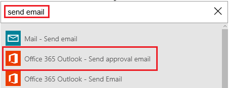

# Microsoft Flow에서 승인 대기
<iframe width="560" height="315" src="https://www.youtube.com/embed/W6oxcYRtW-8?list=PL8nfc9haGeb55I9wL9QnWyHp3ctU2_ThF" frameborder="0" allowfullscreen></iframe>

Sharepoint에서 항목을 만든 경우 승인 메일을 보낸 다음 항목의 승인 또는 거부 여부를 알리는 흐름을 만듭니다. 이 자습서를 정확하게 따라 하려면 트리거 동작처럼 간단한 SharePoint 목록을 만듭니다. 그러나 Dropbox나 OneDrive 같은 다른 데이터 원본도 사용할 수 있습니다.

**필수 구성 요소**

* 이름이 **Project Tracker**이고 열 이름 **Title**이 있는 간단한 SharePoint Online 목록을 만든 다음 이름이 **Assigned To**인 개인 또는 그룹 열을 추가합니다.
  
   

## 흐름을 트리거하는 이벤트 추가
1. [flow.microsoft.com](https://flow.microsoft.com)의 위쪽 탐색 모음에서 **내 흐름**을 선택하고 **새 흐름 만들기**를 선택합니다.
   
    
2. **어떻게 시작하시겠습니까?** 상자에서 **새 항목**을 입력하거나 붙여 넣은 다음 **SharePoint Online - 새 항목이 생성되었을 때**를 선택합니다.
   
    
3. 메시지가 표시되면 SharePoint Online에 로그인합니다.
4. **사이트 URL** 아래에서 목록이 포함된 사이트의 URL을 입력하거나 붙여 넣습니다.
   
    
5. **목록 이름** 아래에서 **Project Tracker** 같은 목록을 선택합니다.
   
    

## 결과 동작 추가
1. **+** 단추를 선택한 다음 **동작 추가**를 선택합니다.
   
    
2. **다음에는 무슨 작업을 수행하시겠습니까?** 상자에 **전자 메일 보내기**를 입력하거나 붙여 넣은 다음 **Office 365 Outlook - 승인 전자 메일 보내기**를 선택합니다.
   
    
3. 메시지가 표시되면 Office 365 Outlook에 로그인합니다.
4. **받는 사람** 필드를 선택한 다음 **전자 메일에 할당**을 선택합니다.
   
    **할당 대상** 열의 사용자는 항목을 승인 또는 거부하는 메일을 받게 됩니다. 흐름을 테스트하기 위해 항목을 만들 때는 이 필드에 자기 자신을 지정합니다. 이렇게 하면 항목을 승인 또는 거부할 뿐 아니라 알림 메일도 받게 됩니다.
   
    **참고**: **제목** 및 **사용자 옵션** 필드를 요구에 맞게 사용자 지정할 수 있습니다.
   
    

## 조건 추가
1. **+** 단추를 선택한 다음 **조건 추가**를 선택합니다.
   
    
2. **개체 이름** 필드에서 **SelectedOption**을 선택합니다.
3. **값 필드**에서 **승인**을 입력하거나 붙여 넣습니다.
   
    
4. **예인 경우** 영역에서 **동작 추가**를 선택합니다.
   
    
5. **다음에는 무슨 작업을 수행하시겠습니까?** 상자에 **전자 메일 보내기**를 입력하거나 붙여 넣은 다음 **Office 365 Outlook - 전자 메일 보내기**를 선택합니다.
   
    
6. **제목** 상자에서 제목을 지정합니다.
   
    예를 들어 **DisplayName에게 할당됨**을 선택하고 한 쪽마다 공백을 포함하여 **승인함**을 입력한 다음 **제목**을 선택합니다.
7. **본문** 상자에서 **프로젝트의 다음 단계를 진행할 수 있음**과 같은 전자 메일 본문을 지정합니다.
8. **받는 사람** 필드에 **전자 메일을 통해 만들기**와 같은 받는 사람을 입력합니다.
   
    SharePoint 목록에서 항목을 만든 사람에게 프로젝트의 승인 또는 거부 여부를 알립니다.
   
    
9. **아니요인 경우** **제목** 및 **본문**을 변경하는 단계를 제외한 마지막 다섯 단계를 수행하여 프로젝트 거부를 반영합니다. 
   
     

## 흐름 완료 및 테스트
1. 흐름에 이름을 지정한 다음 **흐름 만들기**를 선택합니다.
   
     
2. SharePoint 목록에서 항목을 만듭니다.
   
    지정한 받는 사람에게 승인 메일을 보냅니다. 받는 사람이 메일에서 **승인** 또는 **거부**를 선택하면 응답을 나타내는 전자 메일을 받게 됩니다. 

